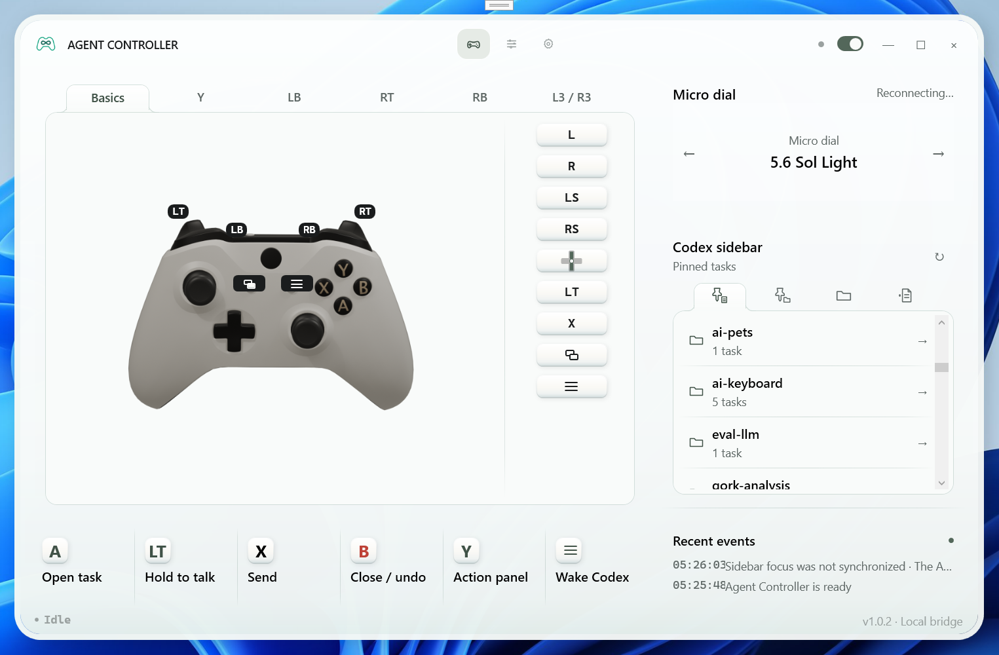
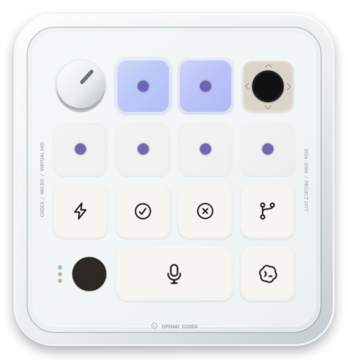

# Agent Controller

[](README.md)
[](README.zh-CN.md)

 

Codex Micro sold out quickly. It is a tiny keyboard made specifically for Codex, and perhaps you wanted one. But consider the evidence:

- Codex Micro has one dial and one stick; a gamepad has two sticks.
- Codex Micro has twelve keys; even a gamepad without rear paddles has more controls.
- Codex Micro is not exactly an ergonomic masterpiece.
- Its price plus shipping can buy several gamepads.
- It has to be shipped to you.
- Most importantly, it cannot play games.

The gamepad wins. QED.



The dashboard brings the interactive controller guide, Micro dial, Codex task sidebar, and recent events into one crystal workspace. Pressing a controller input switches the matching tutorial tab and action hint in real time.

> One catch: you still need a microphone for voice input. Neither device usually records audio by itself.

That led to another line of thought:

- Codex Micro provides an SDK for integrations;
- Codex can write code, build models, and respond to shortcuts;
- many gamepads can also be programmed, remapped, and modeled.

So there could be software that lets a gamepad stand in for Codex Micro.

> Why should your next keyboard have to be a keyboard?

I directed Codex to build a prototype. Two hours later it worked; another day went into refining the interaction and wrestling with the Codex interface. The result is Agent Controller.

- Press **Menu** (☰ on an Xbox controller, also called Start or `+` on some gamepads) to wake or foreground Codex when needed.
- Use the **left stick** to walk the task tree: up/down moves between siblings, right enters a project, and left returns to the parent level. Press **A** to open a task. Click **L3** to cycle between pinned tasks, pinned projects, projects, and projectless tasks.
- The **right stick emulates the Codex Micro upper-left encoder**. Up or left emits `ENC_CW` for the previous item; down or right emits `ENC_CC` for the next item. Tap **R3** to open, enter, or confirm, or hold it for Agent Controller settings.
- Hold **LT** to dictate and release it to stop.
- Press **X** to send.
- To clear the composer, press **Y**, then **A** twice to confirm.
- To cancel an active turn, hold **B** for three seconds and wait for the on-screen countdown. A short press closes menus or undoes recent navigation when applicable.
- Press D-pad up/down to move to the previous/next Q&A turn. Hold up for four seconds to jump to the top, or down for three seconds to jump to the bottom.
- To start a new task, press **Y**, then D-pad up.

That is enough for controller-first vibe coding.

The first public version was tested with an 8BitDo Ultimate 2, an Xbox Series controller, and a Flydigi Vader 4 Pro. A community report also confirmed that an inexpensive GameSir controller connected without trouble. Other XInput-compatible controllers should work, but have not all been validated end to end.

And the six Agent keys from Codex Micro? Hold **LB**, then use the four D-pad directions, View (⧉), or Menu (☰) to choose one of the six visible Agent slots.

If the controller shorthand is unfamiliar, the dashboard now includes an interactive guide for Basics, Tap Y, Hold LB, Hold RT, Hold RB, and stick presses. Click a tab or press the matching control to switch the lesson. L3/R3 are also labeled as LS/RS and animated as vertical stick-cap presses—not downward stick movement.

### Integrated Codex Micro surface



The [Codex Micro surface](virtual-micro/README.md) is now hosted by `AgentController.exe`. Open it from the `MICRO` title-bar button or the tray menu. It keeps its own logical Broker lease but shares the one process-wide Broker child with controller input, so closing the panel only hides it and no standalone simulator, mutex, or tray process is involved.

Unfortunately, it also depends on an **unsigned developer driver package**. The package saves the C/C++ compilation step, but it is not a production installer: [sign it locally and install it](virtual-micro/UNSIGNED-DRIVER.md), or build the driver from source.

> ⚠️ **Security notice — read before use**
>
> v1 remains experimental software, continuously rebuilt from an early one-day prototype, and has not received an independent human code or security audit. A Codex update can change its Micro bridge, shortcuts, or accessibility tree, causing features to fail or perform the wrong action. The app and developer driver are unsigned. Review the source, test only with non-critical tasks, and use it entirely at your own risk. What the app does on your machine:
>
> - sends HID reports to the optional Micro-compatible device through a local Broker, with limited keyboard-shortcut or UI Automation fallbacks only when delivery is explicitly unavailable; controller input is normally gated to Codex being in the foreground, and turning the Bridge off blocks controller actions;
> - reads local Codex task data under `~/.codex`; if fallback bindings are enabled, it can append F17/F18/F20/F22 bindings to Codex's keybindings file;
> - writes its own settings under `%LOCALAPPDATA%`;
> - can register itself to start with Windows (off by default);
> - makes no network requests; its only web-related action is opening vendor or Codex links in your browser.
>
> Agent Controller is an independent experiment and is not affiliated with, authorized by, or endorsed by OpenAI, Codex, or Work Louder.

### Requirements

- Windows 10 (build 19041+) or Windows 11
- The Codex desktop app
- An XInput-compatible controller
- A microphone if you want to use push-to-talk dictation

The tested controllers are the 8BitDo Ultimate 2, Xbox Series controller, and Flydigi Vader 4 Pro. Compatibility with other XInput devices depends on their XInput implementation and still needs physical validation.

### macOS Foundation Preview

The repository now contains an unsigned, read-only macOS 14+ Foundation
Preview. Its Avalonia shell observes Apple Game Controller input, separates
platform permissions, detects the Codex CLI, provides native menu/Dock entries,
and can be cross-published for Apple Silicon and Intel. It does not yet send
Codex actions and does not claim virtual Micro parity. Build and validation
instructions are in the [macOS Foundation Preview guide](docs/macos-foundation-preview.md).

### Install from Releases

1. Download the latest zip from [Releases](../../releases).
2. Extract it anywhere and run `AgentController.exe`.
3. Because the binary is unsigned, Windows SmartScreen may warn you. Choose **More info → Run anyway** only after reviewing the security notice above; alternatively, build from source.
4. Connect the controller in XInput mode, launch Codex, and make sure the Bridge is enabled. When connected, the Device page shows the controller name and a localized **Live input** / **实时输入** badge.
5. Some features may require restarting the Codex desktop app (**ChatGPT**), especially after Agent Controller first provisions or updates Codex keybindings.
6. For the complete Micro-first HID path, separately install the repository's only supported device component: `CodexMicroVhfUm` (UMDF2/VHF). The current release provides an unsigned developer workflow only; read the [local installation guide](docs/CodexMicroSimulator-installation.md) and [unsigned-driver guide](virtual-micro/UNSIGNED-DRIVER.md) first.

The v1.0.2 Windows package is self-contained and does not require a separate .NET runtime. Agent Controller still launches without the driver, but its limited `NotSent` fallbacks are not full Micro compatibility.

### Control reference

#### Base controls

| Input | Action |
| --- | --- |
| Menu | Wake and foreground Codex when needed. If Codex is already in front, controller input arms after the connected pad returns to neutral. |
| Left stick ↑ / ↓ | Move through Agent Controller's stable sidebar directory without opening an item. |
| Left stick or D-pad ← / → | Leave / enter a project directory. |
| L3 | Cycle roots: pinned tasks → pinned projects → projects → projectless tasks. |
| A | Open the focused task. Projects are entered with right. |
| X | Send the current composer text. The fallback uses the configured submit binding, never Enter. |
| B | In a Micro menu session opened through R3, send Agent key 1 (`AG00`) so the official bridge performs its contextual Back action; otherwise hold for three seconds to cancel the active turn. Releasing early stops the countdown. |
| Y | Open the action panel. |
| D-pad ↑ / ↓ | Previous / next Q&A turn; hold ↑ for four seconds to jump to the top or ↓ for three seconds to jump to the bottom. |
| Right stick | Up or left emits `ENC_CW` (previous); down or right emits `ENC_CC` (next). All four directions become Micro encoder detents, with no gamepad-only UI state machine. |
| R3 tap / hold | Tap to press the Micro encoder and open, enter, or confirm the current item. Hold for 500 ms to open Agent Controller settings. |
| LB / RB tap | Open the previous / next available task. |
| LT hold | Start push-to-talk dictation; release to finish. |

#### Y action panel

| Input after Y | Action |
| --- | --- |
| D-pad ↑ | New task |
| D-pad → / ← | Codex history forward / back |
| D-pad ↓ | Show or hide the Codex sidebar |
| A, then A again | Clear the composer after confirmation |
| X | Project context: enter the owning project, or toggle all/pinned within a project |
| B or Y | Close the panel |

#### Hold layers

| Layer | Inputs |
| --- | --- |
| Hold LB — Agent | D-pad ↑ / → / ↓ / ← selects Agent slots 1–4; View selects slot 5; Menu selects slot 6; B cancels the layer. |
| Hold RB — Command | Y toggles Fast; A approves; B declines; X forks; View is push-to-talk; Menu dispatches through the current Send, Steer, or Queue control. |
| Hold RT — running turn | X explicitly Steers; Y explicitly Queues; hold B for three seconds to Stop the current turn; A Forks. Releasing B early aborts the countdown; actions fail safely if Codex does not expose the matching control. |

Holding a right-stick direction builds momentum over about two seconds. The first step is immediate, repeat speed then ramps smoothly, and a deeper tilt allows a higher final rate.

The interface supports Simplified Chinese, English, or the Windows display language.

For implementation status and edge cases, see the [v1 control reference](public/docs/controller-operations.md), [architecture and input flow](public/docs/architecture-and-input-flow.md), [Micro command reference](public/docs/codex-micro-command-reference.md), and [v1.0.2 release notes](public/docs/release-v1.0.2.md).

### Known limitations

- The Micro-first path depends on Codex's current private HID contract, `codex-micro-service`, and `codex-micro-bridge`; OpenAI does not promise this as a stable public ABI.
- The full Micro path requires users to review, build, or locally sign `CodexMicroVhfUm`. Do not disable Windows driver-signing enforcement or import untrusted certificates.
- Fallback actions may still depend on Codex's current shortcuts and accessibility tree. A Codex UI update can break them.
- The Simple model list uses the official command shortcut; conflicts are blocked. Restart Codex once if it does not hot-load a newly written binding.
- Unit tests and a successful Release build do not replace physical end-to-end testing against the current Codex app, account, and model options.
- Agent slots currently use the first six tasks in the live snapshot; Agent and Command slots are not yet user-configurable.
- macOS currently provides only the unsigned, read-only Foundation Preview; App Server actions, voice, native Micro, signing/notarization, and physical Mac acceptance remain open.
- v1 does not yet provide a commercially signed driver installer, configurable Agent/Command slots, or complete Plan-mode controller routing.

### Beyond Codex

Only Codex is supported today, but the controller, capability, and Agent-target layers are intended to leave room for additional adapters. If there is enough demand, Agent Controller could expand to command-line workflows and other coding agents such as Claude Code.

That work would require a dedicated adapter with its own task discovery, command execution, state detection, and safety checks. Current Codex compatibility should not be taken as compatibility with those tools today.

### Build from source

Install .NET SDK 10.0.302. For IDE builds, use Visual Studio 2026 with MSBuild 18 or newer; Visual Studio 2022 cannot load the SDK selected by `global.json`. Then run:

```powershell
dotnet build AgentController.sln -c Release
dotnet test AgentController.sln -c Release
./scripts/package-release.ps1 -Version 1.0.2
```

Build output is written to `app/bin/Release/net10.0-windows10.0.19041.0/`. The packaging script creates a self-contained Windows x64 zip and SHA-256 checksum under `dist/`.

To cross-build the unsigned macOS Foundation Preview for Apple Silicon and
Intel, run:

```powershell
powershell -NoProfile -ExecutionPolicy Bypass -File .\scripts\publish-macos.ps1
```

See the
[preview guide](docs/macos-foundation-preview.md) before testing it on a Mac.

To create or update the GitHub Release and upload both artifacts, install and authenticate GitHub CLI, push the matching tag, then run:

```powershell
./scripts/publish-release.ps1 -Version 1.0.2
```

The command rebuilds the package, verifies its SHA-256 checksum, checks the remote tag, and idempotently creates or updates the Release. Pass `-SkipBuild` to upload already-built artifacts.

### If you want to modify the source

In principle, emulating Micro's interaction protocol would be faster and less error-prone. But GPT-5.6 Sol kept refusing, arguing that it would be unstable and that UI Automation was the better approach. Its way of making the UI “stable” was to add 700–1,400 ms of latency—not something a human can tolerate as an interaction. To save time, I let it carry on that way at first.

This morning I finally lost patience and called it out, because right-stick model adjustment had already taken far too long. Roughly: “You've gotten this wrong more than five times, and you're still insisting UIA is better??? If you'd used the Micro protocol, this would have been finished ages ago—why are you still arguing?” Then it finally started emulating Micro.

### Repository layout

Key paths in the repository are:

- `app/` — the Windows WPF application and source of truth for runtime behavior;
- `app.Tests/` — regression tests for controller input, localization, navigation, bridge safety, and Codex integration policies;
- `scripts/` — reproducible Release packaging;
- `virtual-micro/` — the hostable Micro surface, shared protocol, `CodexMicroVhfUm` device support, and runtime-capability tests;
- `docs/` — interaction specifications and active design/consultation notes;
- `public/docs/` — user-facing command references, release notes, and experimental plans;
- `todo/` — roadmap organized by major workstream; start with [`todo/README.md`](todo/README.md).

### Credits

Controller artwork is derived from CREATRBOI's "White XBOX Controller" model. License and attribution files ship with the app under `THIRD-PARTY/`.

### License

This project is available under the [PolyForm Noncommercial License 1.0.0](LICENSE). Personal, research, and other noncommercial use, modification, and distribution are permitted; commercial use requires separate permission. Because the license restricts commercial use, this project is source-available rather than open source under the OSI definition.
