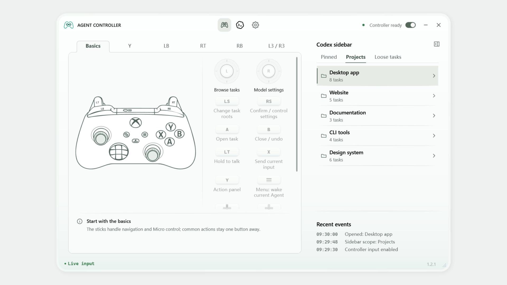

# Agent Controller

[](README.zh-CN.md)

Control Codex with a gamepad, or adapt Agent Controller to another agent yourself. Supports Xbox, 8BitDo, and other controllers connected in XInput mode.



*Development interface with example data.*

The project previously supported DeepSeek Harness 0.0.3, but that integration has not been maintained since.

## Current source and downloads

The current public download is [Agent Controller v1.2.1](https://github.com/gantrol/AgentController/releases/tag/v1.2.1), for Windows 10 (build 19041+) and Windows 11 x64. The self-contained ZIP needs no separate .NET installation; the `-compact` ZIP requires [.NET 10 Desktop Runtime x64](https://dotnet.microsoft.com/en-us/download/dotnet/10.0). Full Micro control in that release still requires a separate virtual HID driver; see the [legacy driver instructions](virtual-micro/UNSIGNED-DRIVER.md).

The current source uses software interfaces and no longer depends on a virtual HID driver. These changes are not included in the public 1.2.1 archives, and end-to-end validation with a physical controller and Codex remains pending.

The next release candidate is **1.2.2**; see its [release notes](public/docs/release-v1.2.2.md). It has not been published yet.

Building from source requires .NET SDK 10.0.302 and both `CodexControl` packages at exactly `1.0.0`. Build them from the matching [codex-control](https://github.com/gantrol/codex-control) source, or obtain the matching release packages once published, then run:

```powershell
.\scripts\import-control-packages.ps1 -PackageDirectory <package-directory>
dotnet build app/AgentController.csproj -c Release
```

## Related projects

- [Codex Micro Monitor](https://github.com/gantrol/codex-micro-monitor): an independent desktop keypad and task monitor. Release [0.3.15](https://github.com/gantrol/codex-micro-monitor/releases/tag/v0.3.15) provides the app, plugin, and source downloads. It requires neither Agent Controller nor a virtual HID driver.
- [codex-control](https://github.com/gantrol/codex-control): shared control components used by Agent Controller and Codex Micro Monitor.

## License and credits

This project uses [GNU General Public License v3.0 only (GPL-3.0-only)](LICENSE). Commercial use is permitted; distribution of covered works must comply with the GPL's corresponding-source and other requirements. Third-party materials retain their own licenses and notices.

The current controller artwork is adapted from the Xbox Controller preset created by [Saikel Orado Liu](https://github.com/Saikel-Orado-Liu) for [input-overlay](https://github.com/univrsal/input-overlay/tree/master/presets/xbox-controller). The original artwork and this project's vector adaptations use CC0; see the [artwork license](app/ThirdParty/InputOverlay-Xbox/LICENSE.txt).

This project is not affiliated with or endorsed by OpenAI, Work Louder, or the controller manufacturers mentioned above.
