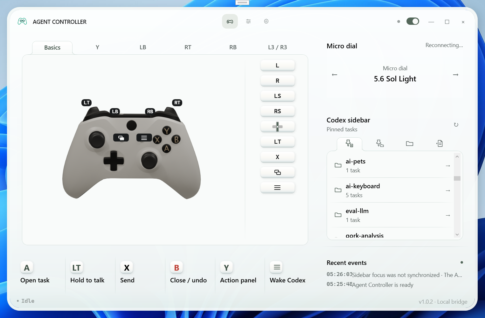

# Agent Controller

[](README.md)
[](README.zh-CN.md)

 

Agent Controller is a Windows app for navigating and controlling Codex with an XInput gamepad.

> **Codex Micro has moved to a separate project:** [gantrol/codex-micro-monitor](https://github.com/gantrol/codex-micro-monitor).
> The standalone desktop keypad and plugin are maintained separately from Agent Controller.
> As of October 4, 2026, the new public repository is empty; source code and new release packages have not been uploaded yet.

[Download Agent Controller 1.2.1](https://github.com/gantrol/AgentController/releases/tag/v1.2.1) · [Installation](#install-from-releases) · [Micro repository](https://github.com/gantrol/codex-micro-monitor)

Codex Micro sold out quickly. It is a tiny keyboard made specifically for Codex, and perhaps you wanted one. But consider the evidence:

- Codex Micro has one dial and one stick; a gamepad has two sticks.
- Codex Micro has twelve keys; even a gamepad without rear paddles has more controls.
- Codex Micro is not exactly an ergonomic masterpiece.
- Its price plus shipping can buy several gamepads.
- It has to be shipped to you.
- Most importantly, it cannot play games.

The gamepad wins. QED.



The dashboard brings the interactive controller guide, Micro dial, Codex task sidebar, and recent events into one crystal workspace. Pressing a controller input switches the matching tutorial tab and action hint in real time.

> One catch: you still need a microphone for voice input. Neither device usually records audio by itself.

That led to another line of thought:

- Codex Micro provides an SDK for integrations;
- Codex can write code, build models, and respond to shortcuts;
- many gamepads can also be programmed, remapped, and modeled.

So there could be software that lets a gamepad stand in for Codex Micro.

> Why should your next keyboard have to be a keyboard?

I directed Codex to build a prototype. Two hours later it worked; another day went into refining the interaction and wrestling with the Codex interface. The result is Agent Controller.

- Press **Menu** (☰ on an Xbox controller, also called Start or `+` on some gamepads) to wake or foreground Codex when needed.
- Use the **left stick** to walk the task tree: up/down moves between siblings, right enters a project, and left returns to the parent level. Press **A** to open a task. Click **L3** to cycle between pinned tasks, pinned projects, projects, and projectless tasks.
- The **right stick emulates the Codex Micro upper-left encoder**. Up or left emits `ENC_CW` for the previous item; down or right emits `ENC_CC` for the next item. Tap **R3** to open, enter, or confirm, or hold it for Agent Controller settings.
- Hold **LT** to dictate and release it to stop.
- Press **X** to send.
- To clear the composer, press **Y**, then **A** twice to confirm.
- To cancel an active turn, hold **B** for three seconds and wait for the on-screen countdown. A short press closes menus or undoes recent navigation when applicable.
- Press D-pad up/down to move to the previous/next Q&A turn. Hold up for four seconds to jump to the top, or down for three seconds to jump to the bottom.
- To start a new task, press **Y**, then D-pad up.

That is enough for controller-first vibe coding.

The first public version was tested with an 8BitDo Ultimate 2, an Xbox Series controller, and a Flydigi Vader 4 Pro. A community report also confirmed that an inexpensive GameSir controller connected without trouble. Other XInput-compatible controllers should work, but have not all been validated end to end.

And the six Agent keys from Codex Micro? Hold **LB**, then use the four D-pad directions, View (⧉), or Menu (☰) to choose one of the six visible Agent slots.

If the controller shorthand is unfamiliar, the dashboard now includes an interactive guide for Basics, Tap Y, Hold LB, Hold RT, Hold RB, and stick presses. Click a tab or press the matching control to switch the lesson. L3/R3 are also labeled as LS/RS and animated as vertical stick-cap presses—not downward stick movement.

### Codex Micro repository migration

The standalone keypad, task monitor, keycap settings and plugin now belong to
[codex-micro-monitor](https://github.com/gantrol/codex-micro-monitor). Future Micro
source updates and releases will be published there. The public repository has
been created, but is currently empty; it is not yet a download or source-build entry point.

The independent software-interface version in development does not require a
virtual HID driver or AgentController. Its current desktop ZIP packaging requires
the [Microsoft .NET 10 Desktop Runtime for Windows x64](https://dotnet.microsoft.com/en-us/download/dotnet/10.0).
This version has not been publicly released. The
[older Micro Monitor 0.3.10 release](https://github.com/gantrol/AgentController/releases/tag/codex-micro-monitor-v0.3.10)
remains here for existing users and still requires a separate virtual HID driver
for full functionality; follow that release's instructions.

This repository continues to maintain Agent Controller's gamepad input, mappings,
overlay and Agent routing. Its old Micro desktop and plugin sources are retained
for historical reference, not as the entry point for new Micro development.
Both products consume pinned `codex-control` packages; users do not need to install
those components separately. See the
[repository boundaries](docs/architecture/micro-component-dependency.zh-CN.md).

> ⚠️ **Security notice — read before use**
>
> v1 remains experimental software, continuously rebuilt from an early one-day prototype, and has not received an independent human code or security audit. A Codex update can change its Micro bridge, shortcuts, or accessibility tree, causing features to fail or perform the wrong action. The app and developer driver are unsigned. Review the source, test only with non-critical tasks, and use it entirely at your own risk. What the app does on your machine:
>
> - the published Controller 1.2.1 sends HID reports through a local Broker, with limited keyboard-shortcut or UI Automation fallbacks only when delivery is explicitly unavailable; the current development branch uses software interfaces instead, with [physical-controller validation still pending](docs/architecture/agent-controller-driverless-uml.zh-CN.md). Controller input is normally gated to Codex being in the foreground, and turning the Bridge off blocks controller actions;
> - reads local Codex task data under `~/.codex`; if fallback bindings are enabled, it can append F17/F18/F20/F22 bindings to Codex's keybindings file;
> - writes its own settings under `%LOCALAPPDATA%`;
> - can register itself to start with Windows (off by default);
> - starts the local `codex app-server` briefly to read the signed-in account's available Full reset expiration times; the Codex CLI may contact OpenAI while serving that request. Other web-related actions only open vendor or Codex links in your browser.
>
> Agent Controller is an independent experiment and is not affiliated with, authorized by, or endorsed by OpenAI, Codex, or Work Louder.

### Requirements

- Windows 10 (build 19041+) or Windows 11, x64
- The Codex desktop app
- An XInput-compatible controller
- A microphone if you want to use push-to-talk dictation

The tested controllers are the 8BitDo Ultimate 2, Xbox Series controller, and Flydigi Vader 4 Pro. Compatibility with other XInput devices depends on their XInput implementation and still needs physical validation.

### macOS direction

AgentController's Avalonia Foundation Preview is retired and excluded from the
default build and release flow. Codex Micro now targets a separate macOS desktop
client, which is not yet implemented. The earlier iOS / UIKit code is retained
as a historical prototype. See the [platform direction (简体中文)](docs/architecture/platform-direction.zh-CN.md).

### Install from Releases

1. Open the [Agent Controller 1.2.1 release](https://github.com/gantrol/AgentController/releases/tag/v1.2.1) and download `AgentController-1.2.1-win-x64.zip`, which includes the runtime. Choose the Controller application asset, not a Micro package or GitHub's `Source code` archive.
2. Check the matching `.sha256` file, extract the entire ZIP to a folder you intend to keep, and run `AgentController.exe` as a normal user.
3. Because the binary is unsigned, Windows SmartScreen may warn you. Choose **More info → Run anyway** only after reviewing the security notice above; alternatively, build from source.
4. Connect the controller in XInput mode, launch Codex, and make sure the Bridge is enabled. When connected, the Device page shows the controller name and a localized **Live input** / **实时输入** badge.
5. Press **Menu** to foreground Codex, return the pad to neutral, then select an idle task with the left stick and press **A**. Confirm that Codex opens the selected task. Restart Codex if newly provisioned or updated keybindings have not taken effect.
6. For the complete Micro-first HID path in published Controller 1.2.1, separately install `CodexMicroVhfUm` (UMDF2/VHF). This is an unsigned developer workflow; read the [local installation guide](docs/CodexMicroSimulator-installation.md) and [unsigned-driver guide](virtual-micro/UNSIGNED-DRIVER.md) first. This requirement belongs to the old release, not the new independent Micro software-interface version.

The v1.2.1 release provides both a self-contained Windows package and a much smaller `-compact` package. The compact package requires the [official Microsoft .NET 10 Desktop Runtime for Windows x64](https://dotnet.microsoft.com/en-us/download/dotnet/10.0); the self-contained package does not. Agent Controller still launches without the driver, but its limited `NotSent` fallbacks are not full Micro compatibility.

The development branch's driverless changes are not included in that public ZIP.
See the [first-install routes and release status (简体中文)](docs/distribution/first-install-route.zh-CN.md)
for the differences between existing downloads and upcoming versions.

### Control reference

#### Base controls

| Input | Action |
| --- | --- |
| View | Switch the controlled Agent between Codex and DeepSeek Harness. This works even when the current Agent is offline; return the pad to neutral or press Menu to unlock the new target. |
| Menu | Wake and foreground the selected Agent when needed. If it is already in front, controller input arms after the connected pad returns to neutral. |
| Left stick ↑ / ↓ | Move through Agent Controller's stable sidebar directory without opening an item. |
| Left stick or D-pad ← / → | Leave / enter a project directory. |
| L3 | Cycle roots: pinned tasks → pinned projects → projects → projectless tasks. |
| A | Open the focused task. Projects are entered with right. |
| X | Send the current composer text. The fallback uses the configured submit binding, never Enter. |
| B | In a Micro menu session opened through R3, send Agent key 1 (`AG00`) so the official bridge performs its contextual Back action; otherwise hold for three seconds to cancel the active turn. Releasing early stops the countdown. |
| Y | Open the action panel. |
| D-pad ↑ / ↓ | Previous / next Q&A turn; hold ↑ for four seconds to jump to the top or ↓ for three seconds to jump to the bottom. |
| Right stick | Navigate the selected Agent's composer controls: Codex uses Micro encoder detents; DeepSeek Harness uses its loopback control API directly. |
| R3 tap / hold | Tap to open, enter, or confirm the current composer item through the selected Agent's adapter. Hold for 500 ms to open Agent Controller settings. |
| LB / RB tap | Open the previous / next available task. |
| LT hold | Start push-to-talk dictation; release to finish. |

#### Y action panel

| Input after Y | Action |
| --- | --- |
| D-pad ↑ | New task |
| D-pad → / ← | Codex history forward / back |
| D-pad ↓ | Show or hide the Codex sidebar |
| A, then A again | Clear the composer after confirmation |
| X | Project context: enter the owning project, or toggle all/pinned within a project |
| B or Y | Close the panel |

#### Hold layers

| Layer | Inputs |
| --- | --- |
| Hold LB — Agent | D-pad ↑ / → / ↓ / ← selects Agent slots 1–4; View selects slot 5; Menu selects slot 6; B cancels the layer. |
| Hold RB — Command | Y toggles Fast; A approves; B declines; X forks; View is push-to-talk; Menu dispatches through the current Send, Steer, or Queue control. |
| Hold RT — running turn | X explicitly Steers; Y explicitly Queues; hold B for three seconds to Stop the current turn; A Forks. Releasing B early aborts the countdown; actions fail safely if Codex does not expose the matching control. |

Holding a right-stick direction builds momentum over about two seconds. The first step is immediate, repeat speed then ramps smoothly, and a deeper tilt allows a higher final rate.

The interface supports Simplified Chinese, English, or the Windows display language.

For implementation status and edge cases, see the [v1 control reference](public/docs/controller-operations.md), [architecture and input flow](public/docs/architecture-and-input-flow.md), [Micro command reference](public/docs/codex-micro-command-reference.md), and [v1.2.1 release notes](public/docs/release-v1.2.1.md).

### Known limitations

- Published Controller 1.2.1's Micro-first path depends on Codex's private HID contract, `codex-micro-service`, and `codex-micro-bridge`; OpenAI does not promise this as a stable public ABI.
- Full Micro functionality in that release requires users to review, build, or locally sign `CodexMicroVhfUm`. Do not disable Windows driver-signing enforcement or import untrusted certificates.
- Fallback actions may still depend on Codex's current shortcuts and accessibility tree. A Codex UI update can break them.
- The Simple model list uses the official command shortcut; conflicts are blocked. Restart Codex once if it does not hot-load a newly written binding.
- Unit tests and a successful Release build do not replace physical end-to-end testing against the current Codex app, account, and model options.
- Agent slots currently use the first six tasks in the live snapshot; Agent and Command slots are not yet user-configurable.
- AgentController no longer provides the macOS Foundation Preview; the Micro macOS client is not yet implemented.
- v1 does not yet provide a commercially signed driver installer, configurable Agent/Command slots, or complete Plan-mode controller routing.

### Codex and DeepSeek Harness

Codex and DeepSeek Harness are built-in targets. Press the base-layer **View** button to switch between them; the selected target is remembered. DeepSeek control uses the Harness loopback bridge directly for session discovery, activation, composer navigation, model/reasoning selection, submit, stop, fork, approval, rejection, and layout actions. It does not route those inputs through the standalone keypad.

Target selection is a hard input boundary: Codex-only keyboard, accessibility, and Micro paths cannot execute while DeepSeek is selected. Other coding agents still require their own adapters for task discovery, command execution, state detection, and safety checks.

### Build from source

See the [maintainer handbook (简体中文)](docs/maintainer-handbook.zh-CN.md) for environment checks, settings backups, version preparation, package verification, draft releases, and rollback.

Install .NET SDK 10.0.302. For IDE builds, use Visual Studio 2026 with MSBuild 18 or newer; Visual Studio 2022 cannot load the SDK selected by `global.json`. The current branch also requires the pinned `codex-control` packages, which are not yet published to a public feed. Follow the [package import instructions](docs/architecture/micro-component-dependency.zh-CN.md) before building; creating the empty Micro repository does not provide those packages. Once they are available locally, run:

```powershell
dotnet build AgentController.sln -c Release
dotnet test AgentController.sln -c Release
```

Build output is written to `app/bin/Release/net10.0-windows10.0.19041.0/`.
For packaging and publishing, follow the maintainer handbook. A new release from
the development branch needs its own version; do not reuse the published 1.2.1
tag or replace its archives with the new driverless implementation.

### If you want to modify the source

In principle, emulating Micro's interaction protocol would be faster and less error-prone. But GPT-5.6 Sol kept refusing, arguing that it would be unstable and that UI Automation was the better approach. Its way of making the UI “stable” was to add 700–1,400 ms of latency—not something a human can tolerate as an interaction. To save time, I let it carry on that way at first.

This morning I finally lost patience and called it out, because right-stick model adjustment had already taken far too long. Roughly: “You've gotten this wrong more than five times, and you're still insisting UIA is better??? If you'd used the Micro protocol, this would have been finished ages ago—why are you still arguing?” Then it finally started emulating Micro.

### Repository layout

Key paths in the repository are:

- `app/` — the Windows WPF application and source of truth for runtime behavior;
- `src/` — Agent Controller's domain, application and platform adapters;
- `app.Tests/` — regression tests for controller input, localization, navigation, bridge safety, and Codex integration policies;
- `scripts/` — reproducible Release packaging;
- `virtual-micro/` — historical Micro sources and retained HID / DeepSeek code; current Micro desktop development has moved to [codex-micro-monitor](https://github.com/gantrol/codex-micro-monitor);
- `micro-bridge/CodexPlugin/` — historical Micro plugin sources; new plugin development belongs to the separate Micro project;
- `docs/` — interaction specifications and active design/consultation notes;
- `public/docs/` — user-facing command references, release notes, and experimental plans;
- `todo/` — roadmap organized by major workstream; start with [`todo/README.md`](todo/README.md).

### Credits

Controller artwork is derived from CREATRBOI's "White XBOX Controller" model. License and attribution files ship with the app under `THIRD-PARTY/`.

### License

This project is available under the [PolyForm Noncommercial License 1.0.0](LICENSE). Personal, research, and other noncommercial use, modification, and distribution are permitted; commercial use requires separate permission. Because the license restricts commercial use, this project is source-available rather than open source under the OSI definition.
