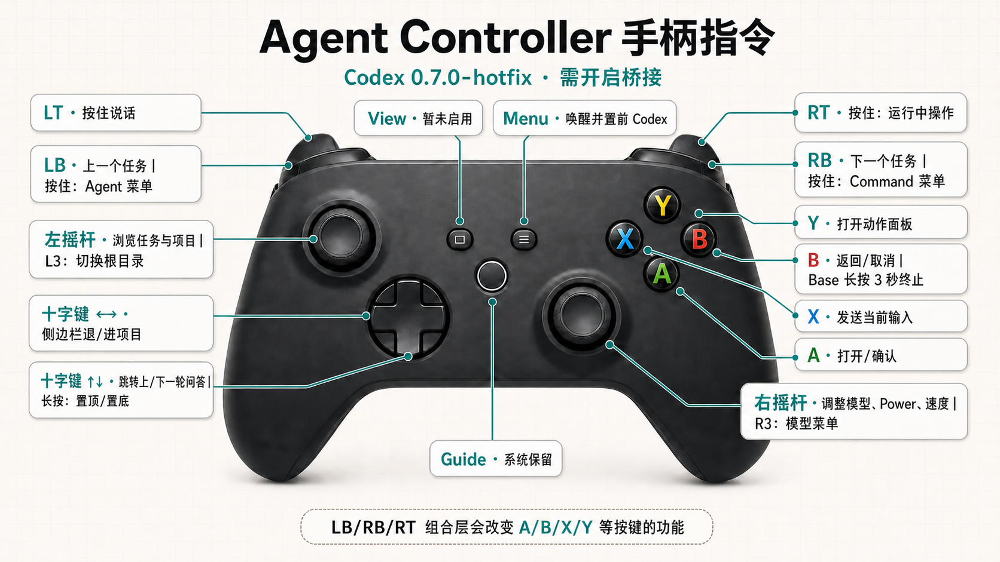

# Agent Controller

[](README.md)
[](README.zh-CN.md)

 



Codex Micro 很快就断货了。这款专为 Codex 设计的小键盘，你想买吗？但你注意到没有：

- Codex 小键盘有一个旋钮、一只摇杆，手柄有两只摇杆。
- Codex 小键盘有十二个键，就算没有背键，手柄的可用控制也更多。
- Codex 小键盘其实不算好看，也谈不上什么人体工学设计。
- Codex 小键盘的价格加运费，可以买很多只手柄。
- Codex 小键盘还要等邮寄。
- 最关键的是，Codex 小键盘不能用来玩游戏。

手柄完胜，证毕。（当然，摸着良心说，六个变色灯还是挺少手柄能那么瞎眼的。）

> 对了，语音输入需要额外的麦克风，这俩一般都不能自己录音。

于是，研究对接方案，又注意到（注意力不够就用 AI 注意）：

- Codex Micro 提供了可供集成的 SDK；
- Codex 可以编程、建模，也能响应快捷键；
- 很多手柄同样可以编程、改键和建模。

那么，就可以有一个软件，让手柄去代替 Codex Micro。

> 你的下一部键盘，何必是键盘？

我指挥 Codex，两小时做出样品，又花了一天打磨交互（主要是跟 Codex 的界面搏斗），终于基本成型。这就是 Agent Controller。

- 首先是启动 Codex 桌面版，或者在需要时将它置于前台——按菜单键（Xbox 手柄上是 ☰，有的手柄叫 Start 或 `+`）。
- 用**左摇杆**分层遍历任务目录：上/下在同级条目中移动，右进入项目，左退出项目；焦点在任务上时，按 **A** 打开任务。按下左摇杆（**L3**），可以快速切换置顶任务、置顶项目、项目和未归项目任务四个区域。
- 用**右摇杆**控制当前模型设置：简易模式下，左/右调整 Power，上选择 Standard，下选择 Fast；短按 **R3** 会打开官方模型列表，可直接选择 5.6 Sol Max 等模型。高级模式下（⚠️ 目前仍不够顺畅），左/右切换 Model、Effort 和 Speed，上/下调整当前选项。
- 如何录音？一直按住 **LT**，松开就是停止。
- 如何发送？按 **X**。
- 如果想删除输入框的全部内容，按 **Y**，再按两次 **A** 确认。
- 如果想取消正在运行的任务，长按 **B** 三秒，等待屏幕倒计时结束。短按 B 则会在适用场景关闭菜单或撤回最近的导航。
- 十字键上/下可以跳到上一轮/下一轮问答；按住上四秒回到顶部，按住下三秒回到底部。
- 如何新建任务？按 **Y**，再按十字键上。

至此，手柄优先的纯 Vibe Coding 功能，基本完成。

首次公开版本用 8BitDo Ultimate 2、Xbox Series 和 Flydigi Vader 4 Pro 实测了上述常用功能。某热心网友也反馈，几十元的 GameSir（小鸡）手柄连接没有什么问题。其他 XInput 兼容手柄应该也能工作，但还没有逐一完成端到端真机验证。

你可能还会问，Codex Micro 的六个 Agent 键呢？按住 **LB**，再用十字键四个方向、视图⧉或菜单☰键，选择屏幕上的六个 Agent 槽位。

> ⚠️ **安全提示——使用前请读**
>
> 这个实验性 v0.7 原型由 **Codex 使用 GPT-5.6 Sol 在一天内完成**，没有经过独立的人工代码或安全审计。Codex 更新可能改变快捷键或辅助功能树，导致 UI Automation 失效或误操作；程序也未签名。请先审查源码，只用非关键任务试用，并自行承担全部风险。应用在你机器上会做的事：
>
> - 向 **Codex 窗口**发送键盘快捷键与 UI Automation 指令；手柄输入默认要求 Codex 位于前台，关闭“桥接”后会阻止手柄控制；
> - 读取 `~/.codex` 下的本机任务数据；启用降级绑定时，可以向 Codex 的快捷键配置追加 F17/F18/F20/F22；
> - 在 `%LOCALAPPDATA%` 写入自身设置；
> - 可选注册开机自启（默认关闭）；
> - **不发起任何网络请求**，唯一涉网行为是在浏览器中打开厂商或 Codex 链接。
>
> Agent Controller 是独立实验项目，与 OpenAI、Codex、Work Louder 没有隶属、授权或背书关系。

### 使用要求

- Windows 10（build 19041+）或 Windows 11
- 已安装 Codex 桌面版
- XInput 兼容手柄
- 如果需要按住说话功能，还需要麦克风

当前实测设备为 8BitDo Ultimate 2、Xbox Series 和 Flydigi Vader 4 Pro。其他 XInput 手柄能否正常使用取决于其 XInput 实现，仍需真机验证。

### 从 Release 下载安装

1. 到 [Releases](../../releases) 下载最新 zip。
2. 解压到任意目录，运行 `AgentController.exe`。
3. 程序未签名，Windows SmartScreen 可能拦截。请先阅读上方安全提示，再选择 **更多信息 → 仍要运行**；介意的话也可以自行构建。
4. 以 XInput 模式连接手柄，启动 Codex，并确认“桥接”已开启。连接成功后，设备页会显示手柄名称和本地化的 **实时输入 / Live input** 标记。
5. 部分功能可能需要重启 Codex 桌面软件（ ChatGPT）后生效，尤其是 Agent Controller 首次写入或更新 Codex 快捷键之后。

v0.7.0-hotfix Windows 包为自包含版本，不需要另行安装 .NET Runtime。

### 按键速查

#### 基础层

| 输入 | 行为 |
| --- | --- |
| 菜单键☰ | 在需要时唤醒并置前 Codex。Codex 已在前台时，连接的手柄回中后会自动启用输入。 |
| 左摇杆上/下 | 在 Agent Controller 的稳定侧边栏目录中移动焦点，不立即打开条目。 |
| 左摇杆或十字键左/右 | 退出/进入项目目录。 |
| L3 | 循环根目录：置顶任务 → 置顶项目 → 项目 → 未归项目任务。 |
| A | 打开当前任务；进入项目请使用右方向。 |
| X | 发送当前输入框文本。降级路径使用配置的提交快捷键，绝不使用 Enter。 |
| B | 在适用场景关闭菜单或撤回最近的导航；其他基础场景按住三秒取消当前运行，提前松开会中止倒计时。 |
| Y | 打开动作面板。 |
| 十字键上/下 | 上一轮/下一轮问答；按住上四秒置顶，按住下三秒置底。 |
| 右摇杆（简易） | 左/右调整实时 Power；上选择 Standard；下选择 Fast。 |
| 右摇杆（高级） | 左/右选择 Model、Effort 或 Speed；上/下选择当前账户与模型实际提供的选项。 |
| R3 短按/长按 | 简易模式短按打开官方层级模型选择器，方向键导航、A 切换/进入/确认；选择完成后用 B/R3 显式结束会话。高级模式短按打开完整设置菜单。长按 500 毫秒打开 Agent Controller 设置。 |
| LB/RB 短按 | 打开上一个/下一个可用任务。 |
| LT 按住 | 开始按住说话，松开结束。 |

#### Y 动作面板

| 按下 Y 后的输入 | 行为 |
| --- | --- |
| 十字键上 | 新建任务 |
| 十字键右/左 | Codex 历史前进/后退 |
| 十字键下 | 显示或隐藏 Codex 侧边栏 |
| A，再按一次 A | 确认后清空输入框 |
| X | 项目上下文：进入所属项目，或在项目内切换全部/仅置顶 |
| B 或 Y | 关闭面板 |

#### 按住组合层

| 层 | 输入 |
| --- | --- |
| 按住 LB——Agent | 十字键上/右/下/左选择 Agent 槽位 1–4；View 选择槽位 5；Menu 选择槽位 6；B 取消。 |
| 按住 RB——Command | Y 切换 Fast；A 批准；B 拒绝；X Fork；View 按住说话；Menu 根据当前界面调用 Send、Steer 或 Queue。 |
| 按住 RT——运行中操作 | X 明确 Steer；Y 明确 Queue；长按 B 三秒 Stop 当前运行；A Fork。提前松开 B 会中止倒计时；Codex 没有显示对应控件时会安全失败。 |

右摇杆保持同一方向时，会在约两秒内逐渐加速：第一次动作立即发生，之后重复速度平滑上升；倾斜越深，最终速度越快。

如果当前选择提供 Speed、但不提供简易 Power——目前 Sol Max 就是这样——Agent Controller 会询问是否切换模式：按 **A** 切换到高级模式，按 **B** 保持简易模式；无论如何，Standard/Fast 仍然可用。拒绝后，同一个模型/强度组合不会反复提示，直到当前选择发生变化。

界面支持简体中文、English，或跟随 Windows 显示语言。

更完整的实现状态和边界情况，请参阅 [v0.7 手柄指令清单](public/docs/controller-command-reference-v0.7.md)与 [v0.7 版本说明](public/docs/release-v0.7.md)。

### 已知限制

- 大部分动作依赖 Codex 当前版本的快捷键与辅助功能树，Codex 界面更新可能导致功能失效。
- 简易模型列表使用官方命令快捷键；快捷键冲突会被拦截。首次写入后若 Codex 未热加载，请重启一次 Codex。
- 单元测试和 Release 编译通过，不能替代针对当前 Codex 版本、账户、模型选项的真实手柄端到端测试。
- Agent 槽位目前取实时快照中的前六个任务；Agent 与 Command 槽位都还不能由用户配置。
- v0.7 尚未包含双拉锁定免手持录音、基础层 View 操作、Plan 模式手柄路由和虚拟 HID 桥接。

### 可以不止 Codex

目前只适配了 Codex，但项目中的手柄、能力和 Agent 目标层已经为增加其他适配器留出了空间。如果确实有需求，Agent Controller 将来可以扩展到命令行工作流，以及 Claude Code 等其他编程 Agent。

这类扩展需要为目标工具单独实现任务发现、命令执行、状态检测和安全检查。当前对 Codex 的兼容，不代表现在已经兼容这些工具。

### 从源码构建

先安装 .NET 9 SDK，然后运行：

```powershell
dotnet build app/AgentController.csproj -c Release
dotnet test app.Tests/AgentController.Tests.csproj -c Release
./scripts/package-release.ps1 -Version 0.7.0-hotfix
```

编译产物位于 `app/bin/Release/net9.0-windows10.0.19041.0/`。封包脚本会在 `dist/` 生成自包含的 Windows x64 zip 与 SHA-256 校验文件。

### 如果你想改源码

思路上，模拟 Micro 的交互协议会更快，更少错误。但是GPT 5.6 Sol会一直拒绝，说什么这样不稳定，不如界面UIA。而它“稳定”界面的方法是加700到1400ms时延，不是人能忍受的操作。为了抢时间，我先让它继续这样搞。

直到今天早上我没忍住批评了它，因为右摇杆调模型这个功能，实在花了太久了。大概是“你都做错了五次以上了，还在这强调UIA好呢？？？你要用Micro的协议，早就做好了，那还用在这犟”。然后它终于开始模拟 Micro。

### 仓库结构

仓库中的主要路径为：

- `app/` —— Windows WPF 应用，也是运行时行为的事实来源；
- `app.Tests/` —— 手柄输入、本地化、导航、桥接安全和 Codex 集成策略的回归测试；
- `scripts/` —— 可复现的 Release 封包脚本；
- `docs/` —— 交互规范，以及进行中的设计和咨询记录；
- `public/docs/` —— 面向使用者的指令清单、版本说明和实验计划；
- `todo.md` —— 路线图和验证备忘。

### 致谢

手柄插图源自 CREATRBOI 的“White XBOX Controller”模型；许可证与署名文件随应用分发，位于 `THIRD-PARTY/` 目录。

### 许可证

本项目以 [PolyForm Noncommercial License 1.0.0](LICENSE) 提供：允许个人、研究及其他非商业用途使用、修改和分发，禁止未经另行授权的商业用途。由于包含非商业限制，本项目属于“源码可用”，而非 OSI 定义下的开源软件。
