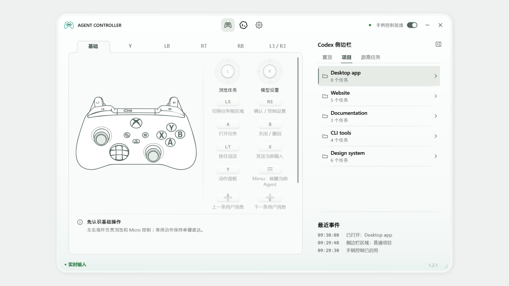

# Agent Controller

[](README.md)

Agent Controller，用手柄控制 Codex，或者你自行适配其他 Agent。支持 Xbox、八位堂等以 XInput 模式连接的手柄。



*开发版界面，使用示例数据。*

项目曾适配过 DeepSeek Harness 的 0.0.3，但后续没有维护。

## 当前源码与下载版

当前公开下载版为 [Agent Controller v1.2.1](https://github.com/gantrol/AgentController/releases/tag/v1.2.1)，支持 Windows 10（build 19041+）和 Windows 11 x64。自包含 ZIP 无需另装 .NET；`-compact` 精简包需要 [.NET 10 Desktop Runtime x64](https://dotnet.microsoft.com/en-us/download/dotnet/10.0)。该版本的完整 Micro 控制路径仍需另装虚拟 HID 驱动，安装要求见[旧版驱动说明](virtual-micro/UNSIGNED-DRIVER.zh-CN.md)。

当前源码已改用软件接口，不再依赖虚拟 HID 驱动。这些改动尚未包含在公开的 1.2.1 安装包中，真实手柄到 Codex 的端到端验收仍待完成。

下一待发布版本为 **1.2.2**，详见[发布说明](public/docs/release-v1.2.2.md)；目前尚未公开发布。

源码构建需要 .NET SDK 10.0.302，以及精确版本为 `1.0.0` 的两个 `CodexControl` 包。先从对应的 [codex-control](https://github.com/gantrol/codex-control) 源码构建，或在发布后取得对应版本包，再运行：

```powershell
.\scripts\import-control-packages.ps1 -PackageDirectory <包所在目录>
dotnet build app/AgentController.csproj -c Release
```

## 相关项目

- [Codex Micro Monitor](https://github.com/gantrol/codex-micro-monitor)：独立的桌面小键盘与任务监控工具，已发布 [0.3.15](https://github.com/gantrol/codex-micro-monitor/releases/tag/v0.3.15)，提供应用、插件和源码下载，无需 Agent Controller 或虚拟 HID 驱动。
- [codex-control](https://github.com/gantrol/codex-control)：Agent Controller 与 Codex Micro Monitor 共用的控制组件。

## 许可证与致谢

本项目采用 [GNU General Public License v3.0 only（GPL-3.0-only）](LICENSE)，允许商业使用；分发受 GPL 约束的作品时，须履行提供对应源码等许可证义务。第三方素材保留其各自的许可证与署名要求。

当前手柄插图改编自 [Saikel Orado Liu](https://github.com/Saikel-Orado-Liu) 为 [input-overlay](https://github.com/univrsal/input-overlay/tree/master/presets/xbox-controller) 制作的 Xbox Controller 素材。原作及本项目的矢量改编采用 CC0，详见[素材许可](app/ThirdParty/InputOverlay-Xbox/LICENSE.txt)。

本项目与 OpenAI、Work Louder 或上述手柄厂商没有隶属或背书关系。
