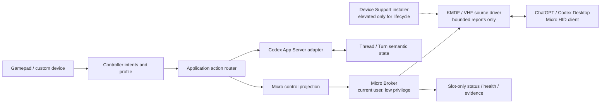

# ADR-0002：以原生 Codex Micro 信号作为完整控制体验主路径

> Status: Accepted for architecture; release blocked by identity authorization and driver certification
> Date: 2026-07-18
> Scope: Windows first, macOS parity research follows

## 决策摘要

Agent Controller 的完整产品模式必须让 ChatGPT/Codex Desktop 看到一个真正的、双向的 Micro 类 HID 设备，并发送与真实 Codex Micro 同类的 Agent Key、Command Key、Analog、Dial、状态和灯光协议。单纯用 UI Automation、快捷键或 App Server 模拟最终动作，不算完成这项能力。

同时，Micro 不是所有业务操作的替代协议。架构固定分成两条互补平面：

- **设备平面**：对真实 Micro 能表达的交互，优先投影成 Micro HID 信号，由 Codex 自己解释当前布局、Composer 焦点、Reasoning、Skill 和灯光状态。
- **语义平面**：Thread、Turn、Steer、Interrupt、审批状态、历史和流式事件继续使用 [Codex App Server](https://learn.chatgpt.com/docs/app-server)；本地任务树、任意任务打开和 Micro 没有表达能力的动作也走语义端口。

Windows 软件版的正式发行基线选定为：

1. 极小的 **KMDF/VHF HID source driver**；
2. 当前用户会话中的低权限 **Micro Broker**；
3. 普通权限运行的 Agent Controller 桌面客户端；
4. 仅负责 `install / update / repair / uninstall` 的签名提权安装器。

驱动对“完整 Micro 模式”是必需组件。基础应用仍允许在驱动被企业策略阻止时进入 **Limited mode**，但 Limited mode 不得被宣传为完整控制体验，也不得继续扩建一套平行的 UIA 仿制品。

## 为什么现在必须改方向

[OpenAI 官方 Codex Micro 文档](https://learn.chatgpt.com/docs/features/codex-micro)已经公开确认了设备级能力：六个 Agent Key 及状态灯、可自定义 Command Key、按住和双击锁定的 PTT、四向模拟杆、可遍历 Composer 控件的旋钮、Reasoning-only 模式、灯光和电池状态。这些行为由 Codex 的设备集成持有，不是稳定的 UI 控件树。

继续为同一能力维护 UIA 定位、按钮文案、多层弹窗、坐标、快捷键和 readback，会形成两套不断漂移的实现。原生 Micro 信号把最脆弱的“当前界面是什么”交还给 Codex；Agent Controller 只负责把手柄输入准确投影为设备动作，并对未知构建熔断。

这不代表观察到的 HID ABI 已成为公开 API。当前冻结证据只覆盖特定 Codex 构建，见：

- [`codex-26.707.12708-vhf-status-input.zh-CN.md`](../codex-26.707.12708-vhf-status-input.zh-CN.md)
- `virtual-micro/` 中针对 26.707 与 26.715 的指纹和协议验证

因此，“原生优先”与“版本门禁”必须同时成立：已知构建走 Micro；未知构建不猜测、不探测性点击、不自动改走可能重复执行的第二通道。

## `virtual-micro/` 给出的事实

`virtual-micro/` 已经证明以下机制可以在本机连通，但它仍是参考实现，不是可直接交付的安装包：

- 设备身份为 VID `0x303A`、PID `0x8360`、Usage Page `0xFF00`、Usage `0x01`；Report ID `0x06`，每份 report 64 bytes，payload 最多 61 bytes。
- Device→Codex 使用带 LF 的 UTF-8 JSON 消息，Codex→Device output 在完整 JSON 后结束而不带 LF；两侧分包规则不对称。
- `v.oai.hid` 表达按键，`v.oai.rad` 表达模拟杆角度/距离；驱动提交结果至少需要区分 `NotSent / Accepted / OutcomeUnknown / Rejected`。
- `sys.version`、`device.status`、`v.oai.rgbcfg` 与 `v.oai.thstatus` 是设备保持在线和状态反馈所需的最小双向 RPC 集合。
- `composer-navigation` 已能让旋钮遍历输入框上方的 Composer 工具和菜单；主程序不应再把所有旋钮事件硬编码成 Reasoning 增减。
- PTT 必须保留真实 down/up 生命周期；进程退出、控制器断连或 Broker 崩溃时必须释放 held key 并发送模拟杆 neutral。

当前参考目录里同时存在三套驱动：KMDF/VHF、UMDF2/VHF、直接 UMDF HID minidriver。README/DESIGN 把 KMDF/VHF 描述成正式路径，安装脚本却安装 `CodexMicroVhfUm.dll` 和 `Root\CodexMicroHidUm`。本机当前也是 UMDF2/VHF devnode 正常运行、旧 KMDF 服务停止；Driver Store 中还残留多个旧 `oem*.inf`。这证明协议 PoC 成立，也证明现有安装/升级/卸载尚未达到产品要求。

此外，当前 Agent Controller 自己的 `app/Services/Micro` 只有少数硬编码动作，重复维护 codec，通过一个外部并不存在于正式产品中的 named pipe 发送，并把 `Accepted` 与 `OutcomeUnknown` 压回近似 `bool`。它不能作为新结构继续扩建。

## 目标运行结构



### 组件边界

#### 桌面客户端

- 读取控制器、上下文和用户 Profile，生成设备无关 `ActionRequest` 或 `MicroControlIntent`。
- 不接收任意 HID byte、任意 `v.oai.*` method 或任意 INF 路径。
- 显示 Micro 健康、实际发送通道、映射是否已验证以及结果证据。
- 正常运行、升级 UI 和修改绑定均不提权。

#### Micro Broker

- 作为随桌面客户端启动的当前用户进程运行，不安装常驻高权限服务。
- 独占打开驱动私有接口；IPC DACL 限制为当前用户，协议带版本、epoch、sequence、长度和有界队列。
- 持有 Micro RPC、Codex 构建指纹、布局快照、held-key/neutral 生命周期和 exactly-once response。
- 只向驱动提交结构合法的 64-byte report batch；只向桌面端暴露类型化动作，不暴露 raw-report API。
- Broker 随普通应用一起签名和更新，不因协议适配变化再次请求 UAC。

这里不默认使用 Windows Service。服务可以把私有设备接口进一步限制到 service SID，但会增加常驻特权面、安装状态、跨会话逻辑和每次 Host 更新的提权成本。首版用低权限 Broker、独占句柄、严格 IOCTL 校验和活动会话租约；若以后要支持多用户/RDS，再单独做威胁模型和 ADR。

#### KMDF/VHF 驱动

- 只创建 HID child、排队 input report、转发 output report、验证 batch header/report 长度和清理连接状态。
- 不解析 JSON、不读取 Codex 文件、不认识 Thread、Action、Skill 或用户配置。
- 所有队列有固定上限；每个请求恰好完成一次；断连后不会重放 OutcomeUnknown batch。
- 使用项目自己的唯一 root hardware ID，例如 `ROOT\AgentController\MicroCompat`。微软也建议 root-enumerated 设备使用公司和设备名组成的唯一命名空间，避免 `ROOT\SYSTEM` 一类冲突。[Hardware IDs for root-enumerated devices](https://learn.microsoft.com/en-us/windows-hardware/drivers/install/hardware-ids)
- VHF child 的目标 VID/PID/Usage 只在“设备身份发布 Gate”通过后进入正式包。

#### Device Support 安装器

- 是唯一带 `requireAdministrator` 的组件；桌面主程序永不整体提权。
- 只接受固定命令和固定产品包，不接受调用方提供的任意 INF、Hardware ID、服务名或删除目标。
- 返回稳定 JSON schema、明确退出码和 `rebootRequired`，便于 UI、静默企业部署和支持工具共用。
- 安装器 EXE 自身必须 Authenticode 签名，驱动包必须是 Microsoft 返回的签名包；两者解决的是不同信任提示。

## 建议的文件组织

```text
src/
  AgentController.Domain/
    Devices/MicroControlIntent.cs         # 不出现 HID byte 或 v.oai.*
  AgentController.Application/
    ControlSurface/MicroProjection/
    Diagnostics/DeviceSupport/
  AgentController.Protocols.Micro/        # 纯 codec、framing、RPC DTO、golden vectors
  AgentController.Adapters.Micro/         # 指纹、布局、Broker client、ActionResult 映射
  AgentController.MicroBroker/             # Windows 首版的低权限 broker host
  AgentController.Platform.Windows/
  AgentController.Platform.MacOS/

native/
  windows/
    AgentController.MicroVhf/              # 唯一正式 KMDF/VHF driver
    AgentController.DeviceSupport/         # install/update/repair/uninstall

compat/
  codex-desktop/<build>/manifest.json      # bundle hash、ABI、layout 能力

packaging/
  windows/device-support/
    manifest.json                          # 版本、架构、签名者、SHA-256
    x64/
    arm64/

tests/
  AgentController.Protocols.Micro.Tests/
  AgentController.Adapters.Micro.Tests/
  AgentController.MicroBroker.Tests/
  AgentController.Platform.Windows.Tests/
  AgentController.E2E.Tests/Micro/
```

迁移结束后删除 `app/Services/Micro` 的重复 codec、bool seam 和旧 pipe client；`virtual-micro/` 继续作为独立实验台，不能成为运行时隐式依赖。

## 手柄到 Micro 的默认投影

原则不是“把所有手柄动作塞进 HID”，而是“只要真实 Micro 有等价控件，就发送真实设备控件；没有等价控件则使用语义平面”。

| 现有手柄意图 | Micro 投影 | 规则 |
| --- | --- | --- |
| LT 按住说话 | `ACT10` key down；松开 key up | 不再调用 UIA 录音按钮；断连必须释放。可选双击锁定也发送真实两次按下/释放时序。 |
| X 发送 | 当前布局中已验证为 Codex/Send 的 Command slot；官方默认是 `ACT12` | 映射未知时不猜 ACT12；提示恢复默认布局或使用明确的语义降级。 |
| Fork / Fast / Approve / Decline | 当前布局中对应 Command slot；默认分别为 ACT09、ACT06、ACT07、ACT08 | 高风险确认仍由 Application 安全策略控制，HID 只负责最后一次物理动作。 |
| 右摇杆横向重复 | `ENC_CC` / `ENC_CW`，`act=2` | 默认进入 `composer-navigation`，让 Codex 自己遍历 Model、Effort、Speed 和其他 Composer 控件，不再探测弹窗。 |
| R3 短按 | `ENC` down/up | 打开或确认当前 Composer 控件。 |
| R3 长按 | `ENC` down，超过官方 500 ms 阈值后 up | 打开 Codex Micro 设置；参考实现用 650 ms 留调度余量。 |
| RB + 右摇杆 | 连续 `v.oai.rad(a,d)`；释放或回中发送 `d=0` | 提供真实 Micro analog；只有越过激活阈值才触发，允许合并中间帧但绝不丢 neutral。 |
| B 在 Micro 菜单打开时 | 邻近旋钮的取消 Agent Key | 只有当前构建和槽位已验证才发送；三秒 Stop 仍是 App Server `turn/interrupt`。 |
| 选中六个 Micro Agent slot 之一并按 A | 对应 `AG00..AG05` 的真实 tap/double-tap | 单击只切换，双击 350 ms 内切换并前置 Codex；任务名必须有独立 roster 证据。 |
| 左摇杆任意任务树导航、任意任务打开 | 不强行投影 Micro | 本地 UI + App Server/deep link；真实 Micro 只有六个 Agent slot，不能冒充无限任务索引。 |
| Y 清空、新建任务；D-pad 轮次跳转；B 长按停止 | 只有官方布局明确提供相应 Command slot 时才用 Micro | 否则使用 App Server 或已有语义 adapter，不为它们新增 UIA Micro 仿制。 |

右摇杆从“硬编码模型控制器”改成“原生 Dial”是本次改造的关键。`composer-navigation` 让输入框上方工具遍历成为 Codex 自己的职责；Reasoning-only 只是用户可选的官方 Dial 模式，不能再由 Agent Controller 假定。

### 自定义按钮如何与官方布局共存

绑定编辑器需要支持两种不同目标，UI 必须明确区分：

- **Micro control binding**：物理按钮绑定到 `ACT06`、`ACT12`、`ENC`、Analog 等设备控件。Codex 设置拥有最终动作；用户在 Codex 中改映射后，手柄自然跟随。
- **Semantic action binding**：物理按钮绑定到 `composer.submit`、`turn.stop` 等语义。路由器只有在经过验证的 Micro layout 能表达该语义时才投影 Micro，否则走 App Server 或报告不支持。

从 `desktop.codex-micro-layout` 观察到的映射只能作为按构建指纹保护的只读快照。不得写回私有配置，也不得在映射未知时把某个 slot 名称猜成 Submit/Approve。

## 方案对比

| 方案 | 原生 Micro 保真度 | 用户安装 | 工程/发行风险 | 维护面 | 决策 |
| --- | --- | --- | --- | --- | --- |
| **KMDF + VHF 软件设备** | 完整双向 HID，可精确暴露 descriptor | 首装/驱动更新一次 UAC；无需额外硬件 | 需要 EV、HLK/WHCP、Microsoft 签名和内核质量门禁 | 驱动极小，协议留在用户态 | **Windows 软件版正式基线** |
| **直接 UMDF2 HID minidriver** | 理论上可完整模拟 | 与 KMDF 一样要 UAC 和驱动签名 | 官方支持 UMDF HID minidriver，但需要自己承担更多 HID IOCTL/transport 行为 | 内核崩溃风险低，代码面更大 | KMDF 认证失败时的备选 |
| **UMDF2 + VHF** | 本机 PoC 已连通 | 与其他驱动相同 | VHF 总览仍写明 HID source 仅支持 kernel mode，但 `VHF_CONFIG` 又公开了 user-mode `FileHandle`；支持边界矛盾 | 用户态隔离好，认证不确定 | 只做 HLK/微软确认实验，不作当前发行基线 |
| **预刷写 USB/BLE 硬件桥** | 最接近真实硬件 | 无 Windows 驱动和 UAC，插入即用 | 有 BOM、库存、固件更新、售后和同样的 VID/PID 授权问题 | OS 维护最低，硬件运营最高 | 免驱/企业环境第二 SKU |
| **ViGEm/vJoy/SendInput 等通用虚拟输入** | 不能暴露目标 vendor-defined descriptor/RPC，不会被识别为 Micro | 有的仍需第三方驱动，有的无需安装 | 解决的是游戏手柄/键鼠注入，不是目标协议 | 会再建一层错误映射 | 拒绝 |
| **App Server + UIA/快捷键** | 不会被 Codex 识别为 Micro，无双向灯光/布局 | 最容易 | App Server 稳定，但 UIA 继续受 UI 改版影响 | 无驱动却保留维护地狱 | Limited mode，不是竞争主路径 |
| **等待官方第三方 Micro API/allowlist** | 可以合法使用自有身份并获得最稳定兼容 | 取决于官方机制 | 依赖外部合作与时间表 | 长期最好 | 立即推进合作，但不能替代当前技术准备 |

Windows 没有供普通用户态应用直接发布任意 vendor-defined 系统 HID 的通用 API。只要目标仍是“Codex 把纯软件设备当成 Micro”，软件方案就必须经过一个受 Windows 信任的驱动；真正免驱的完整路线只有已经作为标准 USB/BLE HID 枚举的物理桥，或未来官方开放的等价设备接口。

微软公开的 [VHF 总览](https://learn.microsoft.com/en-us/windows-hardware/drivers/hid/virtual-hid-framework--vhf-)明确把正式路径描述为 KMDF/WDM kernel-mode source driver；与此同时，[`VHF_CONFIG`](https://learn.microsoft.com/en-us/windows-hardware/drivers/ddi/vhf/ns-vhf-_vhf_config) 又包含 UMDF 所需的 `FileHandle`。在 Partner Center/HLK 对 UMDF+VHF 给出可重复的正式证据前，不能用一次本机成功覆盖这个矛盾。

直接 UMDF HID minidriver 是不同方案，不等同于 UMDF+VHF。微软公开支持用 KMDF 或 UMDF2 构建 WDF HID minidriver；它能成为备选，但会把 VHF 已替我们处理的 HID transport 细节重新纳入项目维护。[Creating WDF HID Minidrivers](https://learn.microsoft.com/en-us/windows-hardware/drivers/wdf/creating-umdf-hid-minidrivers)

## 用户安装会遇到什么，以及如何避免

### 1. 没有管理员权限

Windows 把驱动包放入 Driver Store 和创建 software/root device 都要求管理员权限；`SetupCopyOEMInf`、`DiInstallDriver` 和 `SwDeviceCreate` 均不能让普通用户绕过这一点。[SetupCopyOEMInf](https://learn.microsoft.com/en-us/windows/win32/api/setupapi/nf-setupapi-setupcopyoeminfw)、[DiInstallDriver](https://learn.microsoft.com/en-us/windows/win32/api/newdev/nf-newdev-diinstalldriverw)、[SwDeviceCreate](https://learn.microsoft.com/en-us/windows/win32/api/swdevice/nf-swdevice-swdevicecreate)

规避方式不是教用户开管理员 PowerShell，而是：

- 基础应用按用户安装并正常启动；
- 用户点击一次“安装 Micro 兼容组件”，只让独立安装器触发 UAC；
- 普通运行和应用更新不提权；仅驱动版本变化、Repair 和 Uninstall 再提权；
- 没有管理员凭据时进入 Limited mode，并提供给 IT 的离线部署包，而不是循环弹 UAC。

### 2. 驱动签名和 SmartScreen/安全提示

正式用户不能自己编译一个 `.sys` 就使用。Windows 10 起的新 kernel-mode driver 需要 Hardware Dev Center 签名，Hardware Developer Program 提交需要 EV 证书。[Driver signing](https://learn.microsoft.com/en-us/windows-hardware/drivers/install/driver-signing)、[Driver signing options](https://learn.microsoft.com/en-us/windows-hardware/drivers/dashboard/driver-signing-offerings)

发布分层固定为：

- **开发**：自签名只在隔离开发机上使用；允许 WDK、测试证书和显式开发脚本。
- **受控测试**：attestation/preproduction 包只进入测试环。微软 2026 文档明确把 attestation 定位为 testing scenarios，不能面向 Windows Update 零售受众，也不是 Windows Certified。
- **正式发行**：运行完整 HLK/WHCP，提交 Hardware Dev Center，下载 Microsoft 签名的原样包；安装器另用组织的 Authenticode 证书签名。

因此，开源仓库可以让任何人审计和构建驱动，但普通用户必须下载项目发布者提供的 Microsoft-signed Device Support。社区 fork 若修改驱动，需要自己的组织身份、证书和 Hardware Dev Center 提交，不能复用本项目签名。

### 3. 企业策略、WDAC 与设备安装限制

公司电脑可能按 Hardware ID、device class、签名者或 WDAC 策略阻止驱动，管理员本身也可能不能覆盖。Windows 的设备安装限制是机器级策略，禁止规则可以优先于允许规则。[Manage Device Installation with Group Policy](https://learn.microsoft.com/en-us/windows/client-management/client-tools/manage-device-installation-with-group-policy)

产品必须：

- 把 `BlockedByPolicy` 与普通安装失败分开显示；
- 导出自己的 root Hardware ID、class GUID、发布者、包版本、哈希和所需 allow rule；
- 提供 Intune/Configuration Manager/离线 EXE 的静默安装参数与机器级日志；
- 绝不尝试关闭 WDAC、Memory Integrity、Secure Boot 或设备安装策略；
- 策略不允许时保持 Limited mode，而不是留下半安装 devnode。

### 4. Secure Boot、Memory Integrity、架构和重启

正式包至少覆盖 x64 与 ARM64；安装器先选择同架构包，禁止 32-bit helper 在 64-bit 系统调用 driver install API。KMDF 驱动必须通过 HVCI/Memory Integrity、Driver Verifier、睡眠唤醒和升级矩阵；Memory Integrity 在部分 Windows 11 新装设备默认启用。[HVCI driver compatibility](https://learn.microsoft.com/en-us/windows-hardware/test/hlk/testref/driver-compatibility-with-device-guard)

通常 PnP driver 可以无重启更新，但 API 明确允许返回 `rebootRequired`。安装器必须把它作为真实状态显示并延后激活，不能报告“已就绪”后让用户自己排查。驱动文件全部从 Driver Store 运行，避免因占用文件强制重启。[Avoiding restarts during driver updates](https://learn.microsoft.com/en-us/windows-hardware/drivers/install/avoiding-system-restarts-during-device-installations)

### 5. 更新、降级、重复设备与残留 INF

当前原生 helper 对任意 Root ID/INF 使用 `INSTALLFLAG_FORCE`；微软明确警告这可能用旧驱动覆盖更合适或更新的驱动。[UpdateDriverForPlugAndPlayDevices](https://learn.microsoft.com/en-us/windows/win32/api/newdev/nf-newdev-updatedriverforplugandplaydevicesw)

正式安装器改为以下事务：

1. 读取当前 devnode、published INF、版本、签名者和设备接口，创建回滚快照；
2. 验证下载 manifest、Microsoft signature、组织 signer、SHA-256、架构和固定 Hardware ID；
3. 以正常 Windows driver ranking 安装，普通 Install/Update 不传 FORCE；
4. 启动/重连 Broker，完成全链路健康检查；
5. 成功后才精确删除本产品更旧的 published INF；
6. 失败时，新装移除刚创建的 devnode；升级恢复旧签名包并复验；
7. 只有用户显式 Repair，且新旧版本/签名/Hardware ID 全部属于本产品时，才允许受控强制重装。

卸载只删除唯一 root devnode 和由安装记录确认归属本产品的 published INF，不使用模糊匹配、通配符或 `/force` 清理其他 HID driver。

### 6. 网络、离线安装和应用/驱动版本错配

- 在线安装先下载到版本化临时目录，完成签名与哈希验证后才提权；网络中断不会创建 devnode。
- 提供包含同一签名 manifest 的离线 Device Support 包；用户机器不需要 Visual Studio、WDK、PowerShell、Inf2Cat 或 SignTool。
- 桌面应用与 Broker 使用向后兼容的 versioned IPC；驱动 ABI 单独版本化。应用更新若兼容现有驱动，绝不要求 UAC。
- Driver update 先灰度，再扩大；微软建议在适用时使用 Windows Update 的受控发布、监控和回滚能力。[Safe deployment best practices](https://learn.microsoft.com/en-us/windows-hardware/drivers/develop/safe-deployment-best-practices-for-drivers)

### 7. “一键安装”仍可能失败

设置页不能只显示 Installed/Not installed。最低状态机为：

```text
NotInstalled
Downloading
AwaitingElevation
Installing
RestartRequired
Ready
UpdateAvailable
RepairRequired
BlockedByPolicy
IncompatibleArchitecture
SignatureInvalid
CodexBuildIncompatible
RollbackCompleted
RollbackFailed
```

用户可见操作固定为“安装 / 更新 / 修复 / 卸载 / 导出诊断”。诊断包含版本、Hardware ID、published INF、签名状态、devnode error、HID descriptor 摘要、Broker handshake 和 Codex fingerprint；默认不包含 prompt、任务标题、文件路径正文或原始 RPC payload。

## 安装后健康检查

安装完成只有同时满足以下条件才进入 `Ready`：

1. 唯一 root devnode 存在且 ConfigManager error 为 0；
2. 当前 driver provider、版本、published INF 和 Microsoft signature 与 manifest 一致；
3. VHF HID child 出现，VID/PID/Usage/Report ID/长度与兼容 manifest 一致；
4. Broker 能独占打开私有接口并完成 versioned ping；
5. Device→Codex input 和 Codex→Device output 各完成一轮受限回环；
6. `sys.version`、`device.status`、`rgbcfg`、`thstatus` request 每个恰好回应一次；
7. 发送 neutral 后没有 held key 或非零 analog；
8. Codex 当前构建指纹已知，并观察到它实际打开/请求该 HID，而不是只证明 Windows 枚举成功。

第 8 项是产品健康与普通驱动健康的区别。Device Manager 的“设备工作正常”不能证明 Codex 已把它识别为 Micro。

## 设备身份是正式发布的第一阻塞项

当前协议使用的 VID `0x303A` 由 Espressif 标识；Espressif 的公开说明只对其特定 USB Device/TinyUSB 场景给出使用条件，并不自动授权这个虚拟产品使用 PID `0x8360`。[Espressif USB VID/PID](https://documentation.espressif.com/projects/esp-iot-solution/en/latest/usb/usb_overview/usb_vid_pid.html)

USB-IF 的 VID 申请条款明确把 VID/PID 分配给单一公司，并要求他方使用获得书面批准；未经授权使用 assigned 或 unassigned VID/PID 被明确禁止。[USB-IF Vendor ID form](https://www.usb.org/sites/default/files/vid_only_form_070119.pdf)

即使最终法律意见认为纯软件 VHF child 不参加 USB Logo 认证，它仍在向 Codex 冒充第三方设备身份。正式发行前必须完成以下路线之一：

1. **首选**：OpenAI/Work Louder 提供第三方兼容计划，让 Codex allowlist 项目自有 VID/PID 或新的官方兼容身份；
2. 获得 VID 持有人和相关产品方对精确身份的书面许可，并完成品牌/兼容性声明审查；
3. 如果只能使用项目自有 VID/PID，则先证明 Codex 官方构建会识别该身份；只“购买自己的 VID”但 Codex 不识别，没有产品价值；
4. 在授权未完成前，精确身份仅限隔离开发/研究，不进入公开二进制、商店包或商业宣传。

这项 Gate 高于驱动实现。不能先花完 HLK/安装器成本，最后才发现目标身份不可合法发布。

## macOS 路线

macOS 不应复用 Windows driver。Apple 已提供 CoreHID `HIDVirtualDevice` 来模拟系统可见的 HID，并公开了 virtual HID entitlement；若 CoreHID 能暴露目标 vendor-defined descriptor，它是 Mac 首选研究路径。[HIDVirtualDevice](https://developer.apple.com/documentation/corehid/hidvirtualdevice)、[System Extensions entitlements](https://developer.apple.com/documentation/bundleresources/system-extensions)

Mac 的安装摩擦从 UAC/WHCP 变为：

- Apple Developer ID、notarization 和可能需要申请的 `com.apple.developer.hid.virtual.device` entitlement；
- ChatGPT 官方要求的 Input Monitoring 权限；
- Agent Controller 自己需要的 Controller/Microphone/Accessibility 权限必须按用途分别请求；
- entitlement 未获批时，物理 USB bridge 是唯一仍能提供完整原生 Micro 信号且不安装 System Extension 的路线。

因此 macOS 可以先发布语义能力预览，但不能把“不含原生 Micro”称为与 Windows 完整模式等价。Mac GA/full parity 的完成条件包含 CoreHID 或物理桥的原生 Micro 验证。

## 分阶段改造

### Gate 0：身份与可发行性

- 向 OpenAI/Work Louder/VID 持有人确认第三方兼容和身份方案；获得书面结果。
- 用自有 ID 与目标 ID 分别做 Codex detection matrix，确认过滤发生在 VID/PID、Usage、device type 还是组合条件。
- 选定自己的 root Hardware ID、interface GUID、产品/Provider 名称、升级和卸载所有权规则。
- 在这一步未通过前，不制作公开 Release driver。

### M1：冻结唯一协议源

- 从现有两份 codec 中提取 `AgentController.Protocols.Micro`。
- 导入 `virtual-micro` 已验证的 framing、UTF-8 边界、RPC handler 和 golden vectors；不复制其 UI。
- 建立 Codex build fingerprint manifest，未知版本 fail closed。
- 把 layout snapshot、protocol capability 和 device health 分开建模。

### M2：迁移手柄投影

- 从 `MainWindow` 移出 PTT、virtual-dial/右摇杆和 held lifecycle。
- 增加 `MicroControlIntent`，由 Profile/Context 投影到 slot、encoder 或 analog。
- 首先完成 LT→PTT、X→verified Codex slot、右摇杆→Dial、R3→press/hold、RB+右摇杆→Analog。
- 所有结果保留 sequence、requested/accepted count、native status 和 `OutcomeUnknown`，禁止 bool 化。

### M3：Broker 与唯一 Windows driver

- 以 `virtual-micro` 的 KMDF/VHF driver 为机械参考，删除另外两条生产构建路径。
- Broker 负责 JSON/RPC/指纹/布局/neutral；driver 保持不解析 JSON。
- 完成 Codex detection、output RPC、1000 次动作、断连、睡眠/唤醒和 app/Codex 重启测试。
- 单独用 UMDF+VHF 做 HLK preflight；只有 Microsoft 支持边界和认证证据均成立，才允许新 ADR 改选。

### M4：一键 Device Support

- 把现有 native helper 改造成固定命令、签名 manifest、幂等事务和结构化诊断的安装器。
- 删除用户路径中的 PowerShell、自签根证书、Inf2Cat、SignTool、任意 INF/Hardware ID 和默认 FORCE。
- 完成 x64/ARM64、clean install、update、rollback、repair、uninstall、reboot 与 policy-blocked 矩阵。

### M5：认证与灰度发布

- 取得 EV 证书并注册 Hardware Developer Program。
- 运行 HLK/WHCP、Driver Verifier、HVCI、Secure Boot、Windows 10/11 和 OS upgrade 测试。
- 安装器与 app 做独立签名；driver 每次变更重新提交，不能修改 Microsoft 返回包。
- 小规模自托管正式包验证后，再评估 Windows Update driver flighting/rollout。

### M6：移除 Micro 可表达动作的 UIA 主路径

- PTT、Composer dial、Fast、Fork、Approve/Decline、Submit、Analog 等已验证动作不再维护 UIA 实现。
- UIA 仅保留 Micro/App Server 都无法表达的 Limited mode 能力，并设删除期限和兼容数据。
- 自定义按钮默认绑定语义或 Micro control，不允许输入原始 report/RPC。

### M7：macOS full parity

- 验证 CoreHID virtual device 的 descriptor、双向 output、Codex detection 和 entitlement 审核。
- 若 entitlement/身份不可行，评估同一预刷写硬件桥作为 Windows/macOS 共用免驱 SKU。
- 完整模式与 Limited preview 在下载页和应用内明确区分。

## 验收与 Go/No-Go

### 原生行为

- Codex 设置能检测设备，并对六个 Agent slot、六个实体 Command Key（Mic 的 raw control 保持成对 down/up）、Analog 和 Dial 完成真实交互。
- Agent Key 单击/350 ms 双击、PTT hold/double-tap、Dial step/press/500 ms hold 与 Analog center→direction→center 均符合官方可见行为。
- `composer-navigation` 能遍历 Model、Effort、Speed 及其他 Composer 控件；测试不读取 UIA 控件树来驱动动作。
- 状态灯按 SlotOnly 保留 Idle/Thinking/Complete/Requires input/Error/Off；无 roster proof 时不把 slot 编造成任务名。
- 每类动作连续 1000 次无丢失、重复、卡键或遗漏 neutral；OutcomeUnknown 后不自动重复非幂等动作。

### 安装体验

- 干净标准用户设备从点击到 Ready 只出现一次 UAC，发布者已验证；不安装 WDK/VS，不运行 PowerShell，不导入根证书，不更改 Secure Boot/HVCI。
- 拒绝 UAC、没有管理员、企业策略阻止、网络断开、签名损坏和重启所需都有独立、可恢复的结果。
- 普通 app/Broker 兼容更新无 UAC；driver update/repair/uninstall 才提权。
- 升级失败能恢复旧包；卸载后没有产品 devnode、私有接口、安装记录引用的旧 INF 或启动项。
- x64/ARM64、Windows 10/11、Secure Boot/HVCI on/off、睡眠唤醒和 OS feature update 矩阵通过。

### 发布 Gate

以下任一项缺失均为 No-Go：

- 目标 VID/PID/产品身份的书面可发行依据；
- 唯一驱动架构与 Hardware ID；
- EV + Hardware Developer Program + HLK/WHCP/Microsoft signature；
- 签名一键安装、精确卸载、失败回滚和企业部署材料；
- 已知 Codex build compatibility manifest 与未知构建熔断；
- 无 UIA 参与的 Micro 全链路验收证据。

## 对其他模型分析的修正

引用分析中“App Server 主链 + 驱动可选组件”的技术分工基本正确，但产品措辞需要修正：

- App Server 是语义主链，不是 Micro 设备平面的替代品。
- 驱动可以不阻止基础应用启动，但对 Windows **Full Micro mode 是硬依赖**，不是可随时砍掉的附加实验。
- 现有 UMDF2/VHF 本机成功不能直接决定发行架构；微软 VHF 文档矛盾必须通过 HLK/官方确认解决。
- 除驱动签名外，`0x303A:0x8360` 的设备身份授权是更早的商业发布 Gate。
- Windows Update 适合后续安全更新和灰度，但首次安装仍需要产品自己的提权引导、root devnode 生命周期和立即健康检查。

最终目标不是“永远不需要维护”，而是把维护从每个 Codex UI 改版都要追的 UIA 规则，收敛为版本化协议指纹、一个极小驱动、一个用户态 Broker 和可审计的发行流程。这是可预测、可测试、可以商业支持的维护面。
