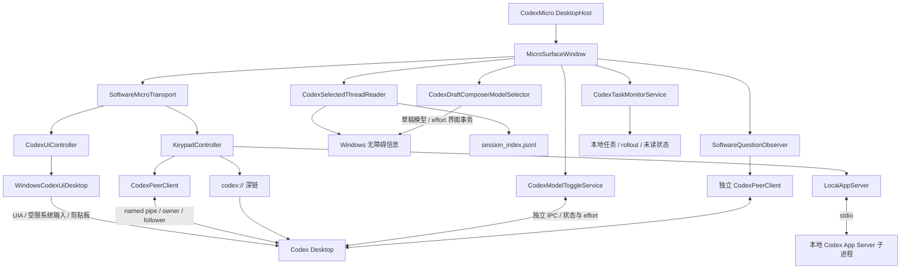
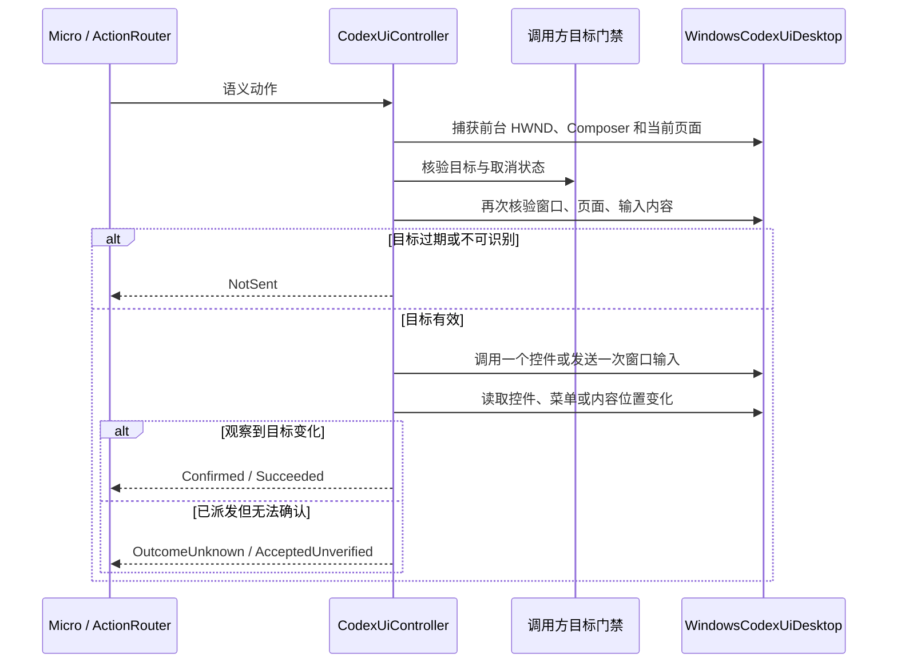
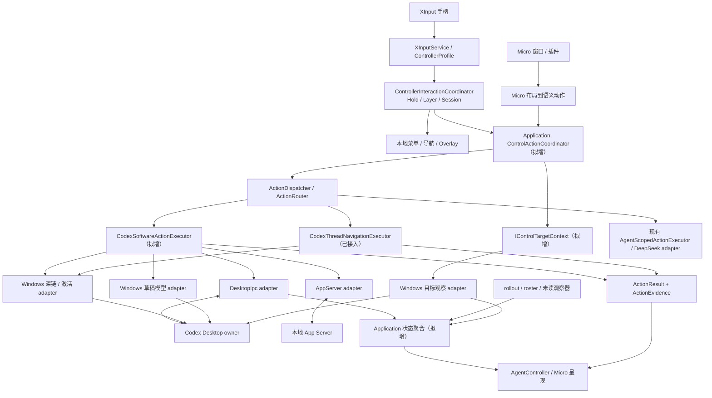
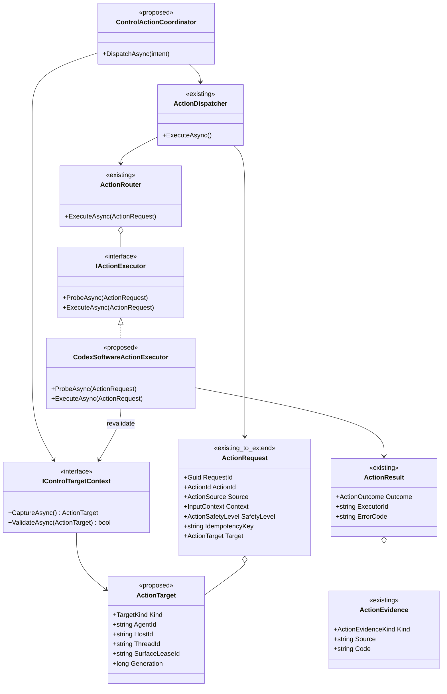
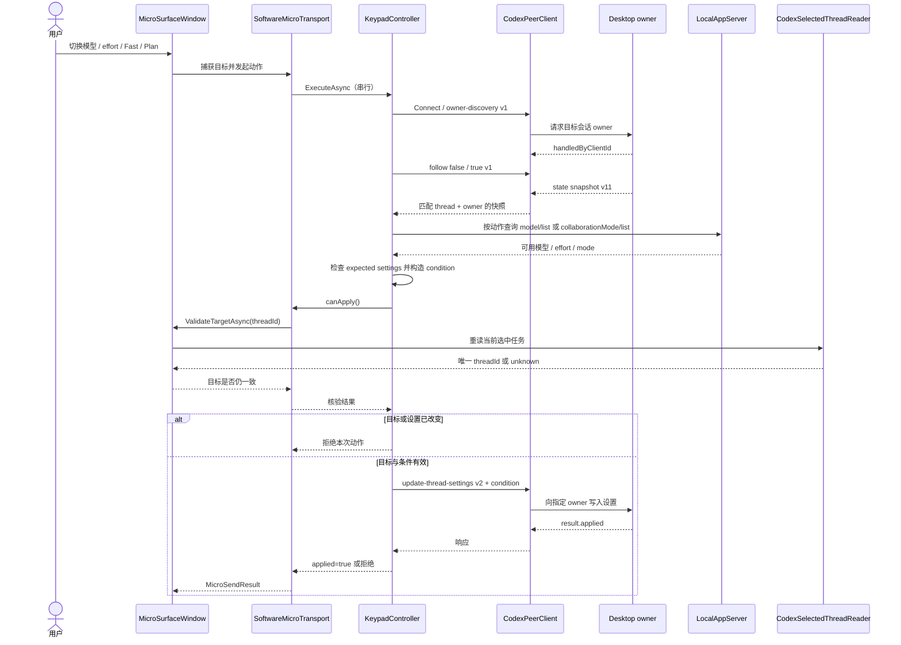
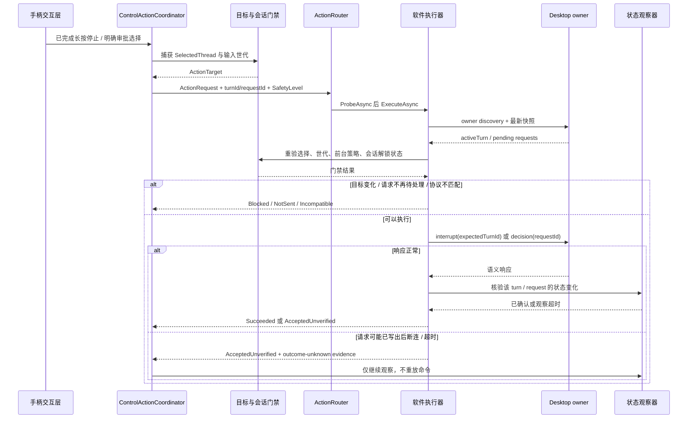
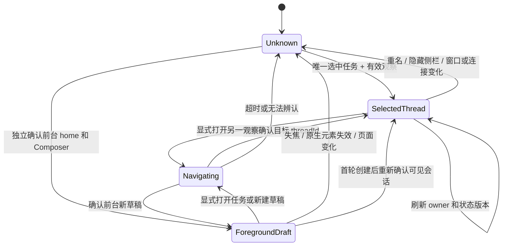
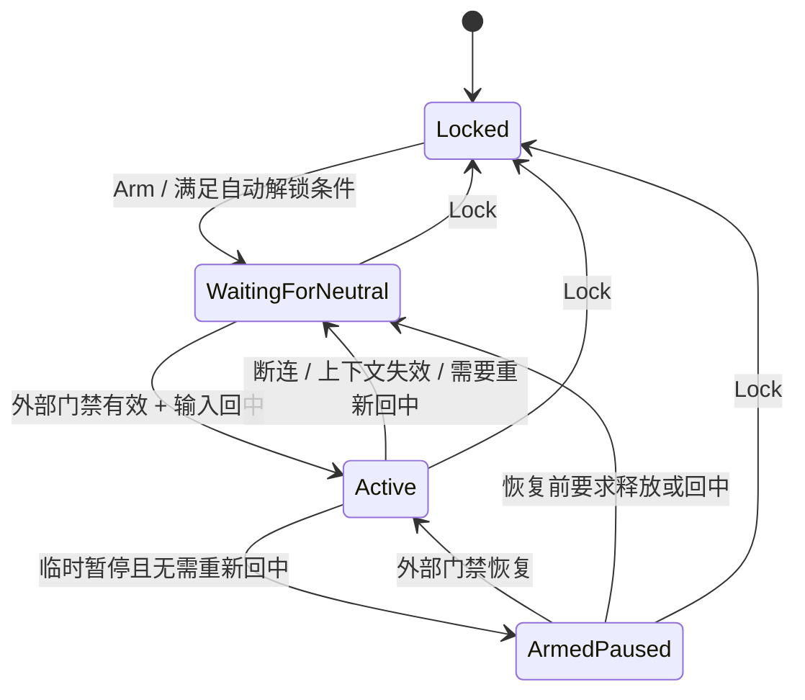

# AgentController 免驱版 UML

> 状态：Windows 主程序已切换免驱装配；真实手柄与 Codex 端到端行为仍待验收
> 日期：2026-10-03
> 基线：`855ff8c` 及梳理时的工作树；包含尚未提交的 Micro 草稿适配
> 范围：Windows / 本机 Codex；复用现有手柄交互和 WPF 界面

### 首轮实施进度

- `src/AgentController.Adapters.Codex.Software` 以 `net10.0` 编译，不引用 WPF、MicroSurface、Broker 或 HID 协议程序集；客户端已转为固定版本的 `CodexMicro.Codex` 包，见[组件依赖](micro-component-dependency.zh-CN.md)。
- 新增 `src/AgentController.Adapters.Codex.Windows`，单独承接 UIA、窗口识别和系统剪贴板；依赖 Application，供 Micro 和 AgentController 共同调用。
- AgentController 的 `thread.open` / `thread.create` 已装配 `CodexThreadNavigationExecutor`，调用 `CodexSoftwareClient`；打开使用显式任务 ID，新建通过深链打开空白草稿。返回 `AcceptedUnverified`，打开任务沿用已有导航观察与撤回机制。
- 新建草稿在实际派发前重新核验门禁；两类动作都重新检查所选 Agent，退出时取消尚未派发的操作。导航失败不追加 UIA 或快捷键调用。
- Micro 软件入口已接入提交、Composer 菜单导航/选择、滚动、侧栏、前进/后退和技能提及。AgentController 的提交、侧栏、历史与滚动边界动作通过 `CodexUiActionExecutor` 装配；物理旋钮调用当前 Agent 的 Composer 软件导航、选择与取消接口。
- `AppComposition` 不再创建 VHF transport 或提供 HID 执行器回调；`App` 不再承载 Broker 子进程入口，主程序项目移除 Broker 引用。分叉、审批与语音使用已有软件操作，发布脚本不再附带 Micro 驱动安装指南。
- 软件旋钮适配原始 detent 的前后方向；选择前在同一执行门内确认菜单仍打开，未知观察不投影成已关闭。语音记录启动时的 Agent / Composer，松开或切换 Agent 后仍向原会话发送命名停止动作；清理允许失焦和暂停控制，不使用停止快捷键回退。
- `CodexComposerService` 的旧 transport 注入接缝和协议单元测试仍保留；默认软件装配使用无传输实例，不连接设备。不可用传输先于布局读取返回，软件操作不依赖 Micro 自定义键帽或 encoder 配置。Broker / Protocol 项目仅保留在历史路线和对应测试中。
- 本轮完成运行依赖切换，未完成本文所有目标架构拆分；模型 / effort 的另一条 IPC 实现、统一目标和状态合同仍待收敛。软件动作的存在不代表真实手柄端到端验收通过。

以下 UML 保留现状与目标对照；标注“拟增”的类型仍未实现。

免驱版的主链路：**控制器输入 → 语义动作 → Codex 软件接口 → 状态回读**。保留 Micro 的交互思路，将虚拟 HID 从这个版本的运行依赖中移出。

本文的“现有”表示源码存在，“拟增”表示待实现；源码存在不代表端到端验证通过。组件视图使用 Mermaid flowchart，类图、时序图和状态图使用对应 UML 表达。

## 1. 现有实现与迁移边界

| 部分 | 源码现状 | 对 AgentController 的意义 |
| --- | --- | --- |
| Micro 独立入口 | `MicroSoftwareControl` 默认开启，创建 `SoftwareMicroTransport` | 已有可参考的软件运行链路 |
| AgentController 入口 | 导航走共享软件执行器；提交、侧栏、历史、滚动边界走 Windows UI 执行器；旋钮与语音走当前 Agent 的 Composer 软件接口 | 已移除 Broker / VHF 启动和发布依赖；剩余直接软件调用可继续收敛到语义动作 |
| 共享程序集 | IPC / App Server 后端已抽出；`SoftwareMicroTransport` 仍在 WPF 内引用 Broker / Micro 协议类型 | 后端边界已建立，窗口兼容层还需逐步去除协议类型 |
| Desktop IPC | 当前用户 `codex-ipc` named pipe；发现会话 owner 后发送 follower 请求 | 已有会话的设置、Turn、审批通道；属于版本相关的桌面内部接口 |
| Local App Server | 启动 `codex app-server --stdio` | 列表、模型目录、模式目录、分叉；与 Desktop owner 是不同连接 |
| 当前会话 | 读取侧栏无障碍选中项，再以本地 `session_index.jsonl` 标题唯一匹配 ID | 隐藏侧栏、重名或缺失匹配均不能当作已确认目标 |
| 空白草稿 | 工作树已有 `MainWindow.Software.Draft.cs`，绑定前台 home / Composer 上下文 | 没有确认的会话目标时，须独立识别草稿；预热 thread ID 不能证明草稿归属 |
| 状态观察 | 模型 IPC 流、问题 IPC 流、rollout / 未读 / roster 读取并存 | 迁移时需要统一状态来源、版本和过期规则 |

### Micro 当前组件视图

`SoftwareMicroTransport` 是旧 Micro 窗口的兼容接缝：返回 `BrokerDriverInfo`、`MicroSendResult`，把不支持的动作返回成 `NotSent`；`SetKeyAsync(true)` 执行 tap，release 直接返回 Accepted。因此它不能直接替换手柄的 report transport，也不能承接 PTT 的持续按住语义。

当前 effort 交互还存在另一条路径：`MainWindow.Reasoning` 对已有会话调用 `CodexModelToggleService.StepCurrentThreadEffortAsync` / `SetCurrentThreadEffortAsync`。后者自身实现 IPC，迁移不能只提取 `SoftwareControl` 文件夹。

### Windows 界面动作

UI 动作与 IPC 连接状态独立；未知结果不重试，不回退到 HID。技能插入保留编辑器原有内容与选区语义，通过 HTML 剪贴板写入带名称、路径的提及，并回读选中的原子验证。剪贴板已被其他操作改变时不覆盖其新值。无 ScrollPattern 时，在确认前台窗口与会话区域后发送一次系统滚轮输入，并观察消息控件的位置变化；仅当指针仍停在适配器放置的位置时恢复原位置。无法确认边界位置时保留未知结果。

## 2. AgentController 目标组件视图

图中 Application 的控制协调器、目标合同和软件执行器为拟增；`ActionDispatcher`、`ActionRouter`、手柄协调器及输入门禁已有实现。

- `AGxx`、`ACTxx`、`ENC` 和布局 action 字符串在 Micro 入口翻译；手柄入口直接产生 Agent 无关的 Action。
- 复用 `AgentScopedActionExecutor` 的 Agent 隔离，Codex 的 owner、IPC method/version 和 JSON 留在 adapter 内。
- 新的软件版本在装配时选择软件能力。保留旧 HID 版本期间，两者使用明确的装配边界；一次命令只选择一个执行器。
- 状态观察独立于动作执行；显示的任务灯光来自会话状态投影，不能声称读到了硬件 RGB 或原生槽位顺序。
- 稳定会话的业务动作优先复用软件通道。草稿模型 adapter 是有明确目标租约的窄分支，不能由“找不到会话 ID”直接触发。

### 代码归属

以下为逐步形成的边界，不要求先创建全部空项目。第一轮将 Desktop IPC 与 App Server 放在同一 `Adapters.Codex.Software` 项目的不同目录，业务拆分和公开 DTO 收敛随后进行。

| 来源 | 目标归属 | 保留 / 拆分内容 |
| --- | --- | --- |
| `app/Controllers`、`app/Core/Bridge` | 先保留，再逐片移入 Application / Domain | 按键边沿、层切换、长按、死区、回中和 foreground/session 语义 |
| `MainWindow` 的动作分发与 `MainWindow.Software` 的目标核验 | `Application/ControlSurface` + Windows adapter | 前者编排；后者读取原生窗口与无障碍数据 |
| `KeypadController` | Application 用例 + `Adapters.Codex.DesktopIpc` / `Adapters.Codex.AppServer` | 拆开业务策略、目录查询、owner 寻址和 wire 请求 |
| `CodexPeerClient`、模型 / 问题状态 accumulator | `Adapters.Codex.DesktopIpc` | 共用协议实现；动作快照和长期状态订阅仍可有不同生命周期 |
| `LocalAppServer` | `Adapters.Codex.AppServer` | stdio 生命周期、目录和 fork；共享后必须保证串行交换或实现独立响应关联 |
| `CodexSelectedThreadReader`、草稿 selector | `Adapters.Codex.Automation.Windows` | Codex 专属的无障碍选择与草稿事务 |
| `XInputService`、窗口激活、URI 打开 | `Platform.Windows` | 原生输入与操作系统调用 |
| `SoftwareMicroTransport` | Micro 呈现兼容层 | 薄映射；逐步去除 Broker DTO，AgentController 不引用它 |

## 3. 动作与目标类图

`ActionRequest.Target` 是拟增字段，当前代码只有 `Parameters` 和标签式 `InputContext`。目标合同放在 Domain，解析和租约管理放在 Application / adapter；`ThreadId`、`SurfaceLeaseId` 按目标种类可空，窗口句柄、owner client ID、协议版本不进入 Domain。

`TargetKind` 拟分为 `ExplicitThread / SelectedThread / ForegroundDraft / Unknown`。明确任务的打开动作使用 `ExplicitThread`；“当前会话”设置、停止、审批使用捕获的 `SelectedThread`；草稿只使用当前前台窗口的 `SurfaceLeaseId`。停止和审批另外携带确切 `turnId` / `requestId`，并在执行前核验。

现有 `ActionRouter` 先 probe 全部执行器，再按优先级选择一个执行器；**没有执行失败后遍历下一执行器的重试循环**。保留这个性质。现有 `IdempotencyKey` 也仅是请求字段，不代表 Desktop IPC 已提供去重保障。

## 4. 已有会话设置时序（当前 KeypadController 路径）

图中合并了 `get_keypad_state` 与设置命令内部的重复 owner / snapshot 读取。当前快照读取完成后会发送 unfollow；界面模型反馈另由长期状态流更新。`ifModelEquals` / `ifEffortEquals` 使用原始字段，保留“字段缺失”和 `null` 的区别；Fast / Plan 不具备同等的完整服务端条件字段，后续仍需回读最终值。

## 5. 停止 / 审批时序（AgentController 目标）

当前 Micro 审批键仅允许快照中恰有一个可支持的审批；多个待处理请求必须先选定具体 request。普通问答的已回答 / 已跳过观察不等同于审批权限。

### 结果投影

| 软件结果 | 现有 Domain 投影 | 后续处理 |
| --- | --- | --- |
| 能力未实现 | `Unsupported` | 不进入旧通道补发 |
| 协议 / shape 不匹配 | `Incompatible` | 本动作不发送 |
| 未解锁、目标未知或风险门禁失败 | `Blocked` | 等待有效上下文 |
| 可证明命令未写出，例如串行入口忙 | `NotSent` | 新操作重新捕获上下文；不自动继承旧目标 |
| 已收到请求回执，未确认最终业务状态 | `AcceptedUnverified` + `Transport` | 等待相关状态 |
| 可能已写出，但没有确定回执 | `AcceptedUnverified` + `outcome-unknown` 错误码 / 证据 | 禁止自动重试、切通道或重发 toggle |
| 已有与目标动作关联的最终状态证据 | `Succeeded` + `State` / `UiObservation` | 更新呈现 |
| 已收到明确业务拒绝 | `Failed` 或按原因归入 `Blocked` | 保存拒绝原因 |

现有 `ActionOutcome` 没有 `OutcomeUnknown`；首轮迁移采用上表保守投影，并保留独立的投递状态。打开深链的 `opened=true` 只证明 URI 已提交；停止 ACK 不证明 turn 已终止；模型设置成功不证明进行中的 turn 改用了新模型。跨动作不能共用一个“收到响应就是成功”的规则。

## 6. 目标状态机（拟增）

`null` 选择结果只能进入 Unknown；只有额外的前台草稿证据才进入 ForegroundDraft。发起导航即增加 generation 并暂停依赖“当前会话”的动作，确认新目标后才恢复。跨连接重建时丢弃旧 owner / snapshot，不自动复用上一次选择。

### 输入会话状态机（沿用现有类型，补充迁移事件）

`ControllerSession` 只保存这些阶段；连接、前台和输入有效性由外层协调。软件版仍需清空 repeat / held / pending gesture，恢复后不重放断连期间输入。PTT 尚未接通时返回 Unsupported，不能把 down/up 当成两次软件命令。长按 B 停止与短按 B 本地取消继续保持独立。

## 7. 首版能力矩阵

“候选”表示可安排迁移，不表示已验收。标为“拟增”的 Action ID 尚未进入 Application 合同。

| 能力 / Action | Micro 软件源码 | AgentController 免驱首版 |
| --- | --- | --- |
| 打开任务 `thread.open` | 显式 thread ID 深链 + 选择确认 | 已接共享执行器；沿用手柄侧栏观察，尚未做 UI 验收 |
| 新建 `thread.create` | 深链打开空白草稿 | 已接共享执行器；不宣称已创建持久 thread，尚未做 UI 验收 |
| 分叉 `thread.fork` | App Server fork，再打开返回 ID | 候选；区分已分叉与打开失败，禁止因导航失败再次 fork |
| 模型 / effort（拟增 `thread.model.set` / `thread.reasoning.set`） | owner settings + model catalog | 首版核心；旋钮 / 摇杆先计算绝对目标值 |
| Fast / Plan（拟增 `thread.fast.set` / `thread.plan.set`） | owner settings + tier / mode 校验 | 首版核心；串行化并核验当前目标 |
| 停止 `turn.stop` | `expectedTurnId` interrupt | 候选；保留长按阈值和 `HighRisk` |
| 审批 `approval.accept` / `approval.decline` | 指定 pending request 的 command / file decision | 候选；保留明确选择和既有确认门禁 |
| Review（拟增 `review.open`） | 带 `view=review` 的深链 | 候选；按回读证据区分已请求 / 已打开 |
| 显式文本发送（拟增 `turn.start`） | `send_keypad_message` 后端 / 插件入口存在 | 后续；只针对调用方提供的文本与空闲任务 |
| 发送可见草稿 `composer.submit` | Windows UI adapter 调用发送控件并观察草稿消耗 | 已装配；仅激活窗口不算提交成功 |
| 清空可见草稿 `composer.clear` | 不属于此次补齐的 Micro 操作 | 保留既有独立路径 |
| 空白草稿快捷模型 / effort | 工作树有独立前台 selector 分支 | 单列能力；限定草稿租约，完成独立迁移后开放 |
| PTT / 语音 | 软件按键未接通 | 暂不可用；持续输入合同另行设计 |
| Composer 控件导航 / 滚动 / Skill 插入 | 已接 Windows UI adapter | Micro 入口已接；手柄旋钮与技能动作合同仍待迁移 |
| Codex 侧栏 / 历史导航、会话滚动 | 已接 Windows UI adapter | 侧栏、历史和滚动边界已装配 ActionRouter |
| Steer / Queue | 未接通 | 不把这些控件当作普通 Send |
| 多会话状态 / 未读 / 问答反馈 | IPC 与本地观察器已有实现 | 复用并标注来源、时效；不能把本地推断当作命令成功 |

## 8. 实施顺序与完成条件

| 阶段 | 改动 | 可审查结果 |
| --- | --- | --- |
| 1. 抽共享边界 | 从 Micro WPF 抽出 IPC / App Server 客户端和数据合同 | AgentController 能引用软件 adapter，且不加载 Micro 窗口 |
| 2. 收拢目标与状态 | 提取当前选择、navigation generation、owner / revision 和草稿租约 | 两种控制入口遵守同一目标核验规则；旧响应不能覆盖新上下文 |
| 3. 接通首条切片 | `thread.open`，随后模型 / effort / Fast / Plan | 手柄输入 → ActionRouter → 软件执行器 → 回读完整闭环 |
| 4. 迁移特定请求动作 | fork、stop、approval、review | 每次写操作绑定明确目标；投递不明时不重复执行 |
| 5. 切换软件装配与打包 | 梳理 `MainWindow` 全部直接 Micro 调用及 executor 内回退，移除软件版本的 VHF / Broker 引用和启动依赖 | 无虚拟 HID 的机器可启动；未接通能力明确不可用；旧配置有迁移规则 |
| 6. 按能力扩展 | 草稿、PTT、Composer 导航、发送与 Queue / Steer | 每项有独立目标合同和结果证据后再开放 |

需要在实施中补齐的合同：

1. **兼容性**：当前 `KeypadController` 检查状态广播 v11，请求各有版本；尚无完整 build / schema 能力矩阵。软件 executor 的 Probe 需要按方法与状态 shape 判定兼容，不能以 pipe 连通代替能力可用。
2. **并发**：现有 semaphore 只约束单个实例；Micro 与 AgentController 同时运行时没有跨进程动作互斥。不能把本地 `IdempotencyKey` 当作全局 exactly-once；设置使用条件更新，非幂等命令保持单次投递并回读。
3. **投递证据**：当前 `CodexPeerClient` 将部分协议拒绝与断连都抛为 `IOException`，transport 因而保守返回 OutcomeUnknown。提取时须区分发送前失败、明确拒绝、写出后未知。
4. **状态归属**：owner 变化或 patch revision 断档必须重新获取 snapshot；动作 ACK、renderer 状态和 rollout 推断分别保存证据。
5. **持有语义**：快捷模型与 Fast 等可逆动作可规定排队 / 合并策略；发送、分叉、停止和审批不继承旧输入队列，也不因恢复连接自动执行。

## 9. 源码与旧决策索引

| 证据 | 路径 |
| --- | --- |
| Micro 默认软件入口 | [DesktopHost 项目](../../virtual-micro/src/CodexMicro.DesktopHost/CodexMicro.DesktopHost.csproj)、[启动装配](../../virtual-micro/src/CodexMicro.DesktopHost/App.xaml.cs) |
| Micro transport 接缝 | [SoftwareMicroTransport](../../virtual-micro/src/AgentController.MicroSurface.Wpf/SoftwareControl/SoftwareMicroTransport.cs)、[MicroSurface 项目](../../virtual-micro/src/AgentController.MicroSurface.Wpf/AgentController.MicroSurface.Wpf.csproj) |
| 共享项目与导航入口 | [Software 项目](../../src/AgentController.Adapters.Codex.Software/AgentController.Adapters.Codex.Software.csproj)、[CodexThreadNavigationExecutor](../../src/AgentController.Adapters.Codex.Software/CodexThreadNavigationExecutor.cs) |
| 语义命令 / owner / 快照 / IPC / App Server | 已迁入固定版本的 `CodexMicro.Codex` 包，见[组件依赖](micro-component-dependency.zh-CN.md) |
| Windows 界面动作与回读 | [CodexUiController](../../src/AgentController.Adapters.Codex.Windows/CodexUiController.cs)、[WindowsCodexUiDesktop](../../src/AgentController.Adapters.Codex.Windows/WindowsCodexUiDesktop.cs)、[CodexUiActionExecutor](../../src/AgentController.Adapters.Codex.Windows/CodexUiActionExecutor.cs) |
| 当前选择与导航核验 | [MainWindow.Software](../../virtual-micro/src/CodexMicro.Desktop/MainWindow.Software.cs)、[CodexSelectedThreadReader](../../virtual-micro/src/CodexMicro.Desktop/Services/CodexSelectedThreadReader.cs) |
| 草稿分支（工作树） | [MainWindow.Software.Draft](../../virtual-micro/src/CodexMicro.Desktop/MainWindow.Software.Draft.cs)、[DraftContext](../../virtual-micro/src/CodexMicro.Desktop/Services/CodexDraftComposerModelSelector.Context.cs)、[Reasoning](../../virtual-micro/src/CodexMicro.Desktop/MainWindow.Reasoning.cs) |
| 状态与问答 | [CodexModelToggleService](../../virtual-micro/src/CodexMicro.Desktop/Services/CodexModelToggleService.cs)、[SoftwareQuestionObserver](../../virtual-micro/src/AgentController.MicroSurface.Wpf/SoftwareControl/SoftwareQuestionObserver.cs)、[CodexTaskMonitorService](../../virtual-micro/src/CodexMicro.Desktop/Services/CodexTaskMonitorService.cs) |
| 手柄装配与输入 | [AppComposition](../../app/Composition/AppComposition.cs)、[ControllerInteractionCoordinator](../../app/Controllers/ControllerInteractionCoordinator.cs)、[ControllerSession](../../app/Core/Bridge/ControllerSession.cs) |
| 现有动作合同 | [ActionRouter](../../src/AgentController.Application/Actions/ActionRouter.cs)、[ActionRequest](../../src/AgentController.Domain/Actions/ActionRequest.cs)、[ActionResult](../../src/AgentController.Domain/Actions/ActionResult.cs) |
| 显式文本发送入口 | [McpServer](../../micro-bridge/CodexPlugin/McpServer.cs) |

[ADR-0002](../adr/0002-codex-micro-native-compatibility.zh-CN.md)、[原生 Micro 待办](../../todo/03-codex-micro-compatibility.md)与[旧目标结构](target-project-structure.zh-CN.md)记录驱动优先的原生兼容路线。这里新增的是 AgentController 软件版本的实施方向：驱动签名、HID 身份和原生灯光等门槛仍属于原生兼容路线，不作为软件版本的启动前置条件。App Server 与桌面内部 IPC 的职责按当前源码分别记录；本文不宣称后者是公开稳定 API。

验证使用私有冻结源码快照，避免运行中程序占用输出目录。新增私有场景覆盖目标变化、取消、未知结果与控件选择；原生 UIA 夹具验证真实 Windows pattern 调用，当前安装版只读检查与技能解析器合同另行记录。上述证据不等同于真实聊天发送、真实剪贴板技能插入或整个手柄免驱版本的端到端验收。
