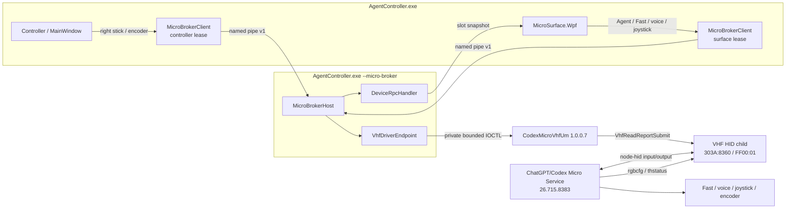
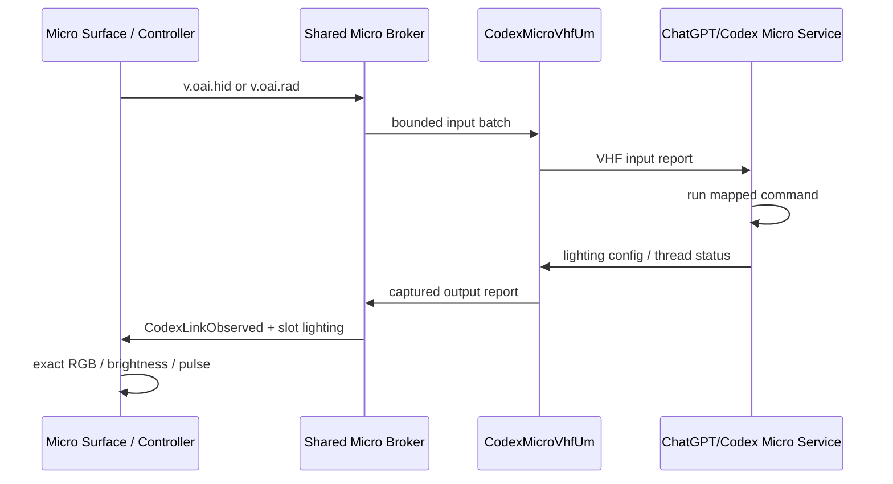

# Codex Micro / VHF 链路与二分定位（2026-07-21）

## 结论

右摇杆、Fast、语音和旋钮共用同一条 Micro HID 输入链；Agent Controller
不应按 ChatGPT/Codex 包版本决定是否发送，也不允许退回 UI Automation。
兼容边界只依赖稳定的 HID 身份和已经冻结的报告协议：

- `VID_303A / PID_8360 / UsagePage FF00 / Usage 01`
- Report ID `6`，固定 64 字节，RPC channel `2`
- `v.oai.hid` 与 `v.oai.rad`

本机的 ChatGPT/Codex `26.715.8383.0` 把 Micro 发现逻辑从
`WLDeviceDiscovery.findWLDevices(...)` 改成了原生 HID topology watcher，随后按
interface path 做重连与热插拔协调；Work Louder 的报告解析器和 OAI RPC 包并未变化。
因此驱动 `1.0.0.7` 固定两个 VHF child 的 Instance ID，并把产品 VID/PID
Hardware ID 放在通用 `HID_DEVICE_SYSTEM_VHF` 之前。应用层不含 Codex 版本白名单。

灯光问题是独立的显示缺陷：Codex 回传的绿色、蓝色、白色和呼吸效果均已到达
Broker，但 WPF 模板把六个中心灯写死成紫色。界面现在直接使用
`v.oai.thstatus` 的颜色、亮度和效果；`breath` / `shallowBreath` 会呼吸显示。

## 组件图

## 输入与灯光时序

## 二分结果

| 分割点 | 结果 | 证据 |
| --- | --- | --- |
| WPF / Controller → Broker | 通过 | 两个逻辑 client 均连接同一 broker child，独立持有输入 lease |
| Broker → 驱动私有 IOCTL | 通过 | `ACT06` press/release 与摇杆批次返回 `Accepted`、native status `0` |
| 驱动 → VHF child | 通过 | 64-byte report 全部被 `VhfReadReportSubmit` 接受 |
| Codex 发现 HID child | 通过 | 当前包的 native watcher 能枚举 `303A:8360 / FF00:01`；设置页显示 Connected |
| Codex → 驱动输出 | 通过 | `rgbcfg` / `thstatus` 持续到达，`CodexLinkObserved=true` |
| Codex 内部动作映射 | 兼容 | 当前 renderer 仍以 `act=1` 处理 Command Key / PTT press，以 `act=0` 处理 release，以 `act=2` 处理 encoder step |
| 灯光协议 → WPF | 已修复 | 原模板中心灯固定紫色；现按回传 RGB、亮度与呼吸效果显示 |

`VhfReadReportSubmit` 的 `Accepted` 只能证明报告进入 VHF，不等于 Codex 已执行命令；
因此黄色运行灯必须表示“驱动已就绪但尚未观察到 Codex 输出”，不能显示为全链路成功。

## 后续兼容规则

1. 不读取或比较 ChatGPT/Codex 包版本；只验证 HID ABI 和实际握手。
2. VHF child 的 Instance ID、Hardware ID、VID/PID、Usage 和 report descriptor
   视为稳定 ABI，升级驱动不得随意变化。
3. topology change 后让 Codex 重新枚举同一稳定 interface；不缓存旧的易变路径。
4. 输入只走 Micro HID；UI Automation 仅可读取非权威的辅助展示信息，不能充当输入回退。
5. 以 Codex 回传的 output report 作为端到端连接信号，以 slot lighting snapshot
   作为灯光事实源。
