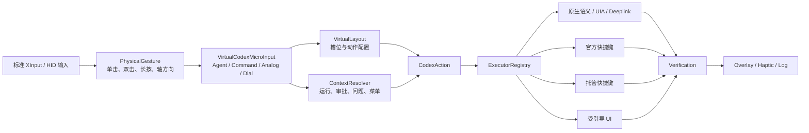

# Agent Controller 交互规范 v0.4a

## Codex Micro 语义模型、操作频率与手柄适配架构

| 项目 | 内容 |
| --- | --- |
| 状态 | Draft |
| 规范版本 | v0.4a |
| 规范仓库 | `D:\AgentController` |
| 本版范围 | Codex Micro 语义、操作频率、上下文、执行与反馈契约 |
| 暂不包含 | 具体 ABXY、肩键、扳机、摇杆按压等物理按键分配 |
| 配套版本 | [v0.4b 物理手柄映射](interaction-spec-v0.4b-physical-controller-mapping.md) |
| 上游基线 | Codex Micro、ChatGPT desktop、Codex turn follow-up 行为 |

本文件替代旧项目中以固定 ABXY、组合键和 F13–F24 为中心的 v0.4 草案。旧草案可作为探索记录，但不再作为实现契约。

---

# 第一篇　总：产品契约

## 1. 总—分—支的阅读方式

本规范按“总—分—支”组织：

- **总**：规定产品是什么、什么必须稳定、什么不得固化。
- **分**：把输入、语义、上下文、执行和反馈拆成可独立演进的层。
- **支**：逐项展开 Agent Keys、Command Keys、Steer、Queue、摇杆、旋钮、审批等行为。

任何具体手柄映射都必须先满足“总”的产品契约，再复用“分”的分层模型，最后落到相应的“支”。不得从某个实体按钮直接跳过语义层调用 Codex 命令。

## 2. 核心结论

Agent Controller **不是** Codex Micro 的 USB/HID 仿真器，而是 Codex Micro 的软件语义适配器。

系统必须建立以下完整链路：

```text
物理输入
  → 物理手势
  → 虚拟 Codex Micro 输入
  → 上下文角色
  → Codex 语义动作
  → 可替换执行器
  → 经验证的反馈
```

其中：

- 固件或控制器只负责稳定地产生标准输入。
- Agent Controller 负责手势、布局、上下文、动作目录和执行策略。
- Codex 更新造成的变化应由主机端适配器吸收。
- 快捷键只是一种执行通道，不是产品语义，也不是固件 ABI。

## 3. 目标

本规范有五个目标：

1. 在标准 XInput 手柄上表达 Codex Micro 的核心工作模型。
2. 保留 Agent Keys、Command Keys、四向模拟输入和旋钮的语义，而非机械复制外形。
3. 覆盖 Codex 桌面端高频且有时效性的操作，包括运行中的 **Steer**。
4. 让 Codex 命令、快捷键和 UI 变化尽量不要求升级控制器固件。
5. 为 v0.4b 的实体按键设计提供稳定的频率、上下文和安全依据。

## 4. 非目标

本版不做以下事情：

- 不安排具体 ABXY、肩键、扳机、十字键或摇杆按压。
- 不要求控制器具有 L4、R4、P1、P2 等增强按键。
- 不仿真 Work Louder 设备身份、灯光协议或无线协议。
- 不把 Codex 内部命令 ID 当作公开、长期稳定的 API。
- 不声称通过一个命令菜单即可安全覆盖全部 Codex 操作。
- 不以某个时点统计出的命令数量作为完成度指标。
- 不覆盖非 Codex 应用的通用桌面控制。

## 5. 规范用语

本文使用以下约束等级：

- **必须（MUST）**：不满足即违反本规范。
- **应该（SHOULD）**：通常必须满足，只有明确记录理由时才能偏离。
- **可以（MAY）**：可选增强。
- **不得（MUST NOT）**：明确禁止。

## 6. 设计原则

### 6.1 Codex Micro 语义优先

当 Codex Micro 已定义某项行为时，Agent Controller 必须优先复用它的名称、状态和交互边界。

例如：

- Agent Key 是“任务槽”，不是任意快捷键。
- Command Key 是“可配置动作槽”。
- “发送 composer 消息”是语义动作，Enter 或 F22 只是可能的执行方式。
- Steer、Queue、Stop 和 Fork 是四个不同动作。

### 6.2 快捷键兜底

动作执行策略应优先使用语义明确且可验证的通道；快捷键用于补足缺少稳定 UI 自动化或原生接口的动作。

固件和手柄配置不得包含：

- Codex 内部命令 ID；
- F13–F24 等桥接按键的固定业务含义；
- 某一 Codex 版本专属的菜单顺序；
- 具体任务 ID、线程 ID 或窗口句柄。

### 6.3 固件稳定，主机演进

固件只需稳定输出按钮、轴和基础手势。以下内容必须由 Agent Controller 管理：

- Codex 动作目录；
- 虚拟 Codex Micro 布局；
- 物理手势到虚拟输入的映射；
- 上下文识别；
- 快捷键冲突处理；
- 版本兼容和降级；
- 可见反馈。

### 6.4 语义、手势和传输分离

以下三者不得混为一谈：

| 层次 | 示例 | 稳定性 |
| --- | --- | --- |
| 语义动作 | `turn.steer` | 产品级，最稳定 |
| 物理手势 | 单击、双击、长按、方向进入 | 设备级，中等稳定 |
| 执行传输 | UIA、deeplink、快捷键、App Server | 适配级，允许频繁变化 |

### 6.5 上下文优先于静态映射

同一物理手势可在不同上下文承担不同角色，但上下文切换必须：

- 可检测；
- 可解释；
- 有优先级；
- 有防误触状态；
- 有明确反馈；
- 在上下文不确定时安全失败。

### 6.6 不得静默失败

系统无法执行动作时，必须返回 `Unavailable`、`Blocked`、`Conflict`、`Degraded` 或 `Failed` 之一。不得播放成功震动或显示“已完成”。

### 6.7 尊重用户现有配置

Agent Controller 不得覆盖用户已有快捷键、Follow-up behavior 或 Codex 设置。需要托管快捷键时，必须进行冲突检查、备份和幂等写入。

## 7. 官方 Codex Micro 基线

### 7.1 输入表面

| 表面 | 官方核心行为 | 可配置性 |
| --- | --- | --- |
| 6 个 Agent Keys | 跟随任务、显示状态、切换任务 | 可配置任务来源；不可改成 Command Keys |
| 6 个 Command Keys | 执行常用动作 | 每槽可重新分配动作 |
| 四向模拟输入 | Plan、前进、侧边栏、后退 | 每方向可分配桌面命令或 Skill |
| 旋钮 | Composer navigation 或 Reasoning only | 两种模式 |
| 灯光 | 表示任务、录音、选择和设备状态 | 可调亮度与自动熄灭时间 |

### 7.2 Agent Keys 默认语义

- 默认跟随最近更新的六个任务，包含置顶和未置顶任务。
- 单击切换任务，但不把 ChatGPT 强制带到前台。
- 350 ms 内双击切换任务并把 ChatGPT 带到前台。
- 自定义模式下，空槽被触发时打开新任务；用户开始该任务后自动绑定到该槽。

### 7.3 Command Keys 默认动作

六个默认动作是：

1. 切换 Fast mode。
2. 批准当前请求。
3. 拒绝当前请求。
4. 在新任务中继续当前任务，即 Fork。
5. 按住说话。
6. 发送 composer 中的消息。

### 7.4 四向模拟输入默认动作

| 方向 | 默认动作 |
| --- | --- |
| 上 | 切换 Plan mode |
| 右 | 应用历史前进 |
| 下 | 显示或隐藏侧边栏 |
| 左 | 应用历史后退 |

### 7.5 旋钮默认语义

- 默认在 composer 控件和选项之间移动，初始焦点是 Reasoning。
- 旋转改变焦点或选项。
- 按下打开或选择当前控件。
- 长按 500 ms 打开 Codex Micro 设置。
- 可切换为 Reasoning only 模式。
- 菜单打开时必须提供一个明确的取消角色。

## 8. Codex 桌面补充语义

Codex Micro 的默认 Command Keys 没有给 Steer 和 Queue 各自设置独立键帽，但 Agent Controller 必须覆盖这两个桌面端核心行为。

定义如下：

- **Steer**：把新消息加入当前仍在执行的 turn，不创建新 turn。
- **Queue**：保存消息，等待当前 turn 完成后再用于下一次 turn。
- **Dispatch default**：执行用户在 `Settings > General > Follow-up behavior` 中选择的默认行为。

Steer 不等于：

- Stop 或 Interrupt；
- Queue；
- Fork；
- 新建任务；
- 回答审批；
- 修改当前 goal。

## 9. 稳定边界与版本

| 层 | 建议版本 | 变化触发条件 | 是否要求固件更新 |
| --- | --- | --- | --- |
| Hardware profile | `hardwareProfileVersion` | 新控制器或轴特性 | 通常否 |
| Gesture schema | `gestureSchemaVersion` | 新增手势类型 | 极少 |
| Virtual Micro schema | `virtualLayoutVersion` | 虚拟表面模型变化 | 否 |
| Codex action catalog | `actionCatalogVersion` | Codex 功能变化 | 否 |
| Codex adapter manifest | `adapterVersion` | 执行方式或兼容性变化 | 否 |
| User layout | `userLayoutVersion` | 用户重新配置 | 否 |

上游 Codex 更新时，应优先更新 action catalog 和 adapter manifest。不得因为 Codex 快捷键变化而要求升级控制器固件。

## 10. 总体架构



---

# 第二篇　分：分层模型

## 11. 物理输入层

### 11.1 职责

物理输入层只报告控制器事实，不解释 Codex 语义。

建议事件：

```text
ButtonDown(input)
ButtonUp(input)
Tap(input)
DoubleTap(input, intervalMs)
HoldStart(input, durationMs)
HoldEnd(input, durationMs)
AxisEnter(axis, direction, magnitude)
AxisRepeat(axis, direction)
AxisExit(axis)
DeviceDisconnected()
```

### 11.2 约束

- 必须使用物理位置标识，而不是厂商印刷的 ABXY 字母作为内部主键。
- 左摇杆方向与十字键方向必须保留为不同输入源；不得在输入层提前归一化为同一个 `Direction`。
- 左摇杆属于连续轴输入，十字键属于离散按钮输入；两者的死区、重复和释放规则必须分别配置。
- 必须支持死区、回滞和回中判定。
- 双击、长按和组合键的阈值必须由主机配置。
- 设备断开时必须立即释放所有按下状态、录音状态和候选上下文。
- 组合键解析期间必须抑制可能冲突的单键动作，直到组合成功或超时。

## 12. 虚拟 Codex Micro 输入层

### 12.1 核心事件

```text
AgentKeyPress(slot: 1..6, tapCount: 1|2)
CommandKeyDown(slot: 1..6)
CommandKeyUp(slot: 1..6)
AnalogDirectionEnter(up|right|down|left)
AnalogDirectionRepeat(up|right|down|left)
AnalogDirectionExit(up|right|down|left)
DialStep(delta)
DialPress()
DialHold(durationMs)
```

这些事件构成 Codex Micro 的稳定虚拟表面。物理手柄可以用不同手势产生同一虚拟事件，但下游动作语义保持一致。

### 12.2 控制器扩展事件

Agent Controller 可以增加以下扩展角色：

```text
ContextPrimary()
ContextSecondary()
ContextCancel()
ContextNavigate(direction)
OpenActionPalette()
SwitchVirtualLayer(layer)
```

扩展事件必须使用 `controller.*` 命名空间，不能冒充官方 Codex Micro 行为。

## 13. 虚拟布局层

### 13.1 数据边界

必须分开保存两种映射：

1. `ControllerProfile`：物理手势 → 虚拟输入。
2. `VirtualMicroLayout`：虚拟槽位 → CodexAction。

不得只保存“物理按钮 → CodexAction”的扁平映射。

### 13.2 概念结构

```json
{
  "schemaVersion": 1,
  "agentSource": {
    "mode": "recent",
    "customAssignments": []
  },
  "commandSlots": {
    "1": "composer.toggleFast",
    "2": "decision.approve",
    "3": "decision.decline",
    "4": "task.fork",
    "5": "composer.pushToTalk",
    "6": "composer.dispatchDefault"
  },
  "analogDirections": {
    "up": "mode.togglePlan",
    "right": "navigation.forward",
    "down": "panel.toggleSidebar",
    "left": "navigation.back"
  },
  "dial": {
    "mode": "composerNavigation"
  }
}
```

该结构只说明语义，不代表 v0.4b 的物理按键安排。

### 13.3 用户配置保护

- 更新内置默认值不得覆盖用户布局。
- 动作被废弃时，应迁移到同义动作或标记为 `Unavailable`。
- 未知字段必须尽量保留，以支持前后版本回滚。
- 配置迁移必须有版本号和可诊断结果。

## 14. 动作目录层

### 14.1 动作数据模型

每个 `CodexAction` 至少包含：

| 字段 | 含义 |
| --- | --- |
| `id` | 稳定语义 ID |
| `family` | 动作族 |
| `label` | 本地化名称 |
| `frequency` | F0–F4 |
| `contextPriority` | U0–U3 |
| `risk` | R0–R2 |
| `repeatPolicy` | 禁止、离散、连续 |
| `prerequisites` | 前台、活动 turn、非空 composer 等 |
| `preferredExecutors` | 有序执行策略 |
| `fallbacks` | 可接受降级 |
| `verification` | 成功判定 |
| `feedback` | 成功、降级、失败反馈 |

### 14.2 动作族

| 动作族 | 代表动作 |
| --- | --- |
| `task.*` | 切换、新建、Fork、置顶、归档 |
| `composer.*` | 发送、语音、附件、模型、Reasoning、Fast |
| `turn.*` | Steer、Queue、Stop |
| `decision.*` | Approve、Decline、回答问题 |
| `navigation.*` | 历史、列表、项目、任务 |
| `panel.*` | 侧边栏、终端、Review、底部面板、浏览器 |
| `workspace.*` | 打开文件夹、搜索、查找 |
| `git.*` | Review、Commit、Pull request |
| `automation.*` | Skill、Scheduled task |
| `settings.*` | Codex、快捷键、Codex Micro |
| `controller.*` | 手柄层、映射、诊断、固件入口 |

## 15. 操作频率模型

### 15.1 F0–F4 定义

频率描述的是“在典型编码会话中需要多快、多顺手地触达”，不是固定遥测次数。

| 级别 | 定义 | 映射要求 |
| --- | --- | --- |
| F0 即时循环 | 连续工作流中的基本动作，一次会话反复发生 | 必须直接、可盲操、低延迟 |
| F1 高频 | 每个任务或每段工作多次发生 | 应直接或只需一个稳定修饰层 |
| F2 中频 | 每日若干次，允许轻微模式切换 | 可进入一层或短菜单 |
| F3 低频 | 偶尔使用，通常改变较多状态 | 可使用动作面板、长按或确认 |
| F4 配置 | 初始化、维护、诊断 | 放入设置，不占常驻操作面 |

### 15.2 上下文优先级 U0–U3

平均频率不能单独决定触达优先级。审批、停止和 Steer 等操作可能全局频率不高，但在出现时具有时效性。

| 级别 | 定义 | 示例 |
| --- | --- | --- |
| U0 普通 | 不依赖当前状态 | 打开设置 |
| U1 上下文 | 在特定表面有明显价值 | 菜单选择、问题导航 |
| U2 紧急 | 有短时机窗口，应立即可达 | Steer、Stop、审批 |
| U3 安全 | 错误触发可能造成明显后果 | 高风险批准、删除、外部发布 |

### 15.3 风险 R0–R2

| 级别 | 定义 |
| --- | --- |
| R0 | 可逆或只导航 |
| R1 | 改变会话、任务或配置，但可恢复 |
| R2 | 破坏性、外部可见、涉及权限或难以撤销 |

未来实体映射的排序必须先看上下文和安全，再看平均频率：

```text
上下文声明权 → 风险防护 → 操作频率 → 手指行程 → 记忆一致性
```

## 16. 默认频率分级

### 16.1 F0：即时循环

| 动作 | 上下文 | 风险 | 说明 |
| --- | --- | --- | --- |
| `navigation.move` | U1 | R0 | 列表、菜单、问题选项移动 |
| `context.primary` | U1 | R0/R1 | 当前表面的主操作 |
| `context.cancel` | U2 | R0 | 关闭菜单、撤销候选、停止局部模式 |
| `composer.dispatchDefault` | U1 | R1 | 空闲时发送；运行时遵循 Follow-up behavior |
| `composer.pushToTalk` | U1 | R0 | 按住说话与松开结束 |
| `turn.stop` | U2 | R1 | 仅在检测到活动 turn 时成立 |

### 16.2 F1：高频

| 动作 | 上下文 | 风险 | 说明 |
| --- | --- | --- | --- |
| `task.switchAgentSlot` | U1 | R0 | 六个任务槽切换 |
| `navigation.back` / `forward` | U0 | R0 | 应用历史 |
| `mode.togglePlan` | U0 | R1 | 规划与执行切换 |
| `composer.adjustReasoning` | U1 | R1 | 高频参数调整 |
| `composer.toggleFast` | U0 | R1 | 官方默认 Command Key |
| `decision.approve` | U2/U3 | R1/R2 | 必须由审批上下文声明 |
| `decision.decline` | U2 | R1 | 不得与普通 Cancel 合并 |
| `question.select` | U2 | R1 | 仅在问题上下文 |
| `turn.steer` | U2 | R1 | 把消息追加到当前 turn |
| `turn.queue` | U1 | R1 | 显式保存到下一 turn |
| `panel.toggleSidebar` | U0 | R0 | 高频导航表面 |
| `panel.openTerminal` | U1 | R0 | 常用开发表面 |
| `panel.openReview` | U1 | R0 | 检查修改 |

### 16.3 F2：中频

| 动作 | 风险 | 说明 |
| --- | --- | --- |
| `task.new` | R1 | 新任务 |
| `task.fork` | R1 | 在新任务继续当前任务 |
| `task.pinToggle` | R1 | 任务组织 |
| `composer.chooseModel` | R1 | 模型选择 |
| `composer.chooseSpeed` | R1 | Standard / Fast 等 |
| `composer.attachFile` / `attachPhoto` | R1 | 添加上下文 |
| `panel.toggleBottom` | R0 | 次级面板 |
| `panel.openBrowser` | R0 | 浏览器表面 |
| `workspace.searchTasks` | R0 | 任务搜索 |
| `automation.openSkills` | R0 | Skill 入口 |
| `queue.manage` | R1 | 编辑、排序、发送或删除排队消息 |

### 16.4 F3：低频

| 动作 | 风险 | 说明 |
| --- | --- | --- |
| `task.archive` | R1 | 低频任务维护 |
| `workspace.openFolder` | R1 | 改变工作区 |
| `workspace.findInTask` | R0 | 定位内容 |
| `composer.copyMarkdown` | R0 | 输出操作 |
| `git.commit` | R2 | 产生仓库状态变化 |
| `git.createPullRequest` | R2 | 可能外部可见 |
| `automation.manageSchedule` | R2 | 持续性自动操作 |
| `environment.change` | R2 | 改变执行环境 |

### 16.5 F4：配置与维护

| 动作 | 风险 | 说明 |
| --- | --- | --- |
| `settings.openCodex` | R0 | Codex 设置 |
| `settings.openKeyboardShortcuts` | R0 | 快捷键设置 |
| `settings.openCodexMicro` | R0 | 虚拟 Micro 设置 |
| `settings.agentSource` | R1 | Agent Key 来源 |
| `controller.editMapping` | R1 | 实体映射 |
| `controller.diagnostics` | R0 | 输入和兼容性诊断 |
| `controller.firmwareEntry` | R2 | 仅提供厂商入口，不自动刷写 |
| `controller.lighting` | R0 | 软件反馈外观 |
| `adapter.provisionBindings` | R1 | 托管快捷键 |

### 16.6 分级可调整性

- 以上是产品默认值，不是永久固定值。
- 用户可以把常用 F2 动作提升到 F1 操作面。
- 系统可以在本地、可选且不上传的前提下统计使用频率，提出映射建议。
- U2/U3 动作即使平均频率低，也必须在相应上下文内直接可达。
- 任何提升不得绕过风险保护。

## 17. 上下文层

### 17.1 上下文优先级

从高到低：

1. `SafetyConfirmation`
2. `ApprovalRequest`
3. `Question`
4. `ModalDialog`
5. `MenuOrListbox`
6. `ComposerControl`
7. `Dictation`
8. `RunningTurn`
9. `Base`

高优先级上下文声明角色后，低优先级动作必须暂停，直到上下文退出。

### 17.2 角色，而非按钮

上下文只声明以下角色：

| 角色 | 含义 |
| --- | --- |
| `Primary` | 选择、确认、批准或执行当前主动作 |
| `Secondary` | 第二动作；在审批中可表示明确拒绝 |
| `Cancel` | 关闭、撤销候选或停止当前局部模式 |
| `Navigate` | 在当前上下文移动 |
| `Adjust` | 改变当前选项值 |
| `FollowUp` | 运行中的 Steer 或 Queue |

v0.4b 再决定实体手势如何触发这些角色。

### 17.3 防误触状态机

上下文进入必须经过：

```text
Idle → Candidate → Armed → Executing → Cooldown → Idle
```

- `Candidate`：首次检测到上下文；立即冻结有冲突的 Base 动作。
- `Armed`：上下文连续稳定至少 300 ms，并且焦点、窗口、控件仍匹配。
- `Executing`：只允许一次语义动作。
- `Cooldown`：等待按钮释放、上下文变化或最短冷却时间。

旧草案中“等待 300 ms 后才开始保护”的方式存在危险窗口。本规范要求从 `Candidate` 开始就冻结冲突动作。

### 17.4 语义证据

上下文识别至少需要组合验证：

- 目标进程和窗口；
- 可访问性角色；
- 控件可见且可用；
- 可访问名称或稳定标识；
- 当前焦点或选中状态；
- 上下文在采样窗口内保持稳定。

只看到某个文本片段，不足以执行审批、拒绝或破坏性动作。

## 18. 执行层

### 18.1 动作先于执行器

必须先得到 `CodexAction`，再由 `ExecutorRegistry` 选择执行方式。执行器优先级由每个动作单独声明，不能用一个固定顺序强套所有动作。

常见执行器：

1. 支持且身份可验证的原生语义接口。
2. UI Automation 中名称和角色明确的控件。
3. 官方 deeplink。
4. 官方、默认且已验证的快捷键。
5. Agent Controller 托管的快捷键。
6. 受引导的菜单或命令面板。

### 18.2 App Server 边界

Codex App Server 提供 `turn/steer`，但只有在 Agent Controller：

- 已完成初始化；
- 明确拥有或恢复了同一 thread；
- 明确知道当前活动 turn；
- 能确认桌面显示与该 thread/turn 一致；

时，才可以用它驱动当前工作。

不得假设桌面当前任务与某个 App Server 会话天然相同。身份无法证明时，应使用桌面原生 UI 路径或返回 `Unavailable`。

### 18.3 快捷键兜底规则

托管快捷键必须：

- 只由主机端保存；
- 从可用键池动态选择；
- 在写入前检测用户冲突；
- 保留用户原有条目；
- 写入前创建应用自有备份；
- 幂等执行；
- 记录由 Agent Controller 创建的绑定；
- 能清理仅由本应用创建且已经废弃的绑定；
- 检测是否需要重启或重新加载 Codex；
- 不把内部 command ID 写进固件或控制器配置。

F13–F24 可以是候选传输资源，但不得组成固定产品 ABI，也不得默认占满。

### 18.4 执行结果

```text
Succeeded   已执行且验证成功
Unavailable 当前版本或上下文不支持
Blocked     前台、安全门或权限阻止
Conflict    快捷键或上下文冲突
Degraded    已触发，但无法验证精确语义或结果
Failed      执行器运行失败
```

## 19. 反馈层

### 19.1 反馈内容

每次动作至少反馈：

- 当前虚拟表面或槽位；
- 动作名称；
- 当前上下文；
- 执行结果；
- 使用了直接路径还是降级路径；
- 必要时给出恢复建议。

### 19.2 Agent 状态反馈

没有对应实体灯时，应通过 overlay 和轻量震动表达：

| 官方状态 | 颜色 | 建议软件反馈 |
| --- | --- | --- |
| Idle | 白 | 无持续震动 |
| Thinking | 蓝 | 低强度短脉冲或动画 |
| Complete unread | 绿 | 一次完成脉冲 |
| Requires input | 琥珀 | 可区分的双脉冲 |
| Error | 红 | 明显错误脉冲 |
| Unassigned | 灭 | 槽位显示为空 |

选中任务必须有额外的脉动或边框，不得只靠颜色。

### 19.3 Follow-up 反馈

- Steer 成功：`已加入当前运行`。
- Queue 成功：`已排入下一轮`。
- 新 turn：`已开始新一轮`。
- 无法识别实际行为：`已触发默认发送，结果待确认`，结果必须标记为 `Degraded`。

不得把这四种反馈统一写成“已发送”。

## 20. 安全与可靠性

- `Cancel` 不得自动解释为 `Decline`。
- 审批上下文外不得执行 Approve 或 Decline。
- 运行状态外不得执行 Stop 或 Steer。
- Composer 为空时不得触发 Submit、Steer 或 Queue。
- 破坏性和外部可见动作必须长按、二次确认或进入明确确认页。
- 原始 Enter/Escape 只有在焦点和语义已验证时才可发送。
- 窗口切换、设备断开、应用退出时必须回到中性状态。
- 未知 Codex 版本不得猜测菜单坐标或命令 ID。
- 任何成功反馈必须晚于成功验证。

---

# 第三篇　支：行为分支

## 21. Agent Keys 分支

### 21.1 任务来源

支持四种来源：

| 来源 | 行为 |
| --- | --- |
| Most recent | 最近更新的六个任务；默认值 |
| Pinned | Pinned 中的前六个任务 |
| Priority | 等待输入、未读、活动任务优先 |
| Custom | 用户逐槽指定 |

Priority 的精确排序应由适配器配置，不得在缺少官方定义时假装存在唯一内部排序。最低要求是把 Requires input、未读和活动任务置于普通 Idle 之前，并单独显露 Error。

### 21.2 单击与双击

| 手势 | 语义 |
| --- | --- |
| 单击 | 切换任务，不强制把 ChatGPT 带到前台 |
| 350 ms 内双击 | 切换任务并把 ChatGPT 带到前台 |

如果技术通道不能在后台完成单击语义，适配器可以聚焦窗口后切换，但必须返回 `Degraded`，并明确显示“切换时带到前台”。

### 21.3 自定义空槽

Custom 模式下：

1. 触发空槽。
2. 打开新任务。
3. 用户开始任务。
4. 将该任务绑定到原空槽。

任一步骤失败都不得把未知任务写入槽位。

### 21.4 不可转换性

Agent Keys 不能变成额外 Command Keys。控制器可以提供额外扩展层，但必须与六个任务槽语义分离。

## 22. Command Keys 分支

### 22.1 六个逻辑槽

Command Keys 是六个可配置逻辑槽。默认布局必须能够恢复，但恢复默认值属于主机设置动作，不是旋钮或某个隐藏手势的官方语义。

| 槽位默认动作 | 频率 |
| --- | --- |
| Fast mode | F1 |
| Approve | F1 / U2–U3 |
| Decline | F1 / U2 |
| Fork | F2 |
| Push-to-talk | F0 |
| Dispatch default | F0 |

### 22.2 Push-to-talk

- 按住开始录音，松开停止。
- 350 ms 内双击锁定免手持录音。
- 锁定后再次触发停止。
- 录音、处理和文本就绪必须有不同反馈。
- 控制器断开、Codex 退出或上下文丢失时必须安全停止录音。

### 22.3 重新分配

Command slot 可以绑定：

- 内置 CodexAction；
- 当前版本支持的 Skill；
- Agent Controller 托管快捷键；
- 受控的 composer 文本或外部 URL 扩展。

后两项属于 Agent Controller 扩展，界面必须与官方内置动作区分。破坏性动作不得绕过风险保护。

## 23. Composer Dispatch、Steer 与 Queue 分支

### 23.1 三个动作

| 动作 | 前置状态 | 结果 |
| --- | --- | --- |
| `composer.dispatchDefault` | Composer 非空 | 空闲时开始 turn；运行时按用户默认 Follow-up behavior |
| `turn.steer` | 存在活动 turn 且 Composer 非空 | 追加到当前 turn |
| `turn.queue` | 存在活动 turn 且 Composer 非空 | 保存到下一 turn |

### 23.2 默认发送解析

`composer.dispatchDefault` 必须遵循：

```text
无活动 turn
  → 开始新的 turn

有活动 turn + 默认 follow-up = Steer
  → 追加到当前 turn

有活动 turn + 默认 follow-up = Queue
  → 排入下一 turn

无法检测活动 turn 或默认设置
  → 可触发桌面默认发送，但只能返回 Degraded
```

系统不得为了“统一体验”私自修改用户的 Follow-up behavior。

### 23.3 显式 Steer

显式 Steer 必须：

- 检测到当前任务存在 in-flight turn；
- 检测到 composer 非空；
- 使用语义明确的 Steer 控件或已验证的 `turn/steer`；
- 验证消息被当前 turn 接收；
- 不创建新任务或新 turn；
- 不打断当前 turn。

如果只发送 Enter，无法证明是 Steer，因此不算显式覆盖。

### 23.4 显式 Queue

显式 Queue 必须：

- 检测到活动 turn；
- 使用语义明确的 Queue 行为；
- 验证排队消息出现在 composer 上方的队列区域或等价状态中；
- 保留用户编辑、重排、立即发送和删除队列消息的能力。

### 23.5 审批与运行同时存在

审批上下文优先于 RunningTurn：

- `Primary` 和 `Secondary` 由审批占用。
- 普通发送手势不得误触 Approve 或 Decline。
- 显式 FollowUp 角色只有在 Steer/Queue 控件仍明确可用时才可执行。
- 上下文证据不足时返回 `Unavailable`，不能发送 Enter 猜测。

### 23.6 当前项目覆盖审计

截至本规范编写时，`D:\AgentController` 的实现状态是：

| 项目 | 当前状态 | 依据 |
| --- | --- | --- |
| 普通 Submit | 部分覆盖 | `IComposerAutomation.Submit` 与 `CodexComposerService.SubmitComposer` |
| 命名 Send 控件 | 部分覆盖 | 优先查找 Send / Submit 类 UIA 按钮 |
| Enter 兜底 | 已有 | 找不到命名按钮后向 composer 发送 Enter |
| 显式 Steer | **未覆盖** | 没有 Steer 动作、能力或结果类型 |
| 显式 Queue | **未覆盖** | 没有 Queue 动作、能力或队列验证 |
| 活动 turn 检测 | **未覆盖** | Composer 接口没有 turn state |
| Follow-up behavior 检测 | **未覆盖** | `AppSettings` 和 Codex adapter 都没有对应设置 |
| 结果区分 | **未覆盖** | 当前反馈统一为“提示词已发送” |

因此，当前发送实现可能在 Codex 默认设置为 Steer 时“碰巧”触发 Steer，但这只属于 `Degraded` 的默认 dispatch，不能视为 Steer 语义已经实现。

### 23.7 实现契约建议

适配器应增加独立的 Follow-up 能力：

```text
TryGetTurnState()
TryGetFollowUpMode()
DispatchDefault()
SteerCurrentTurn()
QueueForNextTurn()
ManageQueuedMessages()
```

执行结果至少区分：

```text
StartedTurn
SteeredCurrentTurn
QueuedNextTurn
StoppedTurn
UnknownDispatch
```

`AgentCapabilities` 应增加可发现的 `TurnControl` 或 `FollowUp` 能力，不能继续只用宽泛的 `Composer` 表示。

## 24. 四向模拟输入分支

### 24.1 默认值

默认恢复值必须对应官方四向语义：

- Up → Plan
- Right → Forward
- Down → Sidebar
- Left → Back

### 24.2 方向解析

- 同一时刻只能有一个主方向。
- 进入阈值必须高于退出阈值，形成回滞。
- 对角输入应按主轴、角度扇区或上次锁定方向稳定归一化。
- 未回中前不得切换到相反方向。
- 只有声明支持 Repeat 的动作才可自动重复。
- 离散开关动作不得因长推而重复切换。

### 24.3 可配置范围

每个方向可以绑定：

- Codex 桌面命令；
- 已启用 Skill；
- Agent Controller 扩展动作。

绑定 Skill 时，必须显示 Skill 名称、来源和可用状态。

## 25. 旋钮分支

### 25.1 Composer navigation

- `DialStep` 在 composer 控件之间移动或改变当前选项。
- `DialPress` 打开或选择当前控件。
- 菜单打开后，必须让 `ContextCancel` 直接可达。
- 取消动作关闭当前菜单，不得停止 turn 或拒绝审批。

### 25.2 Reasoning only

- 首次旋转打开并调整 reasoning effort。
- 按下打开滑块或高级选项。
- 连续旋转可以重复，但必须逐档反馈。

### 25.3 长按

`DialHold(500 ms)` 打开 Codex Micro 设置或 Agent Controller 中等价的虚拟 Micro 设置页。

不得把长按旋钮定义为“恢复推荐默认值”；这不是官方行为。

### 25.4 手柄适配

标准手柄没有旋钮时，v0.4b 可以用可重复轴、触控滚轮或分层手势模拟 `DialStep`，但下游仍必须收到同一虚拟旋钮事件。

## 26. 审批分支

### 26.1 角色

| 角色 | 动作 |
| --- | --- |
| Primary | Approve |
| Secondary | Decline |
| Navigate | 在多个审批选项间移动 |
| Cancel | 仅在 UI 明确支持“稍后处理/关闭”时取消；否则 Unavailable |

### 26.2 安全要求

- 从 `Candidate` 开始冻结普通发送、返回和停止动作。
- Approve 和 Decline 必须依赖语义明确的控件。
- 高风险批准必须增加长按或二次确认。
- 不得用 Enter 猜测 Approve。
- 不得用 Escape 猜测 Decline。

## 27. 问题分支

- `Navigate` 在问题或选项间移动。
- `Primary` 选择当前答案。
- 多选问题必须明确显示已选状态。
- 自由文本问题应把焦点交给 composer，再使用 dispatch/follow-up 规则。
- `Cancel` 只有在问题允许跳过时可用。
- 问题上下文退出后必须等待输入释放，避免同一次按压落入 Base。

## 28. 菜单与列表分支

- 上下文必须暴露 `Navigate`、`Primary` 和 `Cancel`。
- 菜单打开前的按钮按下不能在菜单打开后再次解释为选择。
- 列表自动重复只用于移动，不用于确认。
- 当前选项、可选数量和边界必须有 overlay 反馈。
- 找不到可靠焦点时应关闭菜单或返回 `Unavailable`，不得按坐标点击。

## 29. RunningTurn 分支

活动 turn 至少暴露：

| 角色 | 动作 |
| --- | --- |
| FollowUp default | 根据设置 Steer 或 Queue |
| Explicit Steer | 加入当前 turn |
| Explicit Queue | 排入下一 turn |
| Cancel/Stop | 停止当前 turn |
| Task switch | 切换查看其他任务，不自动停止 |

Stop 必须只在活动 turn 被可靠检测时成立。任务只是处于 Thinking 状态但不属于当前选中任务时，系统不得停止错误任务。

## 30. 长尾命令分支

命令菜单是发现和兜底表面，不是万能执行总线。

可通过动作面板承载：

- F2、F3 动作；
- 新增但尚未获得专用映射的动作；
- 当前版本支持的 Skills；
- 兼容性降级入口。

要安全使用命令菜单，必须实现通用菜单上下文，包括搜索、导航、确认、取消和焦点验证。不得把命令数量或内部 ID 数量写入核心规范。

## 31. Controller 扩展分支

Agent Controller 可以提供官方 Micro 之外的能力，例如：

- 虚拟层切换；
- 动作面板；
- 手柄电量；
- 输入诊断；
- 配置导入导出；
- 针对增强手柄的辅助按键。

扩展必须：

- 使用独立命名空间；
- 不改变六个 Agent slots 的含义；
- 不要求标准 XInput 手柄具备额外按键；
- 在基础设备上有可用替代路径。

## 32. 兼容性分支

### 32.1 Capability manifest

每个 Codex 版本应生成或加载 capability manifest：

```text
actionId
support = Supported | Degraded | Unavailable
executor
verification
minimumVersion
lastProbeResult
```

### 32.2 探测与降级

- 启动时探测必要控件和快捷键。
- 首次执行高风险动作前再次确认语义。
- 某路径失败后可转入动作声明的下一执行器。
- 所有路径失败时禁用该动作并显示原因。
- 不得在未知版本上尝试未验证的坐标或内部命令。

### 32.3 更新边界

Codex 更新应只要求：

- 更新动作目录；
- 更新 UIA 选择器；
- 更新 deeplink 或快捷键清单；
- 更新能力探测；
- 更新测试夹具。

不应要求：

- 刷写控制器；
- 改变固件命令编号；
- 重新训练用户全部肌肉记忆。

---

# 第四篇　收束：v0.4b 映射约束与验收

## 33. v0.4b 物理映射前置条件

具体实体分配已经在
[v0.4b 物理手柄映射](interaction-spec-v0.4b-physical-controller-mapping.md)
中定义。本节保留为 v0.4b 必须满足的上位约束。

### 33.1 标准顶部输入面

主手柄视图必须同时展示左右两组顶部输入，不能只展示正面 ABXY：

| 侧别 | 输入 | 类型 | 显示要求 |
| --- | --- | --- | --- |
| 左侧 | LT | 模拟扳机 | 与 LB 分层显示，保留连续量能力 |
| 左侧 | LB | 数字肩键 / bumper | 与 LT 分开命中和反馈 |
| 右侧 | RT | 模拟扳机 | 与 RB 分层显示，保留连续量能力 |
| 右侧 | RB | 数字肩键 / bumper | 与 RT 分开命中和反馈 |

正面示意图应该采用前上方视角并让手柄向玩家方向前倾，使顶部肩键台阶可见。标签应按左右分组表达为“LT / LB”和“RT / RB”，不得把 trigger 与 bumper 合并成一个逻辑输入。

### 33.2 可选四背键扩展面

四背键手柄必须使用独立后视图或独立列表，不应把背键标记挤在正面手柄图上。

规范使用物理位置名称，不直接把厂商标签当作稳定 ID：

| 稳定逻辑位置 | 可能的厂商显示名 |
| --- | --- |
| `RearLeftUpper` | P3、L4、M1 等 |
| `RearLeftLower` | P4、L5、M2 等 |
| `RearRightUpper` | P1、R4、M3 等 |
| `RearRightLower` | P2、R5、M4 等 |

四背键扩展必须遵守：

- 四个位置必须能独立表达；当前仅有 `LeftAuxiliary` / `RightAuxiliary` 两槽的模型不足以代表四背键设备。
- 标准 XInput 不保证暴露独立背键，必须通过设备能力探测或厂商 HID 适配确认。
- 背键适合承载 F0/F1 的加速副本或上下文角色，因为拇指无需离开摇杆。
- 任何核心动作都必须在标准手柄上保留替代路径，不能只绑定到背键。
- 厂商固件若把背键镜像为 ABXY，主机端必须标记为“镜像”，不能误报为四个独立输入。
- v0.4b 应分别给出“标准 XInput”和“增强四背键”两张映射表。

本版不安排实体键。v0.4b 必须遵守：

1. 物理手势只映射到虚拟输入或上下文角色。
2. 所有 F0 动作必须直接可达。
3. U2 动作在对应上下文必须直接可达。
4. 六个 Agent slots 最多经过一个稳定层。
5. 六个 Command slots 必须全部可达。
6. 四向模拟输入和虚拟旋钮语义必须可达。
7. Approve、Decline、Stop、Steer 不得因上下文竞争误触。
8. R2 动作必须有额外保护。
9. 标准 XInput 是基线，增强按键只是可选优化。
10. 当前原型中的 A/X/B/Y 绑定不构成本规范默认值。

## 34. 映射评价指标

v0.4b 至少比较：

| 指标 | 问题 |
| --- | --- |
| 触达层数 | 高频动作需要几步 |
| 手指行程 | 是否频繁离开自然握姿 |
| 可盲操性 | 是否无需看 overlay |
| 冲突窗口 | 上下文切换时会否误触 |
| 记忆一致性 | 相似动作是否保持同一角色 |
| 可逆性 | 错误操作是否容易撤销 |
| 设备兼容 | 标准手柄是否完整可用 |
| 固件稳定 | Codex 更新是否只改主机配置 |

## 35. 实施阶段

### P0：语义正确

1. 建立 CodexAction 目录和 F0–F4 元数据。
2. 建立 VirtualMicroLayout。
3. 实现上下文状态机。
4. 拆分 Dispatch default、Steer、Queue 和 Stop。
5. 增加活动 turn 与 Follow-up behavior 探测。
6. 修正反馈，使执行结果可区分。

### P1：Codex Micro 完整性

1. 六个 Agent slots 与四种任务来源。
2. 单击/双击及前台行为。
3. 六个 Command slots。
4. Push-to-talk 双击锁定。
5. 四向默认动作和可配置动作。
6. 两种 Dial 模式。

### P2：执行与兼容

1. ExecutorRegistry。
2. 托管快捷键资源池。
3. Capability manifest。
4. Codex 版本探测与诊断。
5. 用户配置迁移。

### P3：实体映射

1. 设计标准 XInput 方案。
2. 设计增强手柄可选方案。
3. 完成冲突和可达性测试。
4. 发布 v0.4b。

## 36. 核心验收清单

### 36.1 Codex Micro

- [ ] 默认 Agent source 是 Most recent，而非 Pinned。
- [ ] Agent Key 单击不强制前台。
- [ ] Agent Key 双击在 350 ms 内聚焦前台。
- [ ] Custom 空槽可以创建并绑定新任务。
- [ ] Agent status 能区分 Idle、Thinking、Complete unread、Requires input、Error 和 Unassigned。
- [ ] 六个默认 Command actions 可恢复。
- [ ] Push-to-talk 支持按住与 350 ms 双击锁定。
- [ ] 四向默认动作正确。
- [ ] Dial hold 500 ms 打开设置。

### 36.2 Steer 与 Queue

- [ ] 空闲时 Dispatch default 开始新 turn。
- [ ] 运行中且默认 Steer 时，Dispatch default 加入当前 turn。
- [ ] 运行中且默认 Queue 时，Dispatch default 排入下一 turn。
- [ ] 显式 Steer 不创建新 turn。
- [ ] 显式 Queue 能验证排队状态。
- [ ] 能调用与默认设置相反的单次行为，而不修改用户默认值。
- [ ] 无活动 turn 时显式 Steer/Queue 返回 Unavailable。
- [ ] Composer 为空时不执行。
- [ ] 反馈区分 Started、Steered、Queued 和 Unknown。

### 36.3 上下文安全

- [ ] Candidate 出现时立即冻结冲突动作。
- [ ] Approval 的 Primary/Secondary 不泄漏到普通发送/取消。
- [ ] Cancel 与 Decline 始终是不同动作。
- [ ] Question、Menu 和 ComposerControl 退出后等待输入释放。
- [ ] Stop 只作用于被验证的当前活动 turn。
- [ ] 设备断开后所有状态回中。

### 36.4 执行与升级

- [ ] 更换 CodexAction 不需要更新固件。
- [ ] 用户快捷键不被覆盖。
- [ ] 托管快捷键有冲突检测和备份。
- [ ] 固件中没有 Codex command ID 或 F 键业务含义。
- [ ] 不支持的动作有可见反馈。
- [ ] Codex adapter 可独立更新。

## 37. 关键测试场景

| 场景 | 预期 |
| --- | --- |
| Base composer 发送 | 开始新 turn，并反馈 Started |
| turn 运行中，默认 Steer | 新消息加入当前 turn |
| turn 运行中，默认 Queue | 消息进入队列 |
| turn 运行中，显式执行另一行为 | 单次反转，不修改默认设置 |
| 审批突然出现时用户正按取消 | Candidate 立即冻结，不误拒绝 |
| 审批中触发普通发送 | 不批准、不拒绝，提示上下文占用 |
| 问题列表移动和选择 | 只作用于问题控件 |
| Agent Key 单击 | 切换任务但保持其他应用前台 |
| Agent Key 双击 | 切换并聚焦 ChatGPT |
| Custom 空 Agent slot | 新建后绑定到原槽 |
| 托管快捷键冲突 | 不覆盖，返回 Conflict |
| Codex 更新导致 UIA 失效 | 降级或禁用，不发送猜测输入 |
| 控制器断开 | 停止重复、释放长按、清空候选状态 |

## 38. 待确认问题

以下问题不阻塞本规范，但实施前必须给出答案：

1. Windows 桌面端如何可靠保持 Agent Key 单击“不带前台”。
2. 如何获得所选任务的实时状态，而不只依赖本地历史快照。
3. 如何稳定检测活动 turn 及其 thread 身份。
4. 如何读取 Follow-up behavior，或可靠区分当前 Steer/Queue 控件。
5. 托管 keybindings 修改后是否需要重启，以及如何自动检测。
6. 通用菜单 UIA 在多语言和版本变化下是否足够稳定。
7. Priority source 的项目内精确排序策略。
8. Push-to-talk 免手持锁定在桌面 UI 中的可靠执行与验证。
9. Queue 的编辑、重排、立即发送和删除是否能由稳定语义控件覆盖。

## 39. 参考基线

- [Codex Micro 官方说明](https://learn.chatgpt.com/docs/features/codex-micro.md)
- [Follow-up behavior 设置](https://learn.chatgpt.com/docs/reference/settings#general)
- [Codex CLI interactive shortcuts](https://learn.chatgpt.com/docs/developer-commands?surface=cli#cli-interactive-shortcuts)

`@worklouder/device-kit-oai` 与 `settings.codexMicro.*` 可作为上游实现和动作发现的分析输入，但不得作为 Agent Controller 固件或用户配置的稳定 ABI。规范以公开产品行为和本项目可验证的能力为准。

## 40. 与旧 v0.4 草案的关键差异

| 旧草案做法或缺口 | 本规范的处理 |
| --- | --- |
| 直接安排 ABXY、肩键、扳机和组合键 | v0.4a 只定义语义、频率和上下文；实体映射延后到 v0.4b |
| 把物理按钮直接映射到 Codex 命令 | 强制经过 PhysicalGesture、VirtualMicroInput 和 CodexAction |
| 默认 Agent source 写成 Pinned | 按官方行为修正为 Most recent |
| Agent Key 只按 deeplink/前台切换处理 | 补齐单击保持后台、350 ms 双击聚焦、Custom 空槽绑定和状态语义 |
| 把 F13–F24 当作固定 ABI | 改为主机端动态、冲突感知的可选传输资源 |
| 旋钮长按被定义为恢复默认值 | 修正为 500 ms 打开 Codex Micro 或等价设置 |
| 认为命令菜单天然覆盖全部命令 | 要求先实现通用菜单上下文；命令菜单只作为发现与兜底表面 |
| 审批出现 300 ms 后才开始保护 | Candidate 出现时立即冻结冲突动作，稳定 300 ms 后才 Armed |
| Cancel 与 Decline 可能共用 Escape 语义 | 明确拆分，Decline 只能由审批上下文声明 |
| 普通“发送”覆盖所有 composer 情况 | 拆分 Started turn、Steer、Queue 和 Unknown dispatch |
| 没有检查运行中补充指令 | 将 Steer 定为 F1/U2，并加入能力、执行、反馈和验收契约 |
| 用某个时点的内部命令数量衡量覆盖率 | 改用动作族与 capability manifest，允许 Codex 独立演进 |
