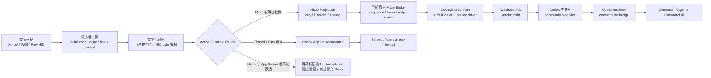
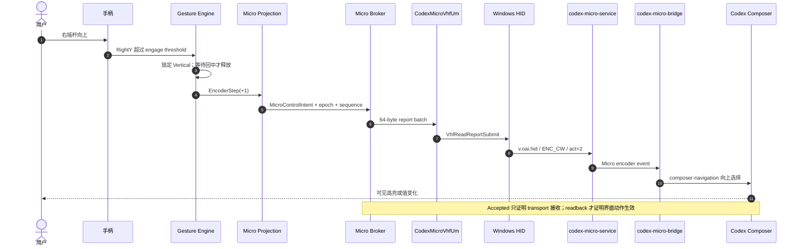

# 架构与输入链路

> Status: Initial design summary
> Updated: 2026-07-18

## 1. 两条互补控制平面

- **设备平面**：Agent/Command key、Dial、Analog、PTT、灯光与设备 RPC 优先使用真实 Micro 类 HID 信号。
- **语义平面**：任意任务树、Thread、Turn、Steer、Interrupt 和权威运行状态使用 App Server 或对应 Agent 的正式接口。
- **Limited adapter**：只保留尚无正式表达的操作；必须显示实际通道和验证结果，并设删除期限。

## 2. 右摇杆目标链路

右摇杆纵向模拟 Micro 左上角旋钮；横向是手柄额外提供的当前控件操作轴，不能伪装成旋钮档位。

| 手柄动作 | 类型化意图 | 设备/执行通道 |
| --- | --- | --- |
| 右摇杆上 | `EncoderStep(+1)` | `ENC_CW, act=2` |
| 右摇杆下 | `EncoderStep(-1)` | `ENC_CC, act=2` |
| R3 短按 | `EncoderPress` | `ENC` down/up |
| R3 长按 | `OpenAgentControllerSettings` | 本地应用动作；不发送 `ENC`，并抑制同一次短按 |
| 右摇杆左/右 | `CurrentControlLeft / CurrentControlRight` | 独立、可验证的导航 executor；绝不发送 `ENC_*` |
| 摇杆回中 | `Neutral` | 释放 axis ownership；不得被快照合并丢失 |

## 3. 当前实现与目标的边界

当前 WPF 实现仍在 `MainWindow`、`CodexComposerService` 内维护 popup、键盘和 UIA fallback；菜单状态可能改变纵横轴最终进入的执行器。目标结构要求：

1. 输入层只产生稳定的物理手势和 neutral 生命周期；
2. `MicroControlIntent` 不包含 UIA、窗口句柄或 Codex 文案；
3. Micro 可表达的动作不再以 UIA 为主执行器；
4. `NotSent` 才允许进入明确的降级路径；`Accepted`、`OutcomeUnknown`、`Rejected` 均禁止双发；
5. 每个动作带 correlation id，能串起原始输入、路由、report、transport 结果和 Codex readback。

完整问题基线见[控制器输入已知问题与实机复现](../../todo/91-controller-input-known-issues.md)。

## 4. `CodexMicroVhfUm` 依赖检查

结论分三层：

| 范围 | 结论 |
| --- | --- |
| Git 跟踪的驱动源码 | **仅保留** `virtual-micro/driver/CodexMicroVhfUm/`；它是 UMDF2/VHF source driver。工作区中的 `CodexMicroVhf/`、`CodexMicroHidUm/` 当前均未被 Git 跟踪，不属于项目依赖。 |
| `virtual-micro` 构建、安装与 v0.1.0 | 构建说明、安装脚本和 `codex-micro-v0.1.0` 标签都只选择 `CodexMicroVhfUm.dll`，安装 Source PnP ID `Root\CodexMicroHidUm`；与 v0.1.0 一致。 |
| Agent Controller 运行时 | 不静态链接驱动 DLL，也不检查 UMDF service 名称；它只打开下表的设备接口并验证 protocol v1。因此它依赖的是 **CodexMicroVhfUm 提供的接口合同**，而不是 Windows loader 层面的 DLL 依赖。任何冒充同一 GUID/合同的驱动理论上也能被打开。 |
| Agent Controller 发布包 | 当前 `package-release.ps1` 不携带或安装驱动；Full Micro mode 需要另行安装匹配的 Device Support。 |

冻结合同：

| 项目 | 值 |
| --- | --- |
| 唯一驱动候选 | `CodexMicroVhfUm.dll` |
| 驱动模型 | UMDF2 HID source + 系统 `Vhf.sys` |
| Source PnP ID | `Root\CodexMicroHidUm` |
| 私有接口 GUID | `E2A7CB54-8420-4D51-9DD8-D6575B9251D1` |
| Broker contract | magic `0x314D4356`（`VCM1`）、version `1` |
| Agent Controller 使用的 IOCTL | `GET_INFO 0x800`、`SUBMIT_INPUT 0x801`、`READ_OUTPUT 0x802` |
| v0.1.0 额外能力 | `SUBMIT_KEYBOARD 0x803`，只允许 Tab、Shift+Tab、Enter；当前 Agent Controller transport 尚未使用 |
| Micro wire report | 64 bytes，Report ID `0x06` |

所以，“产品只选择 `CodexMicroVhfUm`”已经成立；“运行时能证明打开的一定是该二进制”尚未成立。正式 Broker/Device Support 还需校验 Provider、service、PnP identity、驱动版本和签名，再允许 Full Micro mode。

与 `codex-micro-v0.1.0` 标签逐文件比较时，`Driver.c`、`Driver.h`、`Public.h` 和 INF 合同没有变化；当前版本只在 `.vcxproj` 增加了 Debug/Release 静态运行库选择。因此设备身份、IOCTL、report 和 UMDF2/VHF 行为合同仍与 v0.1.0 对齐。
