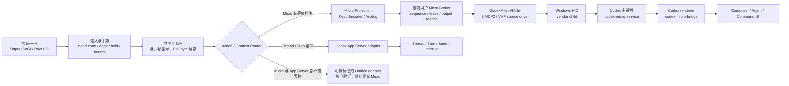
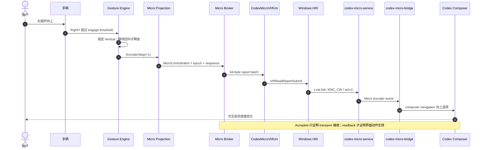
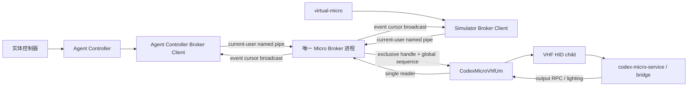

# 架构与输入链路

> Status: Controller-input remediation implemented; hardware acceptance pending
> Updated: 2026-07-18

## 1. 两条互补控制平面

- **设备平面**：Agent/Command key、Dial、Analog、PTT、灯光与设备 RPC 优先使用真实 Micro 类 HID 信号。
- **语义平面**：任意任务树、Thread、Turn、Steer、Interrupt 和权威运行状态使用 App Server 或对应 Agent 的正式接口。
- **Limited adapter**：只保留尚无正式表达的操作；必须显示实际通道和验证结果，并设删除期限。

## 2. 右摇杆目标链路

右摇杆纵向模拟 Micro 左上角旋钮；横向是手柄额外提供的当前控件操作轴，不能伪装成旋钮档位。

| 手柄动作 | 类型化意图 | 设备/执行通道 |
| --- | --- | --- |
| 右摇杆上 | `EncoderStep(+1)` | `ENC_CW, act=2` |
| 右摇杆下 | `EncoderStep(-1)` | `ENC_CC, act=2` |
| R3 短按 | `EncoderPress` | `ENC` down/up |
| R3 长按 | `OpenAgentControllerSettings` | 本地应用动作；不发送 `ENC`，并抑制同一次短按 |
| 右摇杆左/右 | `CurrentControlLeft / CurrentControlRight` | 独立、可验证的导航 executor；绝不发送 `ENC_*` |
| 摇杆回中 | `Neutral` | 释放 axis ownership；不得被快照合并丢失 |

## 3. 当前实现与剩余边界

当前实现已经固定纵横轴所有权和执行通道：

1. `ControllerStateBuffer` 只合并处于同一手势区域的快照，不能跨过按钮、LT 阈值、轴方向或完整 neutral；
2. `StickGestureRouter` 在一次手势内锁定轴与方向，只有 X/Y 都回到 release zone 才允许下一手势重新判定；
3. 右摇杆纵向只进入 `MicroInputService.SendEncoderSteps`，不读取 popup 状态，也不进入横向 executor；
4. 右摇杆横向只进入带 generation 和 450 ms 有效期的 `CurrentControlIntentBuffer`，目标没有可验证 readback 时不注入按键；
5. 可展开控件的“右进入”优先发送 Micro `ENC` 按压；只有明确 `NotSent` 才允许 Right Arrow。`Accepted`、`OutcomeUnknown`、`Rejected` 均禁止双发；
6. 横向 Left/Right/Escape 在 Codex 仍为前台、可见选择与键盘焦点一致时才发送；RangeValue 控件还必须读回正确方向的数值变化；
7. popup/readback 请求采用合并而非互相取消；旧 generation 或超时 intent 不得在后来打开的菜单中重放；
8. LT 使用 Micro-first 的 down/up 状态机；不确定 release 会补发一次，下一次 press 会先恢复 neutral；
9. Agent Controller 与 `virtual-micro` 都是同一当前用户 Broker 的客户端，桌面进程不再直接打开驱动；Broker 合并重叠 held key，并按最近活跃顺序仲裁 analog；Agent Controller 启动时后台预热 Broker，输入线程不会承担最长约 3 秒的首次连接等待，失败连接有 2 秒退避。

仍未完成的是实体手柄与真实 Codex build 的验收记录，以及覆盖原始输入到 readback 的可导出 correlation trace；自动化测试不能替代这两项。

完整问题基线见[控制器输入已知问题与实机复现](../../todo/91-controller-input-known-issues.md)。

## 4. `CodexMicroVhfUm` 依赖检查

结论分三层：

| 范围 | 结论 |
| --- | --- |
| Git 跟踪的驱动源码 | **仅保留** `virtual-micro/driver/CodexMicroVhfUm/`；它是 UMDF2/VHF source driver。工作区中的 `CodexMicroVhf/`、`CodexMicroHidUm/` 当前均未被 Git 跟踪，不属于项目依赖。 |
| `virtual-micro` 构建、安装与 v0.1.0 | 构建说明、安装脚本和 `codex-micro-v0.1.0` 标签都只选择 `CodexMicroVhfUm.dll`，安装 Source PnP ID `Root\CodexMicroHidUm`；与 v0.1.0 一致。 |
| Agent Controller 运行时 | Agent Controller 和 `virtual-micro` 只连接当前用户 named pipe；只有隐藏的 `AgentController.MicroBroker` 进程独占设备接口、分配全局 sequence，并单点读取 output/RPC。因此运行时依赖的是 **CodexMicroVhfUm 提供的接口合同**，而不是 Windows loader 层面的 DLL 静态依赖。任何冒充同一 GUID/合同的驱动理论上仍可能被打开。 |
| Agent Controller 发布包 | 当前 `package-release.ps1` 不携带或安装驱动；Full Micro mode 需要另行安装匹配的 Device Support。 |

冻结合同：

| 项目 | 值 |
| --- | --- |
| 唯一驱动候选 | `CodexMicroVhfUm.dll` |
| 驱动模型 | UMDF2 HID source + 系统 `Vhf.sys` |
| Source PnP ID | `Root\CodexMicroHidUm` |
| 私有接口 GUID | `E2A7CB54-8420-4D51-9DD8-D6575B9251D1` |
| Broker contract | magic `0x314D4356`（`VCM1`）、version `1` |
| Broker 使用的 IOCTL | `GET_INFO 0x800`、`SUBMIT_INPUT 0x801`、`READ_OUTPUT 0x802`；模拟器对话框操作还使用 `SUBMIT_KEYBOARD 0x803` |
| v0.1.0 键盘能力 | `SUBMIT_KEYBOARD 0x803` 只允许 Tab、Shift+Tab、Enter；Agent Controller 的常规 Micro input 不使用它 |
| Micro wire report | 64 bytes，Report ID `0x06` |

所以，“产品只选择 `CodexMicroVhfUm`”以及“只有 Broker 能直接打开私有接口”已经成立，并由 `MicroDriverOwnershipRulesTests` 防止回退；“运行时能证明打开的一定是该二进制”尚未成立。正式 Device Support 还需校验 Provider、service、PnP identity、驱动版本和签名，再允许 Full Micro mode。

与 `codex-micro-v0.1.0` 标签逐文件比较时，`Driver.c`、`Driver.h`、`Public.h` 和 INF 合同没有变化；当前版本只在 `.vcxproj` 增加了 Debug/Release 静态运行库选择。因此设备身份、IOCTL、report 和 UMDF2/VHF 行为合同仍与 v0.1.0 对齐。

## 5. 单 Broker、多客户端实际链路

Broker 对每个客户端保存独立 `clientId`、心跳 lease、held key、PTT 和 analog 状态。同一键被多个客户端同时按住时，只有第一个 down 和最后一个 up 到达驱动；中间的 down/up 只更新 lease。Analog 采用最近活跃者拥有物理输出的规则，当前 owner neutral 或退出时恢复最近一个仍活跃来源的角度与距离，而不是错误归零。正常 disconnect、客户端崩溃后的 lease expiry、Broker 退出都会执行 best-effort neutral。管道限定当前用户、帧长和 batch 数，并限制同时连接数；每个 lease 的 32 条有界 response cache 保证重复 request id 不会双发非幂等输入。驱动 handle、batch sequence 和 output/RPC reader 只有一份。

自动回归覆盖：

- 两个客户端交换连接顺序后共享同一 connection epoch，驱动只连接一次；
- 多个客户端正常按住/松开同一键时，驱动只收到一次 down/up；客户端退出也只释放自己的 held state；
- 三个 analog 来源依次接管并释放时，按最近活跃顺序逐层恢复，最后一个来源释放后才 neutral；
- output/RPC 只有 Broker 读取，灯光状态同时广播给两个客户端；
- 相同 request id + payload 重放只返回缓存 response；换 payload 复用同一 id 会被拒绝；
- app、Broker、协议和模拟器测试通过后，仍必须执行 [`91-controller-input-known-issues.md`](../../todo/91-controller-input-known-issues.md) 中未勾选的实机矩阵。
