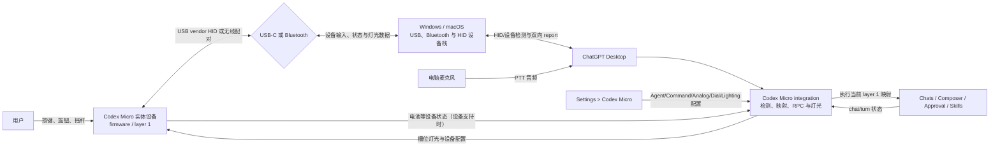
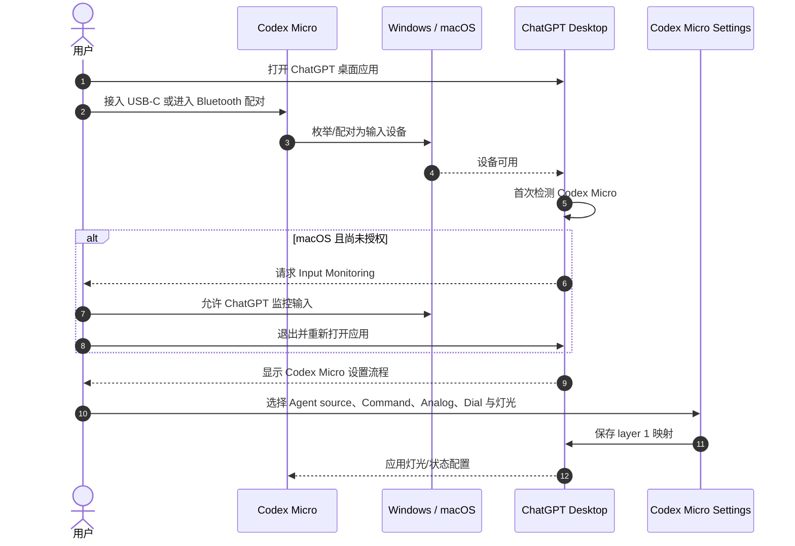
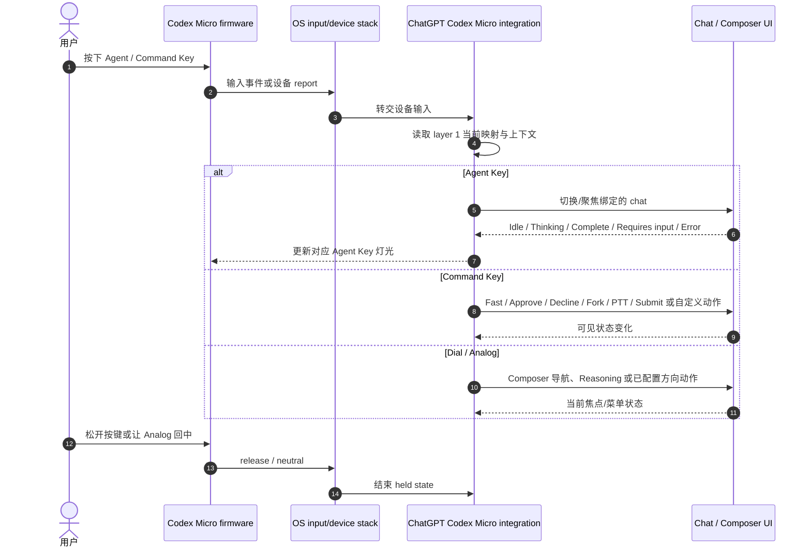
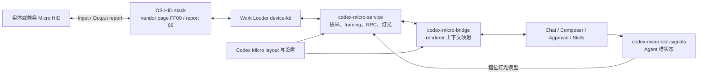
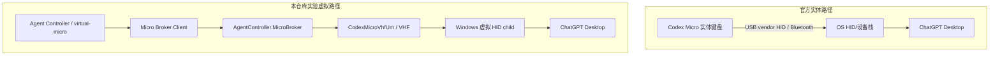

# Codex Micro 实体键盘接入与 UML

> Status: Official setup + read-only reverse-engineering evidence + private compatibility boundary
>
> Updated: 2026-07-19
> Scope: 实体 Codex Micro；不把 Agent Controller 的虚拟 VHF 设备当成实体连接方式

## 1. 结论

实体 Codex Micro **直接连接电脑，不经过 Agent Controller**：

1. 通过 **USB-C 数据线**或 **Bluetooth** 连接电脑；
2. 有线 Codex 通道由操作系统识别为 **vendor-defined HID**；
3. ChatGPT 桌面应用检测到 Codex Micro，首次连接时显示设置流程；
4. ChatGPT 在 Codex Micro 的 **layer 1** 上接收 Agent Key、Command Key、摇杆和旋钮输入，并向设备更新灯光；
5. 用户在 **Settings > Codex Micro** 中配置六个 Agent 槽、Command Key、Analog 方向、旋钮模式与灯光。

这是[官方 Codex Micro 指南](https://learn.chatgpt.com/docs/features/codex-micro)公开的支持边界。官方文档没有把底层 HID/RPC 字节合同承诺为公共 API；本仓库记录的 `v.oai.hid`、`v.oai.rad`、64-byte report 和 bridge 名称只属于特定 Codex Desktop build 的兼容观测。

### 1.1 到底是不是 USB HID

**有线 Codex 专用通道是 USB HID，但不是普通键盘 HID。** 对 Codex Desktop 26.707/26.715 的本地只读观测显示：

| 字段 | 观测值 | 含义 |
| --- | --- | --- |
| VID / PID | `0x303A / 0x8360` | Codex Micro 设备身份 |
| Usage Page / Usage | `0xFF00 / 0x0001` | vendor-defined HID collection；不是 Keyboard Usage Page `0x07` |
| Report ID | `0x06` | Codex 双向 report |
| Report 长度 | 64 bytes | 含 Report ID；其余为 channel、长度与 UTF-8 payload |
| Device → ChatGPT | HID Input Report | `v.oai.hid` 按键、`v.oai.rad` 摇杆、RPC response |
| ChatGPT → Device | HID Output Report | 灯光、槽位状态、版本和设备状态 RPC |

也就是说，Codex 的按键不是作为普通 USB 键盘扫描码直接交给 ChatGPT；它把 JSON 消息分片装进 vendor HID report，由 ChatGPT 的 Micro 集成解释。设备的其他 Work Louder layer 可以有普通快捷键行为，但那不是这里描述的 Codex layer 1 私有通道。

Bluetooth 方面，官方只承诺“可以通过 Bluetooth 连接”。从应用角度，它最终仍由操作系统作为输入/HID 类设备提供给 ChatGPT；**究竟是 BLE HID over GATT 还是 Bluetooth Classic HID，当前官方文档和本仓库证据都没有冻结，不能写死。**

## 2. 部署 UML



图中的 “Codex Micro integration” 是公开行为的逻辑组件名，不代表官方承诺了可供第三方调用的独立 SDK 或稳定进程接口。

## 3. 首次连接时序 UML



在 macOS 上，ChatGPT 需要 **Input Monitoring** 权限才能响应实体键盘按键；Windows 的官方设置步骤没有这一项。

## 4. 按键执行时序 UML



官方文档公开的是上面的行为语义。`codex-micro-service`、`codex-micro-bridge`、`AG*`、`ACT*`、`ENC*` 等名字来自本仓库对特定桌面版本的只读观测，可能随 ChatGPT Desktop 更新而变化。

## 5. 逆向证据链与复现方法

本节只描述对本机已安装 ChatGPT Desktop 包体、设备枚举和本仓库虚拟设备回环的**只读兼容性研究**。它不修改 `app.asar`，不绕过访问控制，不提取或改写实体设备固件，也不把私有协议宣称为官方 SDK。

### 5.1 证据分层

| 层级 | 来源 | 可以证明 | 不能证明 |
| --- | --- | --- | --- |
| 官方产品说明 | Codex Micro 使用指南 | USB-C/Bluetooth、layer 1、可配置行为、灯光和 macOS Input Monitoring | HID descriptor、消息格式、进程和稳定 ABI |
| 安装包静态观测 | 已安装 ChatGPT Desktop 的 service、renderer 与 Work Louder 依赖 | 目标 build 的设备筛选、消息名、布局和状态转换 | 未来 build 仍保持相同实现 |
| HID/wire 观测 | VID/PID、Usage、Report ID、Input/Output report | 目标 build 期待的 vendor HID 形状和双向 framing | transport ACK 等于业务成功 |
| 虚拟设备回环 | `virtual-micro` + VHF + 真实 ChatGPT Desktop | 相同 descriptor/report 能被目标 build 识别并驱动可见行为 | 第三方有权公开发行同一设备身份 |
| 实体设备抓取 | 零售 Codex Micro 的 descriptor、USB/Bluetooth trace | 实体固件实际暴露的接口与无线 profile | 官方会长期兼容第三方实现 |

当前仓库已经完成安装包静态观测和 Windows 虚拟 HID 回环；零售实体设备的独立 descriptor/无线 profile 抓取仍应作为单独证据归档。因此更严谨的说法是：**目标 ChatGPT build 的 Codex 专用通道已确认是 vendor-defined HID；实体零售设备应使用同一合同，但仍需独立抓取完成最终交叉验证。**

### 5.2 冻结的目标 build 指纹

以下 SHA-256 来自 `OpenAI.Codex_26.707.12708.0_x64__2p2nqsd0c76g0` 的只读解包，用于判断研究结论是否还能应用，不能视为文件签名或发布授权：

| 包内文件 | SHA-256 |
| --- | --- |
| `.vite/build/codex-micro-service-CR6sUcZG.js` | `0bb261e3eed89ff69384754ab67df49c9f10dbd2fa567104c5859f43d026c911` |
| `webview/assets/codex-micro-slot-signals-SFcKxWqG.js` | `e5f0084a27fc0e908c4514a5d3bd0a90dba3f953a48521fb4ae2a43b1e5b28bb` |
| `webview/assets/codex-micro-bridge-D90_rd6W.js` | `df6063eb17046594e769050c6bbb3ed169b1352bbd5867fffb4d1f8c724f3e93` |
| `@worklouder/device-kit-oai/dist/rpc_api_oai/rpc_api_oai.js` | `80815366885246cd9644e13b770f38c7f9c0587db13cc8979310571ba0fa029a` |
| `@worklouder/device-kit-oai/node_modules/@worklouder/wl-device-kit/dist/index.js` | `f44d8d09e10a4608bf37f2860cd4807c3be9b0242f91d8258df540e277cd7548` |

对应依赖版本为 `@worklouder/device-kit-oai 0.1.10` 与 `@worklouder/wl-device-kit 0.1.18`。26.715 的行为验证必须保存自己的 build、文件名和散列，不能继承 26.707 的指纹。

### 5.3 逆向得到的组件关系



这是对特定 bundle 的逻辑分层，不承诺每个框都是独立 OS 进程。稳定产品边界只能写成“ChatGPT Desktop 检测并控制 Codex Micro”；内部 chunk 名和依赖属于兼容指纹。

### 5.4 Wire framing 与消息

64-byte report 的冻结布局：

```text
byte 0      Report ID = 0x06
byte 1      channel：0x02 RPC，0x01 debug
byte 2      payload length：0..61
byte 3..63  UTF-8 payload fragment，剩余补零
```

两个方向的结束规则不对称：

- **Device → ChatGPT / Input Report**：逐 report 解码并拼接 UTF-8；完整 notification 或 RPC response 以 LF 结束。
- **ChatGPT → Device / Output Report**：按最多 61 raw bytes 分片，不附加 LF；接收端在每个 fragment 后尝试解析完整 JSON。
- UTF-8 多字节标量不能在 Input Report 边界被拆开；两侧都必须设置总长度和超时上限。

已观测 notification：

```json
{"m":"v.oai.hid","p":{"k":"ACT12","act":1}}
{"m":"v.oai.hid","p":{"k":"ACT12","act":0}}
{"m":"v.oai.rad","p":{"a":0.75,"d":1}}
```

其中 `act=1/0` 表示按下/释放，`act=2` 表示 encoder detent。最小双向 RPC 面为：

| method | 方向 | 用途 |
| --- | --- | --- |
| `sys.version` | ChatGPT → Device | 查询兼容/固件版本 |
| `device.status` | ChatGPT → Device | 查询 profile、layer、电量与充电状态 |
| `v.oai.rgbcfg` | ChatGPT → Device | 写入灯光配置 |
| `v.oai.thstatus` | ChatGPT → Device | 写入六个 Agent 槽的状态灯模型 |
| `v.oai.hid` | Device → ChatGPT | Agent、Command、encoder 等按键通知 |
| `v.oai.rad` | Device → ChatGPT | Analog 角度和距离通知 |

RPC request/response 通过 `id` 关联，每个 request 必须恰好响应一次。`Accepted` 只证明 report 被 transport 接收；没有 chat、composer 或 turn readback 时仍是 `AcceptedUnverified`。

### 5.5 只读复现流程

1. **冻结环境**：记录 ChatGPT Desktop 完整版本、平台、安装包来源和测试账户能力；复制待分析文件后计算 SHA-256。
2. **静态定位**：只读搜索 `codex-micro-service`、`codex-micro-bridge`、Work Louder 依赖、`v.oai.*` method、设备身份和 layout key；不修改或重新打包应用。
3. **枚举 HID**：记录 VID、PID、Usage Page、Usage、Report ID、Input/Output report 长度和设备路径；把物理 USB、Bluetooth 与虚拟设备结果分开保存。
4. **先被动后主动**：先观察 ChatGPT 发出的 version/status/lighting Output Report；随后在隔离的非关键 chat 中一次只验证一个无破坏动作。
5. **关联可见结果**：为每个 report 保存 sequence、时间、方向和脱敏摘要，并记录 ChatGPT UI/readback；不能用“写入成功”替代动作成功。
6. **虚拟回环**：使用最小 vendor-defined descriptor 复现设备，只实现有界 framing、必要 RPC、held release 和 analog neutral；未知 method 返回明确 error。
7. **交叉验证**：至少覆盖 Agent tap、Command tap、PTT down/up、encoder step/press、Analog center→direction→center、灯光与断连恢复。
8. **生成兼容 manifest**：固定 build hashes、设备形状、消息 schema 和 golden vectors；任何关键字段变化都进入 `Incompatible`，不得猜测继续发送。

### 5.6 已确认、推断与未知

| 状态 | 结论 |
| --- | --- |
| 官方确认 | 实体设备支持 USB-C/Bluetooth；ChatGPT 首次检测后提供设置；Codex 使用 layer 1；macOS 需要 Input Monitoring |
| 目标 build 已确认 | ChatGPT 的 Codex 通道选择 vendor-defined HID 形状，使用 64-byte 双向 report、私有 JSON notification/RPC 和 renderer bridge |
| 虚拟回环已确认 | Windows VHF 设备使用相同 VID/PID/Usage/Report 后，26.707/26.715 可完成按键、旋钮、Analog、设置路由和灯光 RPC |
| 高可信推断 | 零售实体设备的 Codex layer 1 使用相同 vendor HID 合同；仍应保存实体 descriptor 抓取作独立证据 |
| 未确认 | Bluetooth 是 BLE HOGP 还是 Classic HID、无线接口是否与 USB descriptor 完全相同、未来 ChatGPT build 的兼容性 |
| 不成立 | “设备枚举成功就等于 ChatGPT 已识别”“transport ACK 就等于业务成功”“私有 ABI 是官方 SDK” |

### 5.7 安全、合规与发布边界

- 逆向证据只用于互操作和兼容研究；日志不得保存 prompt、任务正文、凭据或完整用户数据。
- 不修改 ChatGPT 包体、不注入 renderer、不绕过审批/权限，也不把 UIA 点击伪装成 Micro 原生动作。
- VID `0x303A` 属于 Espressif 标识；本仓库没有证明第三方有权公开发行 `PID 0x8360`。虚拟设备身份只限隔离研究，正式分发前需要书面授权或官方兼容身份。
- 未签名开发驱动不能要求用户关闭 Secure Boot、签名强制或导入来源不明的根证书；公开发行必须另行完成身份、签名、HLK/WHCP、安装与卸载 Gate。
- `Accepted`、`OutcomeUnknown` 或 `Rejected` 后禁止自动改走第二通道；只有明确 `NotSent` 才允许预先定义的 fallback。
- Codex build、任一关键散列、VID/PID、Usage、Report ID、report 长度、method schema 或 layout 形状改变时必须 fail closed。

完整的逐 build 逆向笔记、状态推导和 descriptor 见 [`docs/codex-26.707.12708-vhf-status-input.zh-CN.md`](../../docs/codex-26.707.12708-vhf-status-input.zh-CN.md)；发行与身份决策见 [ADR-0002](../../docs/adr/0002-codex-micro-native-compatibility.zh-CN.md)。

## 6. USB-C 与 Bluetooth 的区别

| 项目 | USB-C | Bluetooth |
| --- | --- | --- |
| 初次接入 | 插入支持数据的 USB-C 线 | 使用键盘左下角触控区选择 Bluetooth 1/2/3 并配对 |
| Codex 通道 | 已观测为 vendor-defined USB HID，Usage Page `0xFF00` | 由 OS 暴露给 ChatGPT；具体 BLE HOGP/Classic HID profile 未被公开或冻结 |
| 稳定性排查 | 先检查线材是否支持数据、端口与供电 | 先检查所选频道、配对记录与电量 |
| ChatGPT 设置 | 检测后相同 | 检测后相同 |
| Codex layer | layer 1 | layer 1 |
| 额外层 | layer 2–6 由 Work Louder Input 配置 | 同左 |

Bluetooth 重新配对使用**左下角触控区**；背部按钮只控制电源，不用于开始配对。具体固件、复位与多层配置以 [Work Louder Creator Micro 2 设置指南](https://worklouder.cc/micro-setup)为准。

## 7. 实体 Micro 与本仓库虚拟 Micro 的区别



| 项目 | 实体 Codex Micro | Agent Controller / `virtual-micro` |
| --- | --- | --- |
| 与电脑连接 | USB-C 或 Bluetooth | 本地 named pipe → Broker → Windows VHF 虚拟 HID |
| 是否需要本仓库驱动 | 否 | Full Micro 模式需要实验性 `CodexMicroVhfUm` |
| 是否需要 Agent Controller | 否 | 手柄映射路径需要；独立 `virtual-micro` 模拟器不依赖主程序 |
| 官方支持状态 | ChatGPT Desktop 官方产品集成 | 非官方、私有兼容实验 |
| 配置入口 | Settings > Codex Micro | Agent Controller 设置 + ChatGPT 的 Micro layout 门禁 |

所以如果用户手上有实体 Codex Micro，正常接法就是“键盘 → USB-C/Bluetooth → 电脑 → ChatGPT Desktop”；不需要先接入 Agent Controller，也不需要安装本仓库的 VHF 驱动。

## 8. 相关资料

- [官方 Codex Micro 指南](https://learn.chatgpt.com/docs/features/codex-micro)
- [架构与输入链路](architecture-and-input-flow.md)
- [Codex Micro 指令参考](codex-micro-command-reference.md)
- [Codex 26.707 逆向证据与 VHF 协议](../../docs/codex-26.707.12708-vhf-status-input.zh-CN.md)
- [ADR-0002：原生 Micro 兼容决策](../../docs/adr/0002-codex-micro-native-compatibility.zh-CN.md)
- [实体键盘模拟器安装教程](../../docs/CodexMicroSimulator-安装教程.zh-CN.md)
- [Work Louder Creator Micro 2 设置指南](https://worklouder.cc/micro-setup)
