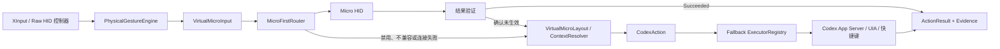

# Codex Micro 虚拟 HID 桥接改造方案

> 状态：v0.7 之后的实验性 TODO；v0.7 不包含、不安装虚拟 HID 驱动，也不启用 Plan 手柄入口
> 编写日期：2026-07-16
> 适用项目：Agent Controller
> 事实基线：[Reference](reference.md)、[26.707.12708.0 VHF/状态/输入协议](../../docs/codex-26.707.12708-vhf-status-input.zh-CN.md)

本文记录未来研究方向，不是 v0.7 已交付能力。当前观察到的 `v.oai.rad`、
设备指纹与报文结构属于私有、非稳定兼容面；实现前必须加入版本/指纹门禁、
明确用户选择、Center → Direction → Center 状态序列和动作结果验证，不能仅凭
写入报文成功就报告动作成功。

## 1. 结论与改造方向

下一阶段不再把“按下一个快捷键”视为所有 Codex 桌面动作的统一实现。
改造重点是把控制器语义、Codex 动作和具体执行通道拆开，并增加一个
实验性的 Codex Micro 虚拟 HID 执行器。

开发顺序：

1. 先建立与传输无关的 `CodexAction` 和执行器接口；
2. 实现可单元测试的 Micro RPC 编解码器；
3. 用 RP2040 / ESP32-S3 原型验证 Codex 是否接受完整设备链路；
4. 通过验证后，再决定是否投入 Windows Virtual HID Framework 驱动；
5. 对 Micro 可表达的输入默认优先发送设备事件；
6. Micro 不可用或已确认未生效时，再按动作选择 App Server、UI Automation
   或快捷键兜底；
7. 设置中允许用户完全禁用 Micro 通道，禁用后不枚举、不连接也不发送事件。

运行时默认策略是 `Micro first, verified fallback`，不是“UIA first”。开发时
仍先完成动作解耦和协议测试，因为只有先建立清晰边界，Micro 优先和失败
兜底才不会造成重复执行或错误成功反馈。

OpenAI 官方资料确认真实 Codex Micro 会被 ChatGPT 桌面应用检测，模拟杆
四个方向可以映射到桌面命令或 Skill，默认向上切换 Plan mode；官方没有
公开虚拟设备、厂商 HID 报文或稳定的第三方设备 ABI。参见
[Codex Micro 使用说明](https://learn.chatgpt.com/docs/features/codex-micro.md)。

因此，本方案中的 HID 协议参数属于对当前安装版本的兼容性观察，不是
OpenAI 或 Work Louder 承诺的长期接口。

## 2. 要解决的问题

当前桌面控制链路混合了多种能力：

- Windows `SendInput` 模拟快捷键；
- UI Automation 查找并操作 Codex 控件；
- Codex App Server 的正式协议；
- 针对 Codex 当前界面结构的兼容性探测。

它们的稳定性、权限、可验证性和适用上下文不同。把动作直接绑定到某个
按键组合会产生以下问题：

- Codex 内部命令未必存在默认快捷键；
- Windows 方向键还涉及扩展键扫描码等注入细节；
- 快捷键发送成功不等于目标动作执行成功；
- Codex Micro 方向事件直接进入桌面命令分发，不经过普通键盘路径；
- UI、快捷键或内部包升级后，失败容易被误报为成功。

虚拟 HID 是 Micro 可表达动作的首选通道；其他正式协议、UIA 和快捷键是
它的兜底。对于 Micro 本身没有表达能力的正式 thread/turn 操作，直接进入
对应的后续执行器，不制造假的 Micro 映射。

## 3. 目标与非目标

### 3.1 目标

- 控制器输入先转换为稳定的虚拟 Micro 输入，再解析成 `CodexAction`；
- Micro 通道未被用户禁用且能力探测通过时，优先发送设备事件；
- 同一个动作可以在 Micro 失败后选择 App Server、UIA 或官方快捷键兜底；
- 每次执行都返回结构化结果和验证证据；
- Codex 升级导致协议不兼容时自动停用实验通道；
- HID 报文、方向阈值、回中和重连行为可以确定性测试；
- 不影响当前没有安装驱动或没有实验硬件的用户。

### 3.2 非目标

- 不修改、注入或重新打包 ChatGPT/Codex 应用；
- 不把私有 npm 包复制进仓库或发布包；
- 不把第三方 VID/PID 当作可公开发行的产品身份；
- 不在第一阶段实现蓝牙设备仿真、灯光动画或固件更新；
- 不为 Micro 无法表达的正式 App Server 能力制造伪设备映射；
- 不静默安装驱动、开启测试签名或请求管理员权限。

## 4. 目标架构



关键边界：

```text
物理输入 != 虚拟输入 != 业务动作 != 执行方式 != 执行结果
```

建议新增或明确以下契约：

```csharp
public interface ICodexActionExecutor
{
    CodexExecutorKind Kind { get; }
    ValueTask<CapabilityProbe> ProbeAsync(CodexAction action, CancellationToken ct);
    ValueTask<ActionResult> ExecuteAsync(CodexActionRequest request, CancellationToken ct);
}

public interface IMicroTransport
{
    MicroTransportState State { get; }
    ValueTask ConnectAsync(CancellationToken ct);
    ValueTask SendNotificationAsync(MicroNotification notification, CancellationToken ct);
    ValueTask DisconnectAsync(CancellationToken ct);
}
```

`VirtualMicroInput` 表达 `AnalogUp`、`AnalogDown`、Command Slot、Agent Slot
和 Dial 等设备语义。`CodexAction` 只表达 `TogglePlanMode`、
`PreviousUserMessage`、`NextUserMessage`、`NavigateBack` 等业务语义，不包含
F19、`Alt+Up`、UIA 名称或 USB 报文字节。

只有在 Micro 通道被跳过或确认失败后，`VirtualMicroLayout` 才把输入解析为
兜底用的 `CodexAction`。这也意味着 Agent Controller 的虚拟布局必须保存并
版本化，不能在兜底阶段临时猜测“Up 一定等于 Plan”。

## 5. 当前版本的 Micro 协议快照

以下数据来自当前本机 `OpenAI.Codex 26.707.12708.0` 包体，仅作为实验适配
基线：

| 字段 | 当前观察值 |
| --- | --- |
| USB VID | `0x303A` |
| USB PID | `0x8360` / 33632 |
| 设备类型 | `project_2077` |
| HID Usage Page | `0xFF00` |
| Report ID | `0x06` |
| RPC Channel | `0x02` |
| Report 总长度 | 64 字节 |
| 单包 RPC 负载 | 最多 61 字节 |
| 模拟杆通知 | `v.oai.rad` |
| 自定义按键通知 | `v.oai.hid` |

输入报告布局：

```text
byte 0     Report ID = 0x06
byte 1     Channel = 0x02
byte 2     UTF-8 payload length
byte 3..63 payload，剩余补零
```

方向必须分开实现：Codex→device 的 output 是 escaped JSON、按 61 raw bytes
分片且无 LF；device→Codex 的 notification/response 才要求 report 边界不拆
UTF-8 标量，并在完整消息末尾追加 LF。详见版本化协议文档 §5。

模拟杆通知没有 JSON-RPC `id`，必须以换行结束。当前设备侧通知使用短字段
`m/p`；解析器可兼容完整字段 `method/params`：

```json
{"m":"v.oai.rad","p":{"a":0.75,"d":1}}
```

方向中心值和触发规则：

| 方向 | `a` 建议值 | 识别区间 |
| --- | ---: | --- |
| Up | `0.75` | `[0.625, 0.875)` |
| Down | `0.25` | `[0.125, 0.375)` |
| Left | `0.50` | `[0.375, 0.625)` |
| Right | `0.00` | 其余角度 |

当前方向选择阈值是 `d >= 0.5`。每次触发后必须发送 `d = 0` 的回中事件，
否则同一方向不会再次触发：

```text
Center(d=0) -> Up(d=1) -> Center(d=0)
```

设备还需要接收并响应桌面端发出的请求，至少覆盖：

- `v.oai.rgbcfg`；
- `v.oai.thstatus`；
- `device.status`；
- 必要时的 `sys.version`。

`v.oai.thstatus` 的 `params` 是六槽数组，元素压缩为
`{id,c,b,e,s,sk,sa}`。这里的 `id` 是 `0..5` 槽号；renderer 原始快照虽含
`threadKey`，native service 在 HID 写出前会将其剥离。Broker 单靠 raw report
无法证明 Agent source 或线程顺序；只有双方从独立同源 roster 得到的 proof
一致时才可合并到具体任务，否则只能作为匿名 SlotOnly 灯光诊断。完整状态优先级、
RGB/effect 数值、VHF 回调与 ACT12 合同见上方版本化协议文档。

响应必须复用请求 `id`。用于原型的最小状态响应：

```json
{
  "id": 123,
  "result": {
    "version": "0.0.1",
    "profile_index": 0,
    "layer_index": 0,
    "battery": 100,
    "is_charging": true
  }
}
```

## 6. 实现路线与决策门

### 6.1 路线 A：RP2040 / ESP32-S3 原型

用途：最快确认设备描述符、报告格式、握手和 Plan 动作是否完整成立。

实现内容：

- TinyUSB vendor HID interface；
- 63 字节 Input / Output report，Report ID 为 `0x06`；
- Host -> Device RPC 分包重组；
- Device -> Host 通知和响应分包；
- 最小状态、灯光配置和线程灯光响应；
- 串口调试日志及原始报文导出。

这是协议验证工具，不进入 Agent Controller 正式安装包。

### 6.2 路线 B：Windows VHF 虚拟设备

用途：验证成功后提供无额外硬件的可选实现。

建议结构：

```text
AgentController.exe
  -> 本地命名管道或受限 IOCTL
VirtualMicroBroker.exe
  -> 设备生命周期、协议状态和诊断
AgentControllerVirtualHid.sys
  -> KMDF Virtual HID Framework 子设备
ChatGPT/Codex
  -> 以 node-hid 打开虚拟设备
```

驱动层只负责：

- 创建设备和 HID report descriptor；
- 提交 input report；
- 转发 output report；
- 在客户端退出、设备移除或系统睡眠时清理状态。

JSON-RPC、方向状态机和 Codex 版本策略留在用户态 Broker，减少驱动代码。

进入路线 B 前必须通过决策门：

- 硬件原型能被当前 Codex 稳定检测；
- 四方向事件连续 100 次无丢失、无重复；
- Plan 动作可以执行并通过界面状态验证；
- 输出 RPC 的最小响应集合已经确定；
- 已确认 VID/PID、驱动签名和发行方式的合规方案；
- 维护成本优于继续强化 UIA 语义执行器。

### 6.3 明确拒绝的路线

- 给 Codex renderer 注入 JavaScript；
- 修改 `app.asar`；
- 从外部进程伪造 Electron 内部 IPC；
- 依赖未公开模块名直接调用 `composer.togglePlanMode`；
- 把 ViGEm/vJoy 当成任意 vendor HID 的替代品。

这些路径要么破坏应用完整性，要么不能生成目标 vendor report，要么升级后
极易失效。

## 7. 分阶段实施计划

### M0：证据冻结与兼容性指纹

- 记录 Codex 桌面版本、关键包版本和协议快照；
- 保存不含私有源码的 golden packet、方向区间和握手序列；
- 定义 `MicroCompatibilityFingerprint`；
- 当版本或协议指纹未知时，状态必须是 `Unavailable`，不能猜测执行。

交付物：协议测试向量、版本探测器、兼容性报告格式。

### M1：动作与执行器解耦

- 从现有输入路由中抽离 `CodexAction`；
- 建立 `ExecutorRegistry` 和能力探测；
- 为每个动作配置执行器优先级及验证方式；
- 将“已发送”拆成 `Succeeded`、`Degraded`、`Unavailable`、`Blocked`、
  `Conflict`、`Failed` 和 `Unknown`；
- 反馈中显示实际执行通道及验证证据。

交付物：不改变默认用户行为的架构重构和回归测试。

### M2：纯托管协议层

- 实现 `MicroRpcCodec`；
- 实现 61 字节分包和重组；
- 实现紧凑字段 `m/p` 与完整字段 `method/params` 的解析；
- 实现模拟杆方向、迟滞、回中和重复抑制状态机；
- 使用内存 transport 完成双向握手测试。

交付物：不依赖驱动、硬件或 Codex 进程的单元测试库。

### M3：硬件协议验证

- 制作 RP2040 / ESP32-S3 实验固件；
- 验证 USB 枚举、Codex 检测、RPC 和方向事件；
- 记录启动、断开、重连、睡眠恢复和 Codex 重启行为；
- 对比 UIA、快捷键和 Micro HID 三条路径的成功率与延迟。

交付物：验证报告和路线 B 的 Go / No-Go 决定。

### M4：Windows VHF PoC

- 建立独立驱动与 Broker 原型；
- 只在开发机手动安装和测试签名；
- 首期输入只开放四方向和已冻结的 ACT12；双向 handshake 及
  `thstatus/rgbcfg/device.status/sys.version` 应答仍必须完整实现；
- 增加进程身份、单客户端连接和桥接总开关；
- 验证 Codex 独占打开、系统休眠和卸载行为。
- input batch 使用 `NotSent / Accepted / OutcomeUnknown` 三态；ACK 超时、partial
  submit 或写后断线一律禁止自动兜底，并以 batch sequence 去重；
- 独立 status event 管道只发布 SlotOnly；没有独立 RosterProof 时不覆盖命名任务。

交付物：不随正式安装包分发的开发者 PoC。

### M5：可选集成与降级

- 设置中增加“优先使用 Codex Micro 设备事件”开关；
- Micro 组件可用时默认开启，并显示版本、驱动、握手和能力状态；
- 用户关闭后立即回中并断开虚拟设备，本次及后续运行直接走兜底执行器；
- HID 不可用时回退至已验证的 App Server / UIA / 快捷键执行器；
- 报告提交后只有在确认目标动作未生效时才自动兜底；如果副作用未知，返回
  `Unknown` 并避免重复执行非幂等动作；
- 提供一键诊断导出，不包含用户 prompt 或私有任务内容。

交付物：Micro-first、可禁用、可回滚且可诊断的集成。

### M6：发行评审

- 确认 VID/PID 和商标使用边界；
- 确认驱动签名、升级、卸载和 Windows 安全提示；
- 建立 Codex 版本兼容矩阵；
- 完成威胁建模、人工代码审查和故障恢复测试；
- 未满足发行要求时保持开发者实验功能，不进入 Release。

## 8. 执行器选择策略

默认运行策略：

| 输入或动作类型 | 首选 | 第一兜底 | 第二兜底 |
| --- | --- | --- | --- |
| Micro Agent/Command/Analog/Dial 输入 | Micro HID | 镜像布局对应的语义执行器 | 明确不可用 |
| Plan mode，且镜像布局确认有对应 Micro 输入 | Micro HID + 状态验证 | UIA 模式选择器 | 官方命令/快捷键 |
| 上下条用户消息，且镜像布局确认有对应 Micro 输入 | Micro HID + 位置验证 | 官方桌面快捷键 | UIA |
| Back / Forward / Sidebar | Micro HID + 状态验证 | UIA 或官方命令 | 官方快捷键 |
| 正式 thread/turn 操作且 Micro 无对应输入 | 跳过 Micro，直接 App Server | UIA | 明确不可用 |

Micro 通道是否参与由三个条件共同决定：设置未禁用、协议兼容性探测通过、
当前 `VirtualMicroLayout` 能表达该输入或动作。满足条件时 Micro 固定为第一
执行路径；任一条件不满足时直接进入兜底，不先发送试探性设备事件。

### 8.1 映射所有权

`v.oai.rad` 只携带角度 `a` 和距离 `d`，不携带桌面命令 ID。Codex 根据自己
保存的 Micro 设置，把方向解析为 Plan、Back、Sidebar、Skill 或其他命令。

为了让失败兜底仍保持相同语义，Agent Controller 必须保存一份版本化的
`VirtualMicroLayout`：

- 初始值采用官方默认方向：Up Plan、Right Forward、Down Sidebar、Left Back；
- 用户在 Agent Controller 中修改布局时，明确提示需要与 Codex Micro 设置
  保持一致；
- 无法确认两侧布局一致时，反馈显示 `MappingUnverified`；
- 对有副作用且无法验证的动作，不在发送 Micro 事件后自动执行第二次兜底；
- 用户禁用 Micro 后，镜像布局仍用于把控制器输入解析为兜底动作。

后续如果发现稳定的官方映射读取接口，可以用它替代手工镜像；当前方案不
读取或修改未公开的 Codex 本地设置。

### 8.2 失败和兜底边界

可以立即兜底：

- 用户已禁用 Micro；
- 驱动、Broker 或设备不存在；
- Codex 版本/协议指纹不兼容；
- 设备尚未 Ready；
- input report 在提交前失败；
- 提交后通过状态探测确认目标动作没有发生。

不能盲目兜底：

- input report 已提交，但 Codex 状态暂时无法读取；
- 当前布局未确认，设备事件可能触发了另一个命令；
- 动作可能已执行，但验证超时；
- Approve、Decline、Submit、Stop 等非幂等或高风险动作。

后一类返回 `Unknown` 或 `MappingUnverified`，由用户决定是否重试，避免一次
控制器输入执行两次或执行两个不同动作。

## 9. 安全、合规与运维约束

- `BridgeEnabled=false` 时禁止发送 HID 输入；
- 断开控制器、Codex 退出或 Broker 崩溃时必须先回中再撤销设备；
- 驱动/Broker 只接受当前用户会话中的 Agent Controller；
- IPC 消息采用固定 schema、大小上限和动作白名单；
- 禁止传入任意 JSON-RPC method 或任意 HID 字节；
- 生产包不得复用、复制或重新分发私有 Work Louder 包；
- 本地实验使用观察到的 VID/PID，不代表拥有公开发行权；
- 日志记录版本、状态、动作和错误，不记录 prompt、文件内容或任务正文；
- 未安装实验组件时，应用必须保持当前权限模型和启动行为。

## 10. 测试与验收标准

### 10.1 单元测试

- 0、1、60、61、62 和多包 UTF-8 payload；
- Report ID、channel、length、补零和换行；
- 完整/紧凑 JSON-RPC 字段；
- 非法长度、未知 channel、截断 JSON 和超时；
- 四方向边界值、迟滞、回中、反向和重复抑制；
- 请求 `id` 关联、乱序响应和断开清理；
- 未知 Codex 版本拒绝启用实验执行器。

### 10.2 集成测试

- Codex 冷启动、热重启和升级后重新探测；
- 首次连接、拔出、重插、睡眠/唤醒；
- 连续触发每个方向 100 次；
- 长按方向只执行一次，回中后允许再次执行；
- Plan 开/关状态必须通过界面语义验证；
- 当前映射被用户修改时，不把执行其他动作误报为 Plan 成功；
- HID 失败后回退路径不会重复执行同一个动作。

### 10.3 完成定义

下一阶段改造只有同时满足以下条件才算完成：

- 控制器到动作、动作到执行器的依赖已经解耦；
- Micro 组件可用且用户未禁用时默认先走设备事件；组件不可用时现有能力
  可以无回归地直接兜底；
- Micro codec 和状态机具备确定性测试；
- 真机原型有可复现的验证报告；
- VHF 是否继续投入已经做出明确 Go / No-Go 决定；
- 所有失败反馈都包含真实执行通道和恢复建议；
- 没有通过验证的动作不会显示为成功。

## 11. 开始编码前仍需确认

- 获取真实 Codex Micro 或等效设备的完整 HID report descriptor；
- 用 USBPcap/设备侧日志确认启动握手及必要 RPC 集合；
- 验证 Windows VHF 暴露的设备能否被 Codex 当前 node-hid 实现正常打开；
- 明确实验 VID/PID 与正式发行身份方案；
- 明确是否接受驱动签名、安装、升级和卸载成本；
- 确认下一阶段首先交付 M1/M2，而不是直接开始内核驱动。

在这些问题确认前，可以安全推进动作/执行器解耦和纯协议测试；不应开始
面向用户发布虚拟 HID 驱动。
