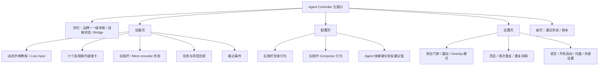
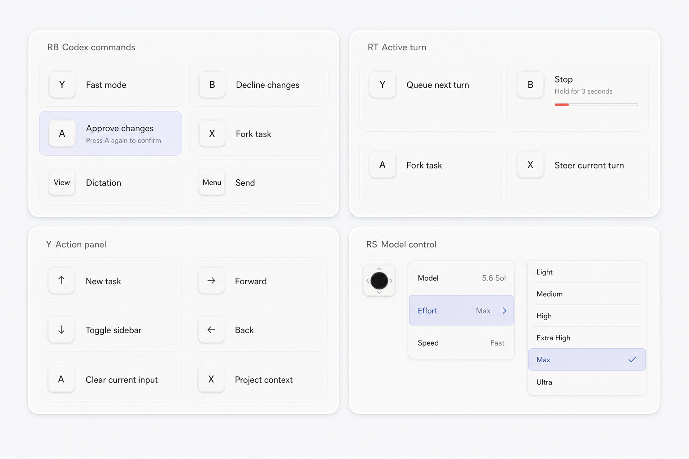
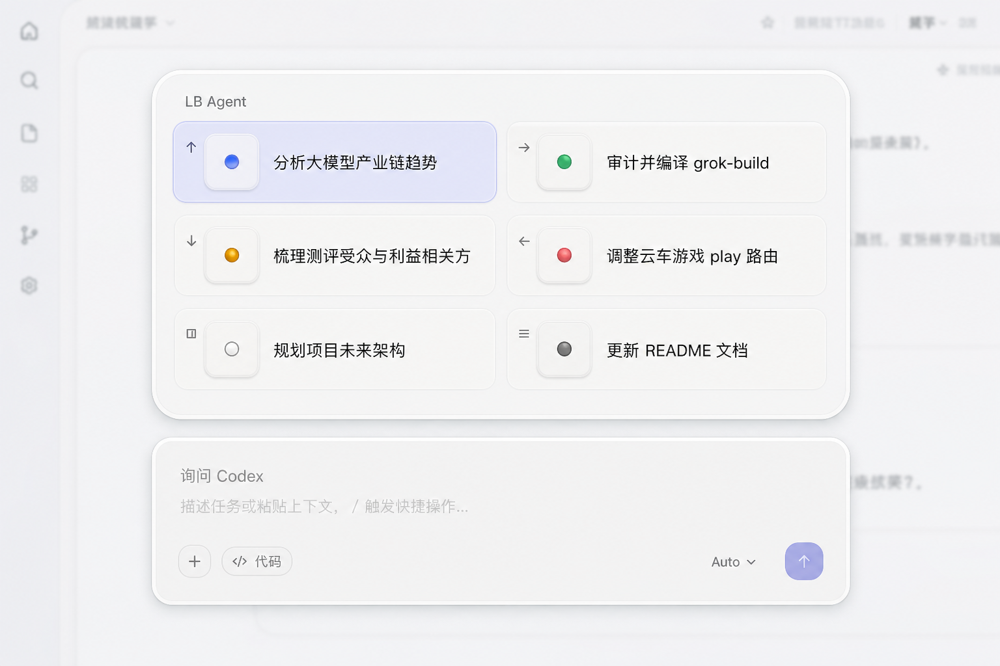
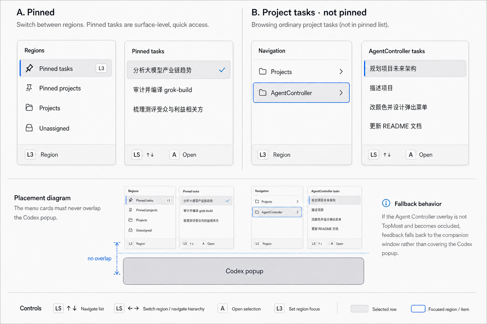
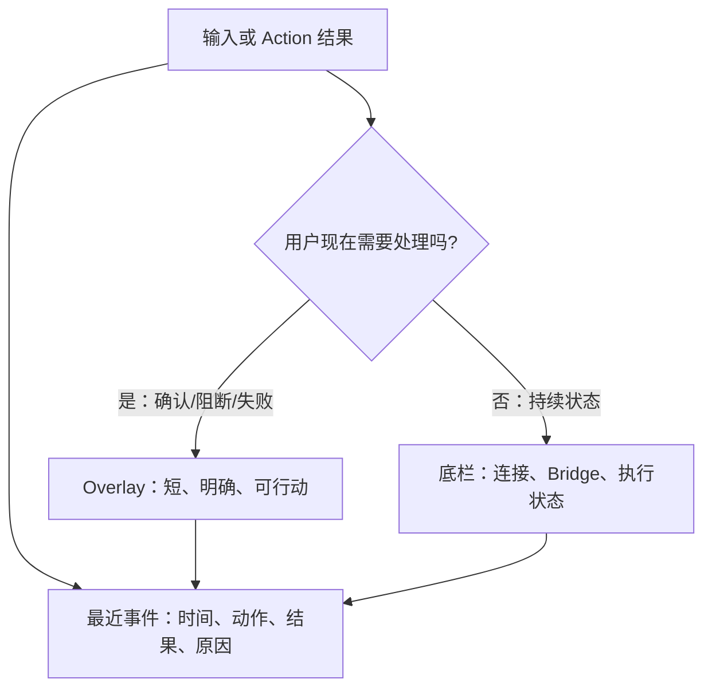

# 界面与交互设计

> Status: Current WPF information architecture and interaction contract
>
> Updated: 2026-07-19
> Scope: 主窗口、侧边栏导航弹层、LB/RB/RT/Y 操作层、反馈与主题

界面服务于两种不同场景：主窗口用于连接、学习、浏览和配置；Overlay 用于用户留在 Codex 中时的短时操作。Overlay 只显示当前按键层和必要反馈，不能发展成第二个完整 Agent 客户端。

## 1. 设计原则

1. **物理位置优先**：用方向、键帽和当前控制器 glyph 表达输入，不能把 Xbox 的 ABXY 字母硬编码给所有手柄。
2. **上下文可见**：用户必须看见当前处于 Base、Agent、Command、Running 还是 Action 层。
3. **危险动作可撤销或需确认**：Stop 使用 3 秒长按；清空输入使用二次确认；Approval/Decline 必须显示目标上下文。
4. **反馈诚实**：区分已发送、已接受但未验证、已验证成功、被阻断和不兼容。
5. **不遮挡 Codex 关键控件**：弹层优先位于上部或侧边；模型/Composer 原生菜单由 Codex 自己显示。
6. **渐进式教学**：Learning 模式显示位置提示；Always 保留操作层；Off 只保留必要反馈。

## 2. 主窗口信息架构



### 2.1 窗口骨架

| 区域 | 当前合同 |
| --- | --- |
| 窗口 | 默认 `1220 × 800`，最小 `1060 × 690`，居中启动 |
| 顶栏 | 高 `66`；左侧品牌，中间“设备/配置/设置”，右侧连接状态与 Bridge 总开关 |
| 内容区 | 外边距 `18`；三个页面同位切换，不重新创建窗口 |
| 底栏 | 高 `38`；左侧事件/状态，右侧版本 |
| 键盘导航 | `TabNavigation=Cycle`；可用键盘完成主要设置与列表操作 |

### 2.2 设备页线框

```text
┌──────────────────────────────────────────────────────────────────────────┐
│ 动态手柄教程 + 当前按键高亮                         [LIVE INPUT]         │
│                                                                          │
│ [主操作] [语音] [发送] [取消/撤回] [项目上下文] [唤醒 Codex]            │
├──────────────────────────────────────────┬───────────────────────────────┤
│                                          │ 右摇杆 / Micro encoder         │
│ 教程与手柄示意                            │ 当前模式、方向、选中值          │
│                                          ├───────────────────────────────┤
│                                          │ 任务/项目目录                   │
│                                          │ scope、项目过滤、列表、刷新      │
│                                          ├───────────────────────────────┤
│                                          │ 最近事件                        │
└──────────────────────────────────────────┴───────────────────────────────┘
```

设备页左侧承载学习，右侧承载当前目标与任务浏览；六张速查卡只展示高频入口，不复制全部组合层指令。控制器未连接时保持教程可读，但 Live input 与连接状态必须明确降级。

### 2.3 配置与设置的职责

| 页面 | 负责 | 不负责 |
| --- | --- | --- |
| 配置 | 解释左右摇杆行为、展示/编辑 Agent 快捷键、恢复默认值 | 运行时状态、设备诊断、通用系统偏好 |
| 设置 | Bridge 之外的行为门禁、Overlay 模式、摇杆参数、语言、自启动、托盘与恢复默认值 | 业务 Action 映射编辑器；当前版本尚未提供自定义 binding UI |

“配置”回答“控制如何映射”，“设置”回答“应用如何运行”。未来新增自定义 Profile 时，应形成独立的 Binding/Profile 流程，不继续向两个页面堆字段。

## 3. Overlay 家族

Overlay 统一使用实体键帽、动作标题、可选副标题和可选确认进度。固定宽度 `804` 的现有面板出现在透明 Overlay 上部，为下方 Codex popup 保留空间。

| 入口 | 形态 | 内容 | 退出 |
| --- | --- | --- | --- |
| LB hold | 2 × 3 Agent keypad | 槽位 1–6、任务标题、状态灯、当前选择 | 松开 LB 或 B |
| RB hold | 2 × 3 Action menu | Fast、Approve、Decline、Fork、PTT、Dispatch | 松开 RB 或 L3 |
| RT hold | 2 × 2 Action menu | Steer、Queue、Stop、Fork | RT 回落到 release threshold |
| Y | 2 × 3 Action menu | New task、Forward、Toggle sidebar、Back、Clear、Project context | Y 或 B |
| R3 / 右摇杆 | Codex 原生 Composer menu | Model、Effort、Speed/Power 等实际可用项 | B 上下文返回 |



这张图用于说明同族布局与信息密度；最终文案、glyph、状态与可用性以运行时 ViewModel 和 XAML 为准。R3 区域是 Codex 自身界面，不应由 Agent Controller 伪造一套静态模型清单。

### 3.1 LB Agent keypad

LB 层使用 2 × 3 Micro 风格键盘，不使用圆盘、放射连线或中央手柄照片。

```text
┌ LB Agent ─────────────────────────────────────────────┐
│ [↑  ●  Agent 1 title]   [→  ●  Agent 2 title]        │
│ [↓  ●  Agent 3 title]   [←  ●  Agent 4 title]        │
│ [View ● Agent 5 title]  [Menu ● Agent 6 title]       │
└───────────────────────────────────────────────────────┘
```



状态灯语义：

| 灯状态 | 含义 | 展示规则 |
| --- | --- | --- |
| 灭 | 未绑定或无可信状态 | 不显示成 Idle |
| 暖白 | Idle | 任务可用但未运行 |
| 蓝 | Thinking/Running | 只在有运行证据时显示 |
| 绿 | Complete unread | 已完成且用户尚未查看 |
| 琥珀 | Requires input | 仅在有审批/提问证据时显示；不能由“仍在运行”猜测 |
| 红 | Error | 有明确错误事件 |

颜色必须与标题/状态文本共同表达，不得只靠颜色。当前 Micro `thstatus` 只有 slot 状态时，若缺少可靠 slot→thread proof，不得覆盖命名任务的状态。

### 3.2 RB / RT / Y 动作菜单

每一行只包含：物理键帽、动作标题、必要时一行副标题、必要时一条进度。选择状态使用统一强调色；危险语义通过动作名称、说明与确认进度表达，不把整张面板染成红色。

| 状态 | 视觉反馈 |
| --- | --- |
| 默认 | 中性键帽和标题 |
| 当前按键/焦点 | 单一强调背景或描边 |
| 不可用 | 降低对比度并保留原因；不能静默消失导致布局跳动 |
| 等待二次确认 | 副标题显示“再次按下确认”与剩余窗口 |
| 长按确认 | 连续进度条；提前松开立即归零 |
| 执行中 | 短暂活动状态；不提前显示成功 |
| 成功/失败 | 由 Overlay feedback、底栏或事件日志给出结果 |

### 3.3 侧边栏导航弹层

侧边栏弹层把“选择 scope/项目”和“选择任务”分成相邻卡片：左摇杆上下移动，左右进入/退出层级，A 打开任务，L3 循环根 scope。目录选择与任务打开必须分离，避免移动焦点时意外切换 Codex 任务。



弹层不能覆盖 Codex popup。若无法保持 TopMost 或安全位置，反馈回落到主窗口/底栏，不在 Codex 关键区域强行叠加。

## 4. 反馈层级



| 反馈面 | 适用内容 | 文案要求 |
| --- | --- | --- |
| 顶栏状态 | 控制器连接、Bridge 开关 | 持续、简短，不随每次动作闪烁 |
| Overlay | 当前层、确认倒计时、阻断、重要失败 | 一个动作、一个结果、一个下一步 |
| 底栏 | 最近一次非阻塞状态 | 不遮挡、不抢焦点 |
| 最近事件 | 调试与回溯 | 时间、Action/输入、outcome、executor/error；不记录 prompt 正文 |

推荐结果词汇与 `ActionOutcome` 对齐：成功、未发送、已接受但未验证、不支持、不兼容、已阻止、失败。不要把“已发送按键”写成“操作成功”。

## 5. 主题与组件规范

应用主题由 `app/Themes/` 中的 token 和控件样式组成：

- `Tokens.Colors.xaml`：中性冷灰基础色、鼠尾草绿强调色、文字、边框与状态色；
- `Tokens.Typography.xaml`：UI/mono 字体与字号层级；
- `Tokens.Metrics.xaml`：间距、圆角与尺寸；
- `Tokens.Elevation.xaml`：主窗口卡片与 Overlay 层级；
- `Tokens.Motion.xaml`：教学、选择和状态灯节奏；
- `Controls/*.xaml`：按钮、分段导航、卡片、输入、列表、状态与 Overlay。

新增视图必须优先复用 token 与共享样式，禁止在页面内重新创造一套颜色、圆角和阴影。状态色只承载状态；普通分类和装饰不用彩虹式分色。

配置页与设置页均在修改后自动保存，不再显示重复的保存按钮；“恢复默认值”位于各自页头，并在恢复后立即保存。

### 5.1 设计系统合同

仅亮色主题，不提供夜间模式。所有规则落在 token 层，视图只消费 token。

**颜色。**画布 `#F3F4F4`，面板 `#FAFBFB`，卡片表面纯白；文字用石墨墨色三级（主 `#1A1C1D`、次 `#5F6866`、弱 `#9AA1A0`）；边框用发丝线灰（细 `#E0E3E3`、强 `#C9CECE`）。唯一强调色为鼠尾草绿 `#53675A` 一族（浅底 `#E6EBE6`、边 `#CFD9D1`、深文字 `#405247`），只用于选中、焦点、主按钮与品牌性提示，不表达状态、不做大面积铺色。

**状态色独立于强调色。**成功 `#2F7D46`、警告琥珀 `#A66A14`、危险红 `#BE4238`；六色任务状态灯（含运行中蓝 `#347FC4`）与实体 Micro 硬件灯语义对齐，禁止挪作装饰或选中态，也禁止用强调色表达状态。

**字号。**下限 11px：Caption 11、Label 12、Body 13、BodyLg 14、Title 16、TitleLg 18、Display 22、Hero 26。数值、版本与 live 数据用 mono 字体。不得在视图内使用低于 Caption 的字号。

**形状。**圆角只用 `Tokens.Metrics.xaml` 的 4/6/8/12/16 刻度；按钮与分段一律圆角矩形，禁止胶囊/椭圆形控件。选中态用鼠尾草绿浅底加深字，不改变控件几何。

**层次。**结构靠发丝线边框与留白表达；阴影只作辅助（卡片近乎无影，Overlay 轻投影），禁止用重阴影或多层描边制造层级。

## 6. 可访问性与输入兼容

- 所有主要设置保留键盘访问、可见焦点和可读标签。
- L3/R3 文案必须同时解释为 LS/RS 垂直按压，不能用“向下拨摇杆”的图示。
- 手柄 glyph 来自当前 `ControllerProfile`；字母与物理位置同时展示时，以物理位置为主。
- 颜色状态同时提供文本、形状或图标；不能只靠红/绿区分。
- 动画应短暂并尊重系统减少动画偏好；状态灯脉冲不能成为唯一信息源。
- Overlay 不抢占 Codex 文本输入焦点；关闭层后恢复原目标或明确报告无法恢复。
- 中英文文本长度不同，标题允许截断但关键动作和确认文案不能被裁掉。

## 7. 界面状态与空状态

| 条件 | 主窗口 | Overlay/手柄行为 |
| --- | --- | --- |
| 未连接控制器 | 显示等待状态与静态教程 | 不显示操作层 |
| 控制器已连接但未回中 | 显示设备，提示等待 neutral | 不消费残留按键边沿 |
| Bridge off | 顶栏开关关闭，持续说明“手柄不会控制 Codex” | 禁止所有 Codex 动作；只做 release/neutral 清理 |
| Codex 不在前台且前台门禁开启 | 显示目标未就绪 | Menu 可在 Bridge on 时唤醒；其他动作 Blocked |
| Micro 不可用 | 显示 Limited/NotSent，而非 Full Micro | 仅走预先定义的语义回退 |
| layout 不可验证 | 标注不兼容/自定义映射未知 | 对应 `ACT*` fail closed |
| 无任务 | 目录显示空状态和新建入口 | LB 槽位显示未绑定，不伪造任务 |
| 动作结果未知 | 保留“已接受但未验证” | 不自动双发；允许用户手工核对 |

## 8. 验收清单

### 主窗口

- 三个一级页面职责清楚，连接状态与 Bridge 在任何页面都可见。
- `1060 × 690` 下无关键文字、按钮或列表被裁切。
- 键盘可访问顶栏、列表、表单、保存与外部设置按钮。
- 设备页在连接、断开、空任务、长标题和中英文下均保持稳定布局。

### Overlay

- LB 六槽顺序固定为上/右、下/左、View/Menu；与 `AgentRadialSlotLayout.Bindings` 一致。
- RB/Y 为 2 × 3，RT 为真实 2 × 2；未使用行折叠，不留空白槽。
- Learning/Always/Off 三种模式只改变说明密度，不改变输入语义。
- Stop、Clear、Approve/Decline 的确认和取消路径可见、可中断。
- Overlay 不抢 composer 焦点，不遮挡 Codex popup，不把 transport ACK 误呈现为成功。

### 状态与国际化

- Unknown、Idle、Running、Requires input、Complete unread、Error 可区分且有非颜色提示。
- 所有用户可见字符串来自本地化 catalog；动态 Agent 名称与控制器 glyph 可安全插值。
- 最近事件不包含 prompt、任务正文或凭据。

## 9. 代码索引

| 界面 | 代码入口 |
| --- | --- |
| 主窗口骨架 | `app/MainWindow.xaml` |
| 设备页 | `app/Views/DevicePageView.xaml` |
| 配置页 | `app/Views/ConfigPageView.xaml` |
| 设置页 | `app/Views/SettingsPageView.xaml` |
| 动态教程 | `app/Views/ControllerTutorialView.xaml` |
| LB Agent keypad | `app/Views/AgentKeypadView.xaml` |
| RB/RT/Y action menu | `app/Views/ActionMenuView.xaml` |
| Overlay 容器与切换 | `app/Views/RadialMenuView.xaml`、`RadialMenuOverlayWindow.xaml` |
| 侧边栏导航弹层 | `app/Views/SidebarNavigationMenuView.xaml` |
| 主题与组件 | `app/Themes/` |
| Overlay ViewModel | `app/ViewModels/RadialMenuViewModel.cs`、`RadialMenuSlotViewModel.cs` |
| 页面 ViewModel | `app/ViewModels/DevicePageViewModel.cs`、`ConfigPageViewModel.cs`、`SettingsPageViewModel.cs` |

交互或界面修改后，至少同步更新对应 XAML、ViewModel、本地化 catalog、设计测试、[手柄操作列表](controller-operations.md)和[系统指令映射](system-design-and-command-map.md)。
