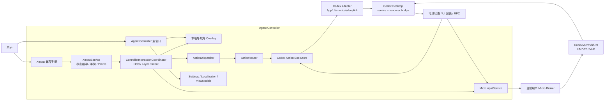
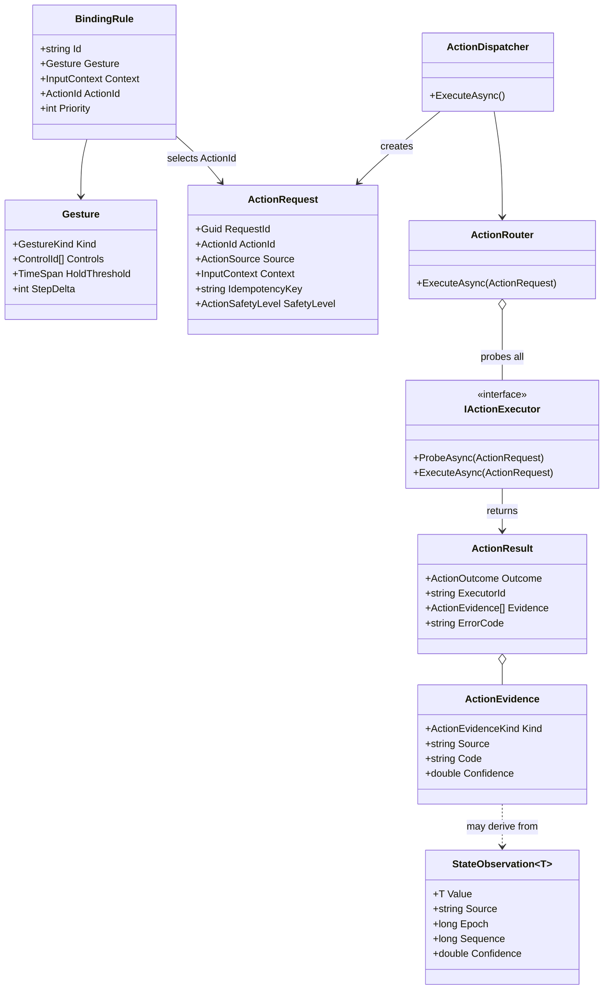
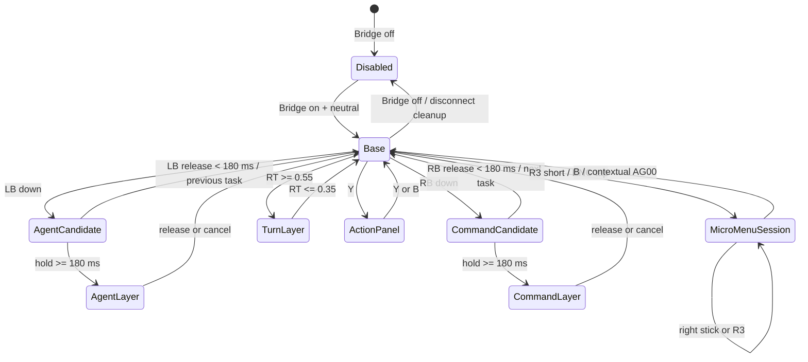
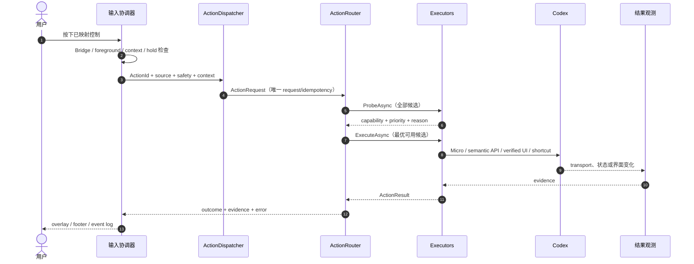
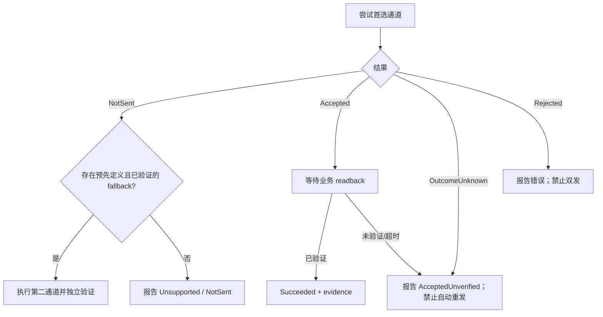

# 系统设计、UML 与指令映射

> Status: Current implementation map + target boundaries
>
> Updated: 2026-07-19
> Scope: Agent Controller WPF 客户端、Application/Domain 骨架、Micro Broker 与 Codex 适配器

本文回答四个问题：系统由哪些部分组成、一次操作如何流转、物理输入最终映射成什么指令、各类结果如何判定。用户操作以[手柄操作列表](controller-operations.md)为准；Micro wire 细节以[Codex Micro 指令参考](codex-micro-command-reference.md)为准；历史 v0.7 差异只在[旧版指令清单](controller-command-reference-v0.7.md)中维护。

实体 Codex Micro 通过 USB-C 或 Bluetooth 直接连接电脑，不经过本仓库的 Broker/VHF 路径；部署和时序见[Codex Micro 实体键盘接入与 UML](codex-micro-physical-connection.md)。

## 1. 文档边界与术语

| 资料 | 回答的问题 | 是否作为当前合同 |
| --- | --- | --- |
| 本文 | 组件、核心类型、路由、Action ID、执行通道 | 是 |
| [手柄操作列表](controller-operations.md) | 用户按什么、会发生什么 | 是 |
| [界面与交互设计](interface-design.md) | 主窗口、弹层、状态、反馈如何呈现 | 是 |
| [架构与输入链路](architecture-and-input-flow.md) | Micro 设备平面、Broker、驱动与输入时序 | 是 |
| [Codex Micro 指令参考](codex-micro-command-reference.md) | HID/RPC/report 的观测合同 | 兼容合同；必须指纹门禁 |
| [v0.7 指令清单](controller-command-reference-v0.7.md) | 旧实现、旧规范与差异 | 否；仅历史基线 |

统一术语：

- **物理输入**：手柄按钮、扳机或摇杆原始状态。
- **逻辑输入**：按物理位置归一化后的 `LogicalInput`，例如 `FaceSouth`，不依赖 Xbox/Nintendo 的字母布局。
- **意图**：一次已去抖、已识别上下文的操作，例如 `SendPrompt` 或 `NavigateSidebarHorizontal`。
- **Action**：Agent 无关、可记录结果的业务命令，例如 `composer.submit`。
- **Micro 投影**：把允许的意图变为 `AG*`、`ACT*`、`ENC*` 或 Analog report。
- **执行证据**：transport、状态或 UI 回读；`Accepted` 只代表 transport 接收，不代表业务成功。

## 2. 系统上下文 UML

这张图是**当前渐进迁移状态**：`Domain` 与 `Application` 已承载稳定 Action 合同和路由，但部分输入协调、Codex 自动化和 WPF composition 仍在 `app/`。目标依赖方向见[目标项目结构](../../docs/architecture/target-project-structure.zh-CN.md)，不能把目标目录误写成已经完成的现状。

## 3. 核心类 UML

关键约束：

1. `ActionDispatcher` 生成 request ID 与幂等键；调用方不能用一个模糊的 bool 代替结果。
2. `ActionRouter` 先探测全部 executor，再按 capability priority 选择；没有可用实现时返回 `Blocked`、`Incompatible` 或 `Unsupported`。
3. `ActionResult` 固定保留 outcome、executor、证据与错误码；transport 与业务结果不能混为一谈。
4. `StateObservation<T>` 用 source、epoch、sequence、时间与 confidence 标识状态来源，避免把推断状态冒充权威状态。

## 4. 输入与层状态机

Bridge 关闭是入口总门控。关闭后可以继续设备发现、被动显示与 release/neutral 清理，但不能用 Menu、摇杆、扳机或按钮控制 Codex。

## 5. 一次 Action 的执行时序

## 6. 物理输入到操作的总映射

### 6.1 Base 层

| 物理输入 | 逻辑/意图 | 业务 Action 或本地操作 | 首选执行通道 | 安全说明 |
| --- | --- | --- | --- | --- |
| Menu | `Menu` | 唤醒/置前 Codex | foreground adapter | Bridge off 时禁止 |
| 左摇杆上/下 | `LeftStick` | 同级目录移动 | 本地 sidebar directory | 只移动焦点，不立即打开 |
| 左摇杆左/右 | `LeftStick` | 退出/进入项目目录 | 本地 sidebar directory | 进入项目不等于打开任务 |
| L3 | `LeftStickPress` | 循环根 scope | 本地 sidebar state | 置顶任务 → 置顶项目 → 项目 → 未归项目 |
| A | `FaceSouth` / `OpenSelectedSidebarTask` | `thread.open` | deeplink/open-thread executor | 只打开已确认任务 ID |
| X | `FaceWest` / `SendPrompt` | `composer.submit` | 验证 layout 后 `ACT12`，否则语义 adapter | 非空并验证清空后才可报成功；禁用 Enter 回退 |
| B 短按 | `FaceEast` | 上下文返回/取消/撤回 | Micro 菜单会话、局部 cancel 或 `navigation.undo` | 普通 Base 不得盲发 `AG00` |
| B 长按 3 秒 | `FaceEast` / hold | `turn.stop` | 当前为已验证 composer/UI adapter；目标为语义 turn interrupt | 高风险；提前松开取消 |
| Y | `FaceNorth` / `OpenActionPanel` | 打开 Y 动作面板 | 本地 UI | 冻结 Base 路由 |
| 十字键上/下 | `DPadUp/Down` | `conversation.previous-user-message` / `conversation.next-user-message` | verified navigation adapter | 长按分别触发 top/bottom |
| 右摇杆上/左 | axis step | `EncoderStep(+1)` | `ENC_CW act=2` | 不承担进入/确认 |
| 右摇杆下/右 | axis step | `EncoderStep(-1)` | `ENC_CC act=2` | 不承担进入/确认 |
| R3 短按 | `RightStickPress` | `EncoderPress` | `ENC` down/up | 建立 Micro 菜单会话 |
| R3 长按 500 ms | hold | 打开 Agent Controller 设置 | 本地窗口 | 抑制同一次 `ENC` 短按 |
| LT 按住/松开 | `LeftTrigger` | PTT start/stop | layout 验证后 `ACT10` down/up | release 不得丢失 |
| LB/RB 短按 | shoulder tap | 上一个/下一个可用任务 | 本地任务导航 | 180 ms 内释放才是 tap |
| View | `View` / reserved | 当前无动作；后续可能用于切换当前受控 Agent | 无 | 实现前保持 fail closed，不复用为其他 Base 动作 |

### 6.2 上下文层

| 层 | 输入 | 操作 | Action / wire |
| --- | --- | --- | --- |
| LB Agent | 十字键上/右/下/左 | Agent 槽 1–4 | `AG00..AG03` tap |
| LB Agent | View / Menu | Agent 槽 5–6 | `AG04..AG05` tap |
| LB Agent | B | 取消本层 | 本地 cancel |
| RB Command | Y | Fast | layout 验证后的 `ACT06` / `composer.toggleFastMode` |
| RB Command | A | Approve | `approval.accept`；默认 Micro `ACT07` |
| RB Command | B | Decline | `approval.decline`；默认 Micro `ACT08` |
| RB Command | X | Fork | `thread.fork`；默认 Micro `ACT09` |
| RB Command | View 按住 | PTT | `ACT10` down/up |
| RB Command | Menu | Dispatch | 当前 composer 的 Send / Steer / Queue |
| RT Running | X | Steer | `turn.steer` |
| RT Running | Y | Queue | `turn.queue` |
| RT Running | B 长按 3 秒 | Stop | `turn.stop` |
| RT Running | A | Fork | `thread.fork` |
| Y Action | 十字键上 | 新建任务 | `thread.create` |
| Y Action | 十字键右/左 | 历史前进/后退 | `navigation.forward` / `navigation.back` |
| Y Action | 十字键下 | 侧边栏开关 | `sidebar.toggle` |
| Y Action | A 两次 | 清空 composer | `composer.clear`，二次确认 |
| Y Action | X | 项目上下文 | 本地 sidebar project context |

## 7. Action ID 与执行器映射

| Action ID | 风险级别 | 当前主要执行器/通道 | 成功判据 |
| --- | --- | --- | --- |
| `thread.open` | Routine | `CodexOpenThreadActionExecutor` / deeplink | 目标 thread 被确认打开 |
| `thread.create` | Routine | `CodexCreateThreadActionExecutor` / 可见命令，必要时官方快捷键 | 新任务界面可见 |
| `thread.fork` | Routine（当前） | `CodexForkThreadActionExecutor` / 验证 Micro → shortcut → UI command | 当前通常为 `AcceptedUnverified`；有 fork/branch readback 后才可升级为成功 |
| `composer.submit` | Routine | `CodexComposerActionExecutor` / 验证 `ACT12` 或 composer adapter | 当前 transport/快捷键路径为 `AcceptedUnverified`；有权威 turn 证据后才可升级为成功 |
| `composer.clear` | ConfirmationRequired | `CodexComposerActionExecutor` | composer 为空且目标编辑器未变 |
| `turn.stop` | HighRisk | `CodexComposerActionExecutor`，目标为语义 stop | 当前 turn 终止；不能只凭点击成功 |
| `turn.steer` | Routine（当前） | 当前为可见 composer 命令；目标为语义 turn adapter | 当前通常为 `AcceptedUnverified`；需 follow-up 进入当前 turn 的证据 |
| `turn.queue` | Routine（当前） | 当前为可见 composer 命令；目标为语义 turn adapter | 当前通常为 `AcceptedUnverified`；需 follow-up 进入下一 turn 队列的证据 |
| `approval.accept` | HighRisk | `CodexUiCommandActionExecutor` / 验证 `ACT07` 或可见审批命令 | 对应 approval 消失或状态改变 |
| `approval.decline` | Routine（当前） | `CodexUiCommandActionExecutor` / 验证 `ACT08` 或可见拒绝命令 | 当前通常为 `AcceptedUnverified`；对应 approval 状态变化后才可升级为成功 |
| `conversation.*` | Routine | `CodexConversationActionExecutor` | 已验证滚动/消息位置变化 |
| `navigation.back` / `forward` | Routine | shell/verified navigation adapter | 历史位置变化；不能误作 composer 光标移动 |
| `navigation.undo` | Routine | `CodexNavigationUndoActionExecutor` | 本地导航栈与目标任务恢复 |
| `sidebar.toggle` | Routine | shell/verified sidebar adapter | 侧边栏可见性变化 |

`ActionSafetyLevel` 是请求合同；UI 的长按、二次确认和上下文检查是其交互实现。新增高风险 Action 时，两者必须同时更新。

### 7.1 当前需要收敛的合同差异

| 项目 | 当前代码 | 产品/交互合同 | 收敛方向 |
| --- | --- | --- | --- |
| Decline 风险级别 | `Routine`，无需二次确认 | Approval/Decline 都要求先验证审批上下文 | 明确是否升为 `HighRisk`；若保持 Routine，也必须补目标与结果 readback |
| Fork 风险级别 | `Routine`，Micro/快捷键/UI 任一路径都多为未验证接受 | 组合层把 Fork 作为直接动作 | 保持直接动作时补 fork readback，不能把 transport 接受写成成功 |
| Steer / Queue | `Routine`，当前按可见按钮名调用 | 只应在已验证 RunningTurn 上下文开放 | 迁入语义 turn adapter，并让 capability probe 拒绝错误上下文 |
| Stop | `HighRisk` + 3 秒长按，但 UIA 点击后仍是未验证 | 需要权威 turn interrupt 与终止证据 | App Server 垂直切片完成后替换当前主路径 |

在这些差异解决前，本文表格中的“当前”列优先描述代码事实；[手柄操作列表](controller-operations.md)中的“首选通道”描述产品目标。

## 8. Micro 指令映射

| 语义 | wire key | `act` / 时序 | 发送前门禁 |
| --- | --- | --- | --- |
| 上一项 | `ENC_CW` | `2`，每档一条 | 设备与 build 兼容；步数 `1..64` |
| 下一项 | `ENC_CC` | `2`，每档一条 | 同上 |
| 打开/进入/确认 | `ENC` | `1 → 0` | R3 短按；长按不得泄漏 tap |
| Agent 1–6 | `AG00..AG05` | `1 → 0` | 槽位 `0..5`；菜单返回的 `AG00` 仅限会话内 |
| Fast | `ACT06` | `1 → 0` | 当前 layout 必须解析为 `composer.toggleFastMode` |
| Approve | `ACT07` | `1 → 0` | layout + approval context |
| Decline | `ACT08` | `1 → 0` | layout + approval context |
| Fork | `ACT09` | `1 → 0` | layout + fork context |
| PTT | `ACT10` | 按住 `1`，松开 `0` | layout 必须解析为 `dictation.pushToTalk`；异常时补 neutral |
| Submit | `ACT12` | `1 → 0` | layout 必须解析为 `composer.submit` |
| Analog pulse | `v.oai.rad` | neutral → direction → neutral | angle/distance 有限；最终 neutral 必达 |

`ACT*` 是可重映射物理槽，不是永久业务常量。`CodexMicroLayoutResolver` 只读解析当前 Codex layout；无法证明映射时必须 `NotSent`，不得按默认键帽猜测。

## 9. 执行结果与 fallback 决策

| 结果 | 用户可理解含义 | 后续动作 |
| --- | --- | --- |
| `Succeeded` | 动作已由结果证据确认 | 更新状态与日志 |
| `NotSent` | 首选通道确认没有发送 | 只允许预先定义的 fallback |
| `AcceptedUnverified` | 可能已执行，但尚无业务证据 | 禁止非幂等重试，提示用户核对 |
| `Unsupported` | 当前适配器没有该能力 | 显示可恢复建议 |
| `Incompatible` | build、layout 或设备合同不匹配 | fail closed，要求修复兼容性 |
| `Blocked` | Bridge、前台、权限或上下文不满足 | 显示具体阻断原因 |
| `Failed` | 已知执行失败 | 保留 executor、错误码与证据 |

## 10. 代码索引与维护规则

| 主题 | 代码入口 |
| --- | --- |
| Composition | `app/Composition/AppComposition.cs` |
| 物理位置归一化 | `app/Controllers/LogicalInput.cs` |
| 输入意图 | `app/Controllers/ControllerInteractionIntent.cs` |
| LB/RB/RT/Y 映射 | `app/Controllers/RadialInputMap.cs` |
| Action 合同 | `src/AgentController.Application/Actions/*ActionContract.cs` |
| Action 请求/结果/证据 | `src/AgentController.Domain/Actions/` |
| 路由与执行器选择 | `src/AgentController.Application/Actions/ActionRouter.cs` |
| Micro 投影 | `app/Services/Micro/MicroInputService.cs` |
| Micro layout 门禁 | `app/Services/Micro/CodexMicroLayoutResolver.cs` |
| Broker | `src/AgentController.MicroBroker/` |

每次更改绑定时，至少同步检查：`RadialInputMap`、教程文案、Overlay 槽位、本文总映射、`controller-operations.md` 与对应测试。每次更改 Micro 指令时，还必须更新 golden vector/协议测试和 `codex-micro-command-reference.md`。
