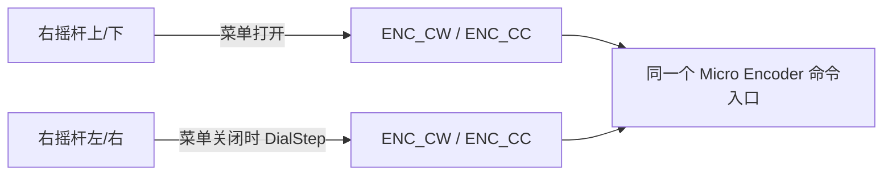
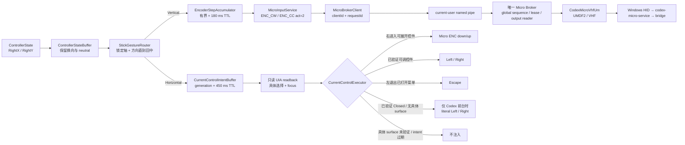
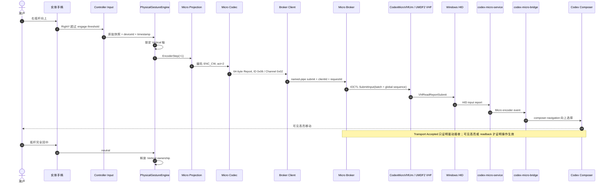

# 91 — 控制器输入已知问题与实机复现

> Status: Code remediation complete; real-device acceptance pending
> Priority: P0 for right-stick navigation; P1 for intermittent input loss
> Depends on: 03-codex-micro-compatibility, 08-testing-observability-and-release

> 2026-07-19 实机回归重新发现两条 P0：右摇杆横向完全无动作，以及菜单键只显示 Agent Controller 反馈、无法把 Codex 置前。代码根因已分别在 `c7754f7`、`be0d67e` 修复；多 Codex 主窗口循环选择在 `af81c9a` 增补。仍须用新构建复验，不能因自动化与一次本机激活探针通过而关闭本条目。

## 目的

集中记录真实 Codex Desktop + 实体手柄的控制器输入问题、代码修复与实机验收。这里的现象优先于单元测试结论；没有真实 HID/Micro 发送记录、界面状态变化和实机复现，不得把问题标记为完成。

2026-07-18 早先的右摇杆试验分支已全部丢弃。当前 `codex/fix-controller-input-91` 从 `main` 重新按故障层实施：先固定物理手势边界，再冻结纵横轴语义，随后处理 PTT、readback、横向执行器、异步 session，最后引入单 Broker。下面保留修复前基线，并把代码证据与仍未完成的实机证据分开记录。

## 问题基线（修复前）

| ID | 场景 | 期望 | 修复前实际 |
| --- | --- | --- | --- |
| RS-01 | Power 横条 | 右摇杆左/右按屏幕方向减小/增大 | 当前方向已正确，作为其他控件的对照样本保留 |
| RS-02 | `Approve for me` | 右进入/打开，左退出/返回；打开后上/下移动菜单高亮 | 右能打开、左能退出，但菜单内没有可靠可见高亮，输入容易表现为卡住 |
| RS-03 | `Add files and more @` | 左/右只负责进入/返回或当前控件的横向动作，上/下选择菜单项 | 左/右动作仍可能反向或落到错误目标，菜单选择不可靠 |
| RS-04 | 模型选择器 | 进入后上/下按视觉顺序选择模型，左返回；不得把横向动作解释为纵向旋钮档位 | 左/右行为仍不正确，上/下与左/右容易混用 |
| RS-05 | Composer 主控件 | 上/下依次选择 Advanced、Fast、Power 横条等控件；左/右调整当前控件或进入/返回 | 上/下有时重复横向调整或落到别的控件，当前控件与实际焦点会失配 |
| RS-06 | 连续或斜向拨动右摇杆 | 一次手势只能由一个轴拥有，回中后下一手势重新判定 | 纵横指令偶发混淆；斜向起步、快速换向和回中附近更容易出现 |
| RS-07 | 模型控制器长期使用 | 每次手势都能继续控制当前模型界面 | 偶发完全失去手柄控制；打开模型选择器后又恢复，恢复动作只是复现线索，不是解决方案 |
| LT-01 | LT 按住说话 | 按下开始、松开停止，任何退出或断连都补发 release | 偶发语音键无效；尚未确认是边沿丢失、策略阻止、自动化失败还是 Codex 未读回 |
| SRC-01 | 实体控制器 + `virtual-micro` 模拟器 | 两者可同时连接，由 Broker 串行化输入并分别管理 held/neutral 生命周期 | 当前看起来只能有一个输入源正常占用；共享句柄、sequence、output/RPC 所有权尚未统一 |
| RS-08 | 2026-07-19 新构建，右摇杆纯左/纯右 | `Closed` 基态也必须投递屏幕同向的横向动作；上下仍只产生 `ENC_*` | 横向 intent 被“必须有非空 UIA ItemName”的门禁永久挂起，左右均毫无反应 |
| WAK-01 | 菜单键唤醒 | Agent Controller 显示反馈后，真实 Codex 主窗口成为前台；若已有多个主窗口，再按菜单键切换下一个 | popup 正常出现，但旧实现按最新进程的 `MainWindowHandle` 选窗并从工作线程直接 `SetForegroundWindow`，Windows 拒绝置前 |

## 从 `virtual-micro` 更新确认的事实（2026-07-19）

- 旋钮旋转仍只有 `ENC_CW` / `ENC_CC`、`act=2`；旋钮按压仍为 `ENC` down/up；模拟摇杆是独立的 `v.oai.rad`。Micro 协议不存在“横向旋钮”命令，所以右摇杆左右只能是 Agent Controller 的显式扩展，绝不能伪装成另一组 `ENC_*`。
- `fix(micro): make encoder input responsive` 使用有界 accumulator、约 24 ms 的档位间隔和 180 ms 过期时间，不在每个档位发送前同步等待 UIA。Agent Controller 的纵向实现继续遵守这套原则。
- `virtual-micro` 的 `CodexWindowActivator` 不信任 `Process.MainWindowHandle`：它枚举 Codex 顶层窗，按 tool-window、owner、窗口类和面积评分，再通过 `AttachThreadInput`、`BringWindowToTop`、`SetForegroundWindow`、`SetActiveWindow`、`SetFocus` 与 `SwitchToThisWindow` 置前。Agent Controller 已移植同一策略，并补上工作线程消息队列初始化。
- v1.0.1/v1.0.2 的新 build 兼容与屏幕灯光保持逻辑不改变上述输入映射；单 Broker 仍是实体控制器与模拟器并存时唯一允许的驱动 owner。

## 代码修复状态（2026-07-18）

| ID | 已实施修复 | 自动化证据 | 实机状态 |
| --- | --- | --- | --- |
| RS-01 | 横向 literal screen direction 保持不变；RangeValue 必须读回正确方向变化 | `CurrentControlActionPolicyTests` | 待按 Power 横条左右各 10 次复验 |
| RS-02 / RS-03 / RS-04 | 上/下固定为 Micro encoder；左仅退出菜单，右仅在已验证可展开控件进入；菜单必须读回具体选中项 | `VirtualDialInputPolicyTests`、`CodexMicroReadbackObserverTests`、`CurrentControlActionPolicyTests` | 待真实 Approve、Add files、模型菜单复验 |
| RS-05 | 横向 executor 只接受与当前可见选择一致的 Codex 键盘焦点；未验证时不注入；可调整控件验证数值方向 | `CurrentControlActionPolicyTests` | 待 Advanced、Fast、Power 顺序复验 |
| RS-06 | state buffer 保留跨区、换向和完整 neutral；手势期间同时锁定轴与方向，回中后才重新判定 | `ControllerStateBufferTests`、`StickGestureRouterTests` | 待慢速、快速、斜向和未完全回中矩阵 |
| RS-07 | encoder intent 有界合并且 180 ms 过期；横向 intent 绑定 generation 且 450 ms 过期；readback 合并请求，不再通过 cancellation 互相饿死；Broker 在应用启动时后台预热且失败重连退避 | `EncoderStepAccumulatorTests`、`CurrentControlIntentBufferTests`、`BrokerCoexistenceTests` | 待长期重复与“打开模型选择器后恢复”复验 |
| LT-01 | PTT 改为 Micro-first down/up；release 不确定时补发一次；下一次 press 先恢复 neutral；断连/退出保留 release | `MicroRpcCodecTests`、`PushToTalkAutomationStateTests`、`ControllerStateBufferTests` | 待短按、口述、菜单、失焦、断连复验 |
| SRC-01 | Agent Controller 与模拟器都改为 named-pipe client；唯一 Broker 独占 `CodexMicroVhfUm`、统一 sequence 和 output/RPC reader；重叠 held key 只投递第一次 down/最后一次 up；analog owner 释放时恢复最近仍活跃来源；请求执行/完成续期/lease expiry 原子化；缓存 request response 防止超时重放双发 | `BrokerCoexistenceTests`、`ClientInputStateTests`、`MicroInputBatchTests`、`MicroDriverOwnershipRulesTests` | 三客户端 fake-driver 仲裁与 lease 边界验收通过；真实驱动双进程仍待复验 |
| RS-08 | `Closed` 是“已确认无打开 surface”，不再要求虚构的非空 `ItemName`；横向策略直接保留 literal Left/Right，执行器仍要求 Codex 前台。任何已识别的具体 surface 继续要求真实焦点与目标名称一致 | `CurrentControlActionPolicyTests`、`VirtualDialInputPolicyTests`、`StickGestureRouterTests` | 25 项定向测试通过；待新构建纯左/纯右实机复验 |
| WAK-01 | 统一枚举并评分 Codex 顶层窗；排除/降权 owned/tool window，恢复最小化主窗，附加输入线程后置前；UIA locator 复用同一主窗选择结果。菜单键在 Codex 已前台且存在多个主窗口时只循环主窗口，普通快捷键聚焦不循环 | `Win32InputTests`；后台 Chrome → Codex 一次性实机激活探针 | 探针从 `chrome` 前台成功切至 `ChatGPT/Codex`；仍待菜单键实体手柄复验与双主窗口复验 |

分层提交：

1. `f809b90` — 保留手势边界；
2. `1030dff` — 纵向固定走 Micro encoder；
3. `b114dd3` — PTT Micro-first 与恢复状态机；
4. `f054aca` — 只读菜单/readback 验证；
5. `40ab80f` — 已验证横向控件执行器；
6. `65a1dfa` — generation、TTL 与 readback 饥饿修复；
7. `38b42f8` — 单 Broker、多客户端 lease；
8. `119a815` — 架构测试禁止桌面进程重新直接打开驱动；
9. `750e653` — request response cache，重复非幂等请求不双发；
10. `2465499` — 应用启动时后台预热 Broker，输入路径不承担首次连接等待；
11. `d2879ae` — 重叠 held key 引用合并与 analog 最近活跃 owner 恢复；
12. `7a41fa4` — 请求执行、完成续期与 lease expiry 原子化。
13. `c7754f7` — 修复 `Closed` 基态横向 intent 被空名称门禁吞掉；
14. `be0d67e` — 移植并强化 `virtual-micro` 主窗口枚举与前台激活；
15. `af81c9a` — 菜单键在多个 Codex 主窗口之间显式循环，普通聚焦保持稳定。

当前自动化基线为主解决方案 796 项、`CodexMicro.Protocol` 5 项；共享工作区中包含待提交 `virtual-micro` 兼容更新时，`CodexMicro.Desktop` 47 项，全部通过。这个结果只证明可重复的代码故障层已经被覆盖，不替代下方未勾选的实机矩阵。

## 不可变交互合同

- 右摇杆模拟 Micro 左上角旋钮的完整交互，不再维持另一套“简易/高级模型控制”状态机。
- 上/下是选择轴：在 composer 中遍历 Advanced、Fast、Power 等控件；在弹出菜单或模型列表中按视觉顺序移动高亮。每个重复档只允许产生一个 `ENC_CW` / `ENC_CC act=2`。
- 左/右是操作轴：按实际屏幕方向调整当前控件；对可进入的菜单，右进入/打开、左退出/返回。左/右不得产生 ENC 档位。
- R3 短按表示旋钮按压，长按打开 Agent Controller 设置；二者都不得被解释为方向动作，且长按必须抑制同一次手势的短按。教程必须说明 R3 是“垂直按下右摇杆帽”。
- 菜单打开后必须有可见选择或可验证 readback。只有“菜单已打开”而没有当前项身份，不算导航成功。
- Micro 驱动返回 `Accepted`、`OutcomeUnknown` 或 `Rejected` 后不得再注入第二套 UIA/键盘动作；只有明确 `NotSent` 才允许降级。
- neutral、key-up 和 PTT release 不能被模拟量合并丢弃；断连时只释放该输入源持有的状态。

## 右摇杆到 Codex 的端到端 UML

### 修复前链路（历史问题基线）

修复前实现不是一条稳定的 Micro 链路，而是根据菜单状态在 Micro、原生方向键和 UIA 之间切换：

```mermaid
flowchart LR
    subgraph PAD["物理手柄"]
        A["右摇杆<br/>RightX / RightY"]
    end

    subgraph INPUT["Agent Controller 输入层"]
        B["XInputService<br/>每 16 ms 轮询<br/>XInput / WGI / Raw HID"]
        C["ControllerStateBuffer<br/>合并模拟量快照"]
        D["UI Dispatcher<br/>ProcessControllerState"]
        E{"输入门禁<br/>Bridge / 前台 / LT / Radial<br/>等待回中"}
        F["StickGestureRouter<br/>死区 + 主轴判定<br/>锁轴直到回中"]
        G["AxisRepeater<br/>right-x / right-y"]
        H["VirtualDialInputPolicy<br/>Up / Down / Left / Right"]
        I["pending navigation<br/>异步 Pump"]
    end

    subgraph ROUTE["当前 Composer 路由"]
        J["CodexComposerService<br/>DialNavigate"]
        K{"菜单状态与方向"}
        L["菜单打开 + 上/下<br/>SendEncoderSteps"]
        M["菜单打开 + 左/右<br/>发送原生方向键"]
        N["菜单关闭 + 左/右<br/>DialStep"]
        O["MicroInputService<br/>ENC_CW / ENC_CC<br/>act = 2"]
        P["Legacy fallback<br/>UIA 控件探测 / 聚焦"]
    end

    subgraph DEVICE["Windows Micro 设备平面"]
        Q["MicroRpcCodec<br/>v.oai.hid + LF<br/>64-byte Report 0x06/0x02"]
        R["VhfMicroReportTransport<br/>sequence + IOCTL_SUBMIT_INPUT"]
        S["VHF source driver<br/>VhfReadReportSubmit"]
        T["Windows HID stack<br/>虚拟 vendor HID"]
    end

    subgraph CODEX["Codex Desktop 私有接收链"]
        U["主进程<br/>codex-micro-service<br/>监听 HID"]
        V["Renderer<br/>codex-micro-bridge<br/>映射 Micro 事件"]
        W["Composer / Popup<br/>移动高亮或调整控件"]
    end

    A --> B --> C --> D --> E
    E -->|"允许"| F --> G --> H --> I --> J --> K
    E -->|"阻止"| X["丢弃或等待 neutral"]

    K -->|"打开 + 上/下"| L --> O
    K -->|"打开 + 左/右"| M --> W
    K -->|"关闭 + 左/右"| N --> O
    K -->|"关闭 + 上/下"| Y["当前无动作 / unsupported"]

    L -->|"仅 NotSent"| M
    N -->|"仅 NotSent"| P --> W
    O --> Q --> R --> S --> T --> U --> V --> W
```

### 修复前轴语义冲突（已移除）

菜单状态会改变哪个物理轴被转换成 `ENC_*`，所以“上下、左右混淆”不一定只来自摇杆斜向噪声：

### 修复后实际链路

纵向不再读取 popup 或横向 readback；横向也不能进入 `SendEncoderSteps`。UIA 在横向链路中只负责读取目标、焦点与结果，不能凭 popup 可见就宣告成功。唯一例外是观察器已确认没有打开 surface 的 `Closed` 基态：此时没有可供校验的 item name，允许在“真实 Codex 主窗口当前为前台”这一硬门禁下发送 literal Left/Right；一旦检测到具体菜单、审批框或控件，仍恢复严格目标校验。

### 修复后原生 Micro 时序

右摇杆上/下固定表示 Micro 旋钮旋转；路由不得读取或猜测 Codex popup 来改变轴语义：

目标映射固定如下：

| 手柄动作 | 类型化意图 | Codex 最终输入 |
| --- | --- | --- |
| 右摇杆上 | `EncoderStep(+1)` | `ENC_CW, act=2` |
| 右摇杆下 | `EncoderStep(-1)` | `ENC_CC, act=2` |
| R3 短按 | `EncoderPress` | `ENC` down/up |
| R3 长按 | `OpenAgentControllerSettings` | 本地应用动作；不发送 `ENC`，并抑制同一次短按 |
| 右摇杆左/右 | `CurrentControlLeft / CurrentControlRight` | 独立导航 executor；绝不转换成 `ENC_*` |
| 回中 | `Neutral` | 释放轴 ownership，不得被快照合并丢失 |

## 已处理的故障层与仍待确认部分

代码 fixture 已把问题拆到以下确定层，不再用一个“右摇杆偶发失灵”概括全部故障：

| 故障层 | 修复 |
| --- | --- |
| Input buffer | 不能跨 gesture region 合并；按钮、LT 阈值、方向和 neutral 边界必须保留 |
| Gesture | 一次手势只有一个轴和一个方向；换轴、反向都必须先完整回中 |
| Projection | 纵向唯一投影为 `ENC_CW / ENC_CC act=2`；横向永远不是 encoder detent |
| Session | encoder 有界合并；横向 intent 绑定 generation/TTL；readback 使用 coalescing gate |
| Verification | popup visible 不等于成功；具体菜单必须有具体选择，具体控件横向必须匹配真实 focus，数值必须按预期方向变化；只有 verified `Closed` 可使用 Codex-foreground-bound literal fallback |
| Window activation | 枚举并评分所有 Codex 顶层窗，不再按进程启动时间猜 `MainWindowHandle`；工作线程先创建消息队列并附加输入线程；菜单循环只包含无 owner、非 tool 的主窗口 |
| PTT | down/up、OutcomeUnknown、release retry、restart neutral 与断连清理进入同一状态机 |
| Transport ownership | 单 Broker 独占 handle、sequence 与 output reader；客户端状态按 lease 隔离；同键引用合并，analog 按最近活跃 owner 恢复；活跃请求不会被 lease sweeper 中途摘除 |

以下部分仍必须由实机记录确认，不能从自动化测试推断：

- 实体控制器采样与 WPF Dispatcher 长时间繁忙时，是否仍能观察到完整 neutral，`DroppedStateCount` 是否增加。
- 每个真实手势是否只出现一个轴、一个方向和一个执行通道；Micro 返回非 `NotSent` 后是否仍有第二次原生按键。
- 当前 Codex build 的菜单 selection、UIA focus 与可见高亮是否一致；不一致时 executor 是否确实拒绝发送。
- popup 打开/关闭、失焦/恢复和鼠标先操作后，generation/TTL 是否阻止旧 intent 重放。
- 当前 Codex build 对 Approve、Add files、模型列表、Advanced、Fast、Power 暴露的 readback 结构是否覆盖现有观察器。
- 两个真实桌面进程是否都只连接 Broker，驱动 batch sequence 是否单调，output/RPC 是否只有一个 reader；重叠 PTT 是否只有一次物理 down/up，analog 后来 owner 释放后是否恢复前一来源。
- 菜单键从 Chrome、桌面、最小化 Codex 等不同前台状态唤醒时，真实主窗口是否每次置前；存在两个 Codex 主窗口时是否只在两者间循环而永不命中工具窗。

## 下一次排查必须采集的证据

对每次手势使用同一个 correlation/session id，按时间顺序记录：

1. 原始控制器快照：X/Y、dead zone、时间戳、设备 ID、是否出现完整 neutral。
2. 手势判定：获胜轴、方向、enter/repeat/exit、轴 ownership 的建立和释放原因。
3. 路由上下文：composer 控件、popup/menu 类型、进入/退出、当前 session epoch、pending/cancel 状态。
4. 实际执行通道：Micro intent/report、batch sequence、四态发送结果，或明确的 fallback 原因；禁止只写“已处理”。
5. Codex 前后状态：popup 是否可见、当前项/控件 identity、可见高亮、值变化和 readback。
6. 多输入源状态：客户端 lease、held keys、neutral、output/RPC reader 与断连清理归属。

日志应能回答“一次物理手势为什么生成这条指令、由哪个通道执行、最终改变了哪个可见控件”，并提供默认关闭、可脱敏导出的诊断包。

## 最小复现矩阵

- [ ] 在 Power 横条先验证纯左、纯右各 10 次，确认方向与单次动作数，建立正常对照。
- [ ] 从 composer 主界面用纯上/下各 10 次遍历 Advanced、Fast、Power，确认没有横向值变化。
- [ ] 分别进入 `Approve for me`、`Add files and more @` 和模型选择器，验证右进入、左退出、上/下移动可见高亮。
- [ ] 对每个场景覆盖：缓慢单轴、快速单轴、斜向起步、未完全回中换轴、完全回中后换轴、长时间重复。
- [ ] 覆盖 popup 打开/关闭、Codex 失焦/恢复、鼠标先打开菜单、R3 打开模型列表、菜单中途关闭。
- [ ] 复现模型控制失活，并比较选择器打开前后完整状态快照；不得只记录“打开后恢复”。
- [ ] 对 LT 覆盖短按、正常口述、菜单开关、失焦、断连，并确认 down/up 是否都到达每一层。
- [ ] 单独连接实体控制器、单独连接模拟器、先后交换连接顺序、同时持续输入；重点复验同一 PTT 的重叠 down/up 与 analog owner 交接，验证 SRC-01 的 lease、恢复顺序与 sequence。
- [ ] 从 Chrome、桌面、最小化 Codex 三种状态各按菜单键 10 次；再打开两个 Codex 主窗口连续点按菜单键，确认按主窗口顺序循环且不命中 tool/popup。
- [ ] 至少在 Xbox Series、Flydigi Vader 4 Pro、8BitDo Ultimate 2 和当前支持的 Codex build 上保存实机结果。

## 完成门槛

- RS-02 至 RS-07、LT-01 和 SRC-01 各有确定失败层、可重复 fixture 和修复前失败/修复后通过的证据。
- [`08-testing-observability-and-release.md`](08-testing-observability-and-release.md) 的基础实机验收通过，且自动化测试不能替代真机记录。
- 右摇杆和 PTT 在 Micro 可表达时走驱动；legacy UIA 仅保留 `NotSent` 的有期限降级路径。
- 实体控制器与模拟器通过 [`03-codex-micro-compatibility.md`](03-codex-micro-compatibility.md) 定义的单 Broker、多客户端 lease 验收。
- UI、日志和反馈明确显示当前通道与已验证结果，不再把 transport ACK 或 popup visible 当作操作成功。
