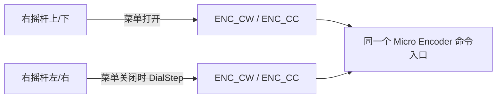
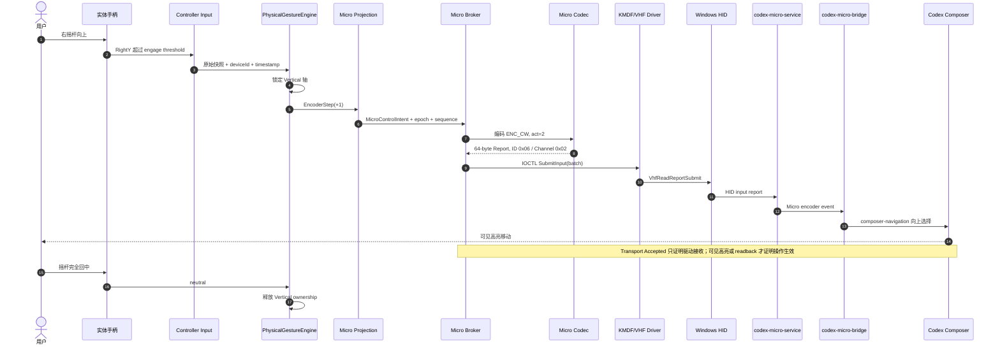

```mermaid
flowchart LR
    subgraph PAD["物理手柄"]
        A["右摇杆<br/>RightX / RightY"]
    end

    subgraph INPUT["Agent Controller 输入层"]
        B["XInputService<br/>每 16 ms 轮询<br/>XInput / WGI / Raw HID"]
        C["ControllerStateBuffer<br/>合并模拟量快照"]
        D["UI Dispatcher<br/>ProcessControllerState"]
        E{"输入门禁<br/>Bridge / 前台 / LT / Radial<br/>等待回中"}
        F["StickGestureRouter<br/>死区 + 主轴判定<br/>锁轴直到回中"]
        G["AxisRepeater<br/>right-x / right-y"]
        H["VirtualDialInputPolicy<br/>Up / Down / Left / Right"]
        I["pending navigation<br/>异步 Pump"]
    end

    subgraph ROUTE["当前 Composer 路由"]
        J["CodexComposerService<br/>DialNavigate"]
        K{"菜单状态与方向"}
        L["菜单打开 + 上/下<br/>SendEncoderSteps"]
        M["菜单打开 + 左/右<br/>发送原生方向键"]
        N["菜单关闭 + 左/右<br/>DialStep"]
        O["MicroInputService<br/>ENC_CW / ENC_CC<br/>act = 2"]
        P["Legacy fallback<br/>UIA 控件探测 / 聚焦"]
    end

    subgraph DEVICE["Windows Micro 设备平面"]
        Q["MicroRpcCodec<br/>v.oai.hid + LF<br/>64-byte Report 0x06/0x02"]
        R["VhfMicroReportTransport<br/>sequence + IOCTL_SUBMIT_INPUT"]
        S["VHF source driver<br/>VhfReadReportSubmit"]
        T["Windows HID stack<br/>虚拟 vendor HID"]
    end

    subgraph CODEX["Codex Desktop 私有接收链"]
        U["主进程<br/>codex-micro-service<br/>监听 HID"]
        V["Renderer<br/>codex-micro-bridge<br/>映射 Micro 事件"]
        W["Composer / Popup<br/>移动高亮或调整控件"]
    end

    A --> B --> C --> D --> E
    E -->|"允许"| F --> G --> H --> I --> J --> K
    E -->|"阻止"| X["丢弃或等待 neutral"]

    K -->|"打开 + 上/下"| L --> O
    K -->|"打开 + 左/右"| M --> W
    K -->|"关闭 + 左/右"| N --> O
    K -->|"关闭 + 上/下"| Y["当前无动作 / unsupported"]

    L -->|"仅 NotSent"| M
    N -->|"仅 NotSent"| P --> W
    O --> Q --> R --> S --> T --> U --> V --> W
```

# 91 — 控制器输入已知问题与实机复现

> Status: Investigation
> Priority: P0 for right-stick navigation; P1 for intermittent input loss
> Depends on: 03-codex-micro-compatibility, 08-testing-observability-and-release

## 目的

集中记录当前真实 Codex Desktop + 实体手柄上仍未解决的输入问题。这里的现象优先于单元测试结论；没有真实 HID/Micro 发送记录、界面状态变化和实机复现，不得把问题标记为完成。

2026-07-18 的右摇杆修复分支已全部丢弃，只保留本问题记录。该分支先后尝试恢复双轴导航、用 UIA 语义/几何关联菜单归属，以及在输入侧增加更强的轴锁定、缓存和 pending 清理，但实机问题仍然存在。该结果只能证明这些修补不足，不能证明 UIA、输入缓冲或任一单层就是根因；没有端到端证据前不要原样重做。

## 已确认现象

| ID | 场景 | 期望 | 实际 / 当前状态 |
| --- | --- | --- | --- |
| RS-01 | Power 横条 | 右摇杆左/右按屏幕方向减小/增大 | 当前方向已正确，作为其他控件的对照样本保留 |
| RS-02 | `Approve for me` | 右进入/打开，左退出/返回；打开后上/下移动菜单高亮 | 右能打开、左能退出，但菜单内没有可靠可见高亮，输入容易表现为卡住 |
| RS-03 | `Add files and more @` | 左/右只负责进入/返回或当前控件的横向动作，上/下选择菜单项 | 左/右动作仍可能反向或落到错误目标，菜单选择不可靠 |
| RS-04 | 模型选择器 | 进入后上/下按视觉顺序选择模型，左返回；不得把横向动作解释为纵向旋钮档位 | 左/右行为仍不正确，上/下与左/右容易混用 |
| RS-05 | Composer 主控件 | 上/下依次选择 Advanced、Fast、Power 横条等控件；左/右调整当前控件或进入/返回 | 上/下有时重复横向调整或落到别的控件，当前控件与实际焦点会失配 |
| RS-06 | 连续或斜向拨动右摇杆 | 一次手势只能由一个轴拥有，回中后下一手势重新判定 | 纵横指令偶发混淆；斜向起步、快速换向和回中附近更容易出现 |
| RS-07 | 模型控制器长期使用 | 每次手势都能继续控制当前模型界面 | 偶发完全失去手柄控制；打开模型选择器后又恢复，恢复动作只是复现线索，不是解决方案 |
| LT-01 | LT 按住说话 | 按下开始、松开停止，任何退出或断连都补发 release | 偶发语音键无效；尚未确认是边沿丢失、策略阻止、自动化失败还是 Codex 未读回 |
| SRC-01 | 实体控制器 + `virtual-micro` 模拟器 | 两者可同时连接，由 Broker 串行化输入并分别管理 held/neutral 生命周期 | 当前看起来只能有一个输入源正常占用；共享句柄、sequence、output/RPC 所有权尚未统一 |

## 不可变交互合同

- 右摇杆模拟 Micro 左上角旋钮的完整交互，不再维持另一套“简易/高级模型控制”状态机。
- 上/下是选择轴：在 composer 中遍历 Advanced、Fast、Power 等控件；在弹出菜单或模型列表中按视觉顺序移动高亮。每个重复档只允许产生一个 `ENC_CW` / `ENC_CC act=2`。
- 左/右是操作轴：按实际屏幕方向调整当前控件；对可进入的菜单，右进入/打开、左退出/返回。左/右不得产生 ENC 档位。
- R3 短按表示旋钮按压，长按打开 Agent Controller 设置；二者都不得被解释为方向动作，且长按必须抑制同一次手势的短按。教程必须说明 R3 是“垂直按下右摇杆帽”。
- 菜单打开后必须有可见选择或可验证 readback。只有“菜单已打开”而没有当前项身份，不算导航成功。
- Micro 驱动返回 `Accepted`、`OutcomeUnknown` 或 `Rejected` 后不得再注入第二套 UIA/键盘动作；只有明确 `NotSent` 才允许降级。
- neutral、key-up 和 PTT release 不能被模拟量合并丢弃；断连时只释放该输入源持有的状态。

## 右摇杆到 Codex 的端到端 UML

### 当前实际链路（问题基线）

当前实现不是一条纯 Micro 链路，而是根据菜单状态在 Micro、原生方向键和 UIA 之间切换：

### 当前轴语义冲突

菜单状态会改变哪个物理轴被转换成 `ENC_*`，所以“上下、左右混淆”不一定只来自摇杆斜向噪声：

### 目标原生 Micro 时序

右摇杆上/下固定表示 Micro 旋钮旋转；路由不得读取或猜测 Codex popup 来改变轴语义：

目标映射固定如下：

| 手柄动作 | 类型化意图 | Codex 最终输入 |
| --- | --- | --- |
| 右摇杆上 | `EncoderStep(+1)` | `ENC_CW, act=2` |
| 右摇杆下 | `EncoderStep(-1)` | `ENC_CC, act=2` |
| R3 短按 | `EncoderPress` | `ENC` down/up |
| R3 长按 | `OpenAgentControllerSettings` | 本地应用动作；不发送 `ENC`，并抑制同一次短按 |
| 右摇杆左/右 | `CurrentControlLeft / CurrentControlRight` | 独立导航 executor；绝不转换成 `ENC_*` |
| 回中 | `Neutral` | 释放轴 ownership，不得被快照合并丢失 |

## 仍待确认的根因

以下均是待证假设，不是结论：

- XInput 快照合并或 UI 线程排队丢失关键 neutral，导致上一轴的 ownership 延续到下一手势。
- 方向锁定只覆盖单个路由层，后续 coordinator、Micro transport 或 UIA fallback 又重新按原始 X/Y 判定。
- 同一手势同时进入 Micro 与 legacy UIA/键盘降级路径，先后作用于不同控件。
- 菜单“逻辑归属”、UIA focus、键盘 selection 和屏幕可见高亮是四种不同状态，当前代码错误地把其中一个当成全部成立。
- popup 打开/关闭时 session、pending repeat 或 cancellation token 未完整换代，旧动作在新上下文执行。
- Codex Desktop 对不同 composer 控件采用不同菜单/listbox 结构，基于名称、几何或固定 Tab/Arrow 的推断不稳定。
- 实体控制器与模拟器争用设备接口、全局 sequence 或 output report 读取者，导致其中一个输入源看似失联。

## 下一次排查必须采集的证据

对每次手势使用同一个 correlation/session id，按时间顺序记录：

1. 原始控制器快照：X/Y、dead zone、时间戳、设备 ID、是否出现完整 neutral。
2. 手势判定：获胜轴、方向、enter/repeat/exit、轴 ownership 的建立和释放原因。
3. 路由上下文：composer 控件、popup/menu 类型、进入/退出、当前 session epoch、pending/cancel 状态。
4. 实际执行通道：Micro intent/report、batch sequence、四态发送结果，或明确的 fallback 原因；禁止只写“已处理”。
5. Codex 前后状态：popup 是否可见、当前项/控件 identity、可见高亮、值变化和 readback。
6. 多输入源状态：客户端 lease、held keys、neutral、output/RPC reader 与断连清理归属。

日志应能回答“一次物理手势为什么生成这条指令、由哪个通道执行、最终改变了哪个可见控件”，并提供默认关闭、可脱敏导出的诊断包。

## 最小复现矩阵

- [ ] 在 Power 横条先验证纯左、纯右各 10 次，确认方向与单次动作数，建立正常对照。
- [ ] 从 composer 主界面用纯上/下各 10 次遍历 Advanced、Fast、Power，确认没有横向值变化。
- [ ] 分别进入 `Approve for me`、`Add files and more @` 和模型选择器，验证右进入、左退出、上/下移动可见高亮。
- [ ] 对每个场景覆盖：缓慢单轴、快速单轴、斜向起步、未完全回中换轴、完全回中后换轴、长时间重复。
- [ ] 覆盖 popup 打开/关闭、Codex 失焦/恢复、鼠标先打开菜单、R3 打开模型列表、菜单中途关闭。
- [ ] 复现模型控制失活，并比较选择器打开前后完整状态快照；不得只记录“打开后恢复”。
- [ ] 对 LT 覆盖短按、正常口述、菜单开关、失焦、断连，并确认 down/up 是否都到达每一层。
- [ ] 单独连接实体控制器、单独连接模拟器、先后交换连接顺序、同时持续输入，验证 SRC-01 的 lease 与 sequence。
- [ ] 至少在 Xbox Series、Flydigi Vader 4 Pro、8BitDo Ultimate 2 和当前支持的 Codex build 上保存实机结果。

## 完成门槛

- RS-02 至 RS-07、LT-01 和 SRC-01 各有确定失败层、可重复 fixture 和修复前失败/修复后通过的证据。
- [`08-testing-observability-and-release.md`](08-testing-observability-and-release.md) 的基础实机验收通过，且自动化测试不能替代真机记录。
- 右摇杆和 PTT 在 Micro 可表达时走驱动；legacy UIA 仅保留 `NotSent` 的有期限降级路径。
- 实体控制器与模拟器通过 [`03-codex-micro-compatibility.md`](03-codex-micro-compatibility.md) 定义的单 Broker、多客户端 lease 验收。
- UI、日志和反馈明确显示当前通道与已验证结果，不再把 transport ACK 或 popup visible 当作操作成功。
