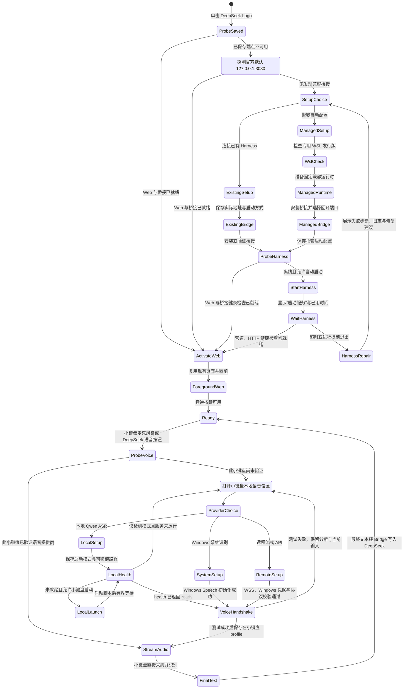
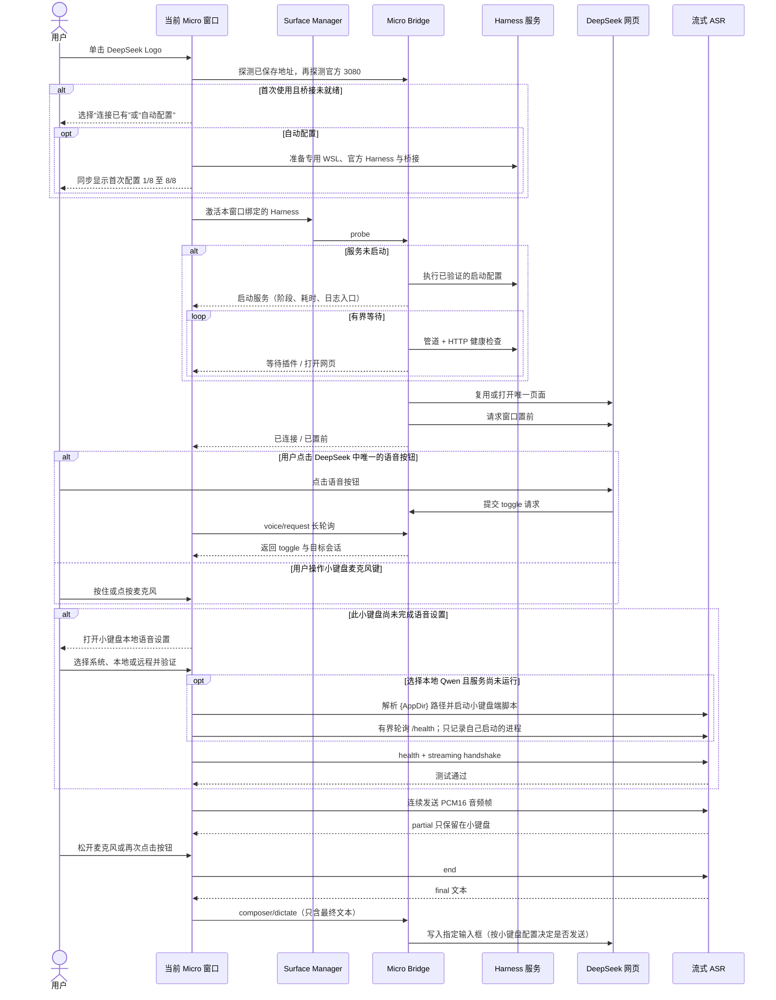

# Codex Micro 桌面模拟器设计说明

> v0.2.1 实现说明：发行窗口由独立进程直接加载原透明 WPF XAML、资源字典、控件
> 模板和动画。`590 × 610` 几何、透明合成、悬停卡片、托盘和可访问性胶囊都是
> 当前发行物本身，不再由另一套绘图技术近似重画。

## 1. 产品定位

这是一个独立于 AgentController 的 Windows 桌面 Codex Micro 模拟器。底座和
左上实体旋钮采用原创的光学水晶与黑色陶瓷语言；其余控件直接
学习当前 Codex 桌面端内置 Micro 预览组件的设计令牌和比例，同时允许为桌面
交互微调尺寸，优先保证辨识度、原界面精度、鼠标命中精度和状态可读性。

程序由三个彼此清晰的部分组成：独立 WPF 桌面宿主、Codex Micro 协议编解码、
Windows UMDF2/VHF 虚拟 HID。宿主直接链接原 Micro Surface XAML，但与 Agent
Controller 不共享进程生命周期，只连接当前用户唯一的 Micro Broker 管道；Codex
继续拥有动作映射和 Agent 状态。

## 2. 视觉结构

- 窗口客户区完全透明，只显示键盘本体和克制的中性投影。
- 机身采用冰青/薄荷静态折射边、透明光学水晶外壳、玉脂白悬浮光导内芯和立体
  水晶键帽。内部不显示 PCB、走线、焊点或裸露电子元件。
- 外壳采用无缝悬浮结构，不模拟螺丝、固定件、接缝或其他非必要物理构造。
  视觉目标是美观、轻盈和科技感，不以复刻真实硬件制造方式为优先级。
- 外壳和键帽不使用巡航流光、呼吸光、跟随提亮或环境发光；水晶质感只由静态
  透明度、材质渐变和边缘高光表达，运行时不会产生明暗流动。
- 背板最多使用三层连续结构：2 px 亮棱线、相隔 6 px 的冷灰壁厚暗隙、低对比
  乳白台面。整面蓝紫彩虹膜和重复同心描边均不使用；底缘仅保留 15% 不透明度的
  静态薄荷内反射，不使用模糊或外溢。
- 基准画布为 `590 × 610`，内部按键区为 `424 × 424`。
- 按键区为 `4 × 4` 固定方格，每格 `106 × 106`；普通键帽为 `96 × 96`。
  语音键仅横向跨两格，为 `202 × 96`，其余键保持正方形。
- 左右丝印位于键区外的独立安全带，以参与布局的 90° 旋转呈现，缩放时不会
  被键帽遮挡。
- 左上旋钮和整机底座保持自有实体设计，不套用 Codex 内置预览的扁平版本。
- Agent 键采用 Codex 内置的半透明状态色叠层：白色玻璃底、状态色光晕、
  径向透光场和 `#685FAE` 紫色中心点；状态色从中心向外归零，帽体始终保持
  白霜材质，未分配键隐藏状态色但保留中心点。
- 动作键采用暖白磨砂顶面、透明水晶侧壁、白色双描边和克制的黑色陶瓷轴影；
  侧壁只表达键帽高度，不使用厚重或高对比的机械键盘底边。
- 全局光位固定在上方偏左：顶边最亮、左边弱高光、底缘和侧壁最深。悬停只提高
  顶面与棱线亮度，不改变中心灯尺寸或键帽高度；位移仅发生在按下时，并以
  80 ms 下沉、110 ms ease-out 回弹。
- 右上摇杆采用珍珠白陶瓷渐变圆角方形座和 `#111111` 圆帽。圆帽可按住后向
  任意角度拖动，视觉行程为 13 px；按下时圆帽轻微下沉，松手以 180 ms 弹性
  动画回中。四个方向标记直接阴刻在米灰底盘上，不设置
  圆形或方形键底。刻槽以暗色上缘和半透明白色下缘形成凹陷感；透明命中区使用
  自定义模板，悬停或按下时不会出现 Windows 默认蓝色方形底色。
- 左下设置区采用 Codex 内置预览的结构：三颗竖排状态灯加 `#2D2925` 简洁
  圆钮，无齿轮、刻度、圆点、同心描边或 Logo。圆钮内部用细圆环显示当前更紧张
  的 Codex 剩余额度，并在百分比下方显示当前快捷模型。
- 底部品牌标识使用当前 Codex 应用中的 Codex 图形；动作键图标随
  `desktop.codex-micro-layout` 双向同步。软件设置页写入与官方相同的 TOML
  schema，并以原子替换保留所有非 Micro 配置。

## 3. 驱动与协议路径

唯一设备路径采用微软正式 Virtual HID Framework。`CodexMicroVhfUm.dll` 是
UMDF2 HID source driver，在 `EvtDeviceAdd` 中依次调用 `VHF_CONFIG_INIT`、
`VhfCreate` 和 `VhfStart`；系统内置 `Vhf.sys` 作为 lower filter 枚举 HID
子设备。输入通过 `VhfReadReportSubmit` 进入 HID class，Codex 输出由
`EvtVhfAsyncOperationWriteReport` 接收并严格一次调用
`VhfAsyncOperationComplete`；清理阶段在 PASSIVE_LEVEL 同步执行
`VhfDelete(handle, TRUE)`。

设备对 Codex 暴露以下身份：

| 字段 | 值 |
| --- | --- |
| Vendor ID | `0x303A` |
| Vendor HID Product ID | `0x8360`（`project_2077`） |
| 受限键盘 Product ID | `0x8361` |
| Usage Page | `0xFF00` |
| Usage | `0x0001` |
| 输入报告 | Report ID `0x06`，64 字节 |
| 受限键盘报告 | 独立键盘子设备，Report ID `0x07`，只允许 Tab / Shift+Tab / Enter |
| Source PnP ID | `Root\CodexMicroHidUm` |

VHF source driver 仍保留遗留受限键盘设备接口，但当前小键盘不调用它。桌面端用有界 IOCTL
批次提交完整的 64 字节 HID report；驱动将 Report ID `0x06` 保留在
`reportBuffer[0]`，并同时写入 `HID_XFER_PACKET.reportId`。Codex 发来的 RPC
输出经驱动有界队列回传桌面端，Agent 灯光以六槽位快照原子更新，不经过
AgentController。桌面端只连接 VHF 设备接口，不再回退到另一种虚拟 HID。

Broker 把任何有效 Codex Output report 视为链路心跳，并在该心跳仍新鲜时保持后台
读取器存活，即使面板客户端意外失联也不会立即中断 `device.status` 等 RPC；最后
一个客户端明确正常断开时则立即退出，避免升级或重新构建时继续锁定程序文件。驱动控制
接口提供受限的 transport-reset IOCTL：先同步 `VhfDelete` 两个 child，清空旧输出
与 held-input 状态，再重新 `VhfCreate` / `VhfStart` 并生成新的 connection epoch，
从而制造真实的 HID 拓扑变化，让 Codex 丢弃卡死句柄并重新枚举。输入已进入 VHF
但 12 秒没有握手，或已建立链路 90 秒没有心跳时，Broker 以 20 秒冷却最多自动
尝试三次；手动“重新连接”直接调用同一路径。

同一个 UMDF2 source 创建两个独立 VHF HID child，各自拥有报告描述符和句柄：
vendor child 由 Codex 的 `codex-micro-service` 消费；遗留键盘 child 仅允许 Tab、
带左 Shift 的 Tab 和 Enter。小键盘不再使用该 child，也不会根据 UIA 观察结果
改变输入通道；Codex 旋钮动作只走 vendor child 的原生 `ENC_*` 报告。

## 4. 交互定义

| 部件 | 操作 | 行为 |
| --- | --- | --- |
| 动作键 | 单击 | 发送对应 `v.oai.hid` 按下/释放报告 |
| 语音键 | 按住/松开 | 分别发送 `ACT10` 按下和释放，保持 Codex PTT 时序 |
| 左上旋钮 | 滚轮或上下拖动 | 按离散步进顺序发送 `ENC_CW` / `ENC_CC` |
| 左上旋钮 | 启用“反转旋钮方向”后旋转 | 保持实体旋转动画，交换上报的 `ENC_CW` / `ENC_CC`；顺时针提高推理强度 |
| 左上旋钮 | 短按 | 发送一次 `ENC` 按下/释放，打开或确认 Codex 当前高亮项 |
| 左上旋钮 | 外部 Harness 的“输入区控件”模式旋转 / 短按 | 动态遍历当前输入框内可见、可用控件并在网页蓝色高亮 / 执行高亮控件；不发送 Codex HID |
| 左上旋钮 | Codex“仅推理强度”模式旋转 / 短按 | 只调整当前模型推理强度 / 通过当前任务的语义设置通道在快捷模型 A、B 间切换 |
| 左上旋钮 | 权限模式选择面中旋转 | 继续通过官方 Micro bridge 发送 `ENC_CW` / `ENC_CC`，遍历 Ask for approval、Approve for me 与 Full access |
| 左上旋钮 | Full access 确认框中旋转 / 短按 | 仍只发送 `ENC_CW` / `ENC_CC` / `ENC`；若当前 Codex bridge 不支持，则明确不可用，不改发键盘或 UIA 动作 |
| 左上旋钮 | 右键 | 不执行操作；设置入口不与选择旋钮复用 |
| 左下黑色旋钮 | Codex 模式短按 | 通过 `codex-ipc` 定位唯一当前任务，在软件设置中的快捷模型 A / B 之间切换下一轮；默认 Sol / Luna |
| 左下黑色旋钮 | 当前目标为外部 Harness 时左键 / 右键 | 通过直连插件切换该 Harness 配置的快捷模型 / 直达该 Agent 的适配器与独立按键设置 |
| 左下黑色旋钮 | 长按 | 发送 650 ms `ENC` 长按，由 Codex 内部路由进入官方 Micro 设置 |
| 左下黑色旋钮 | 右键 | 直接打开右下角当前 Agent 的设置区：Codex 进入快捷模型配置；外部 Harness 进入该 Harness 独立的适配器与按键配置 |
| 右上圆帽摇杆 | 按住拖动 | 连续发送角度和距离；50% 行程开始触发方向，松手发送中立值 |
| 底盘四向阴刻 | 单击 | 发送对应方向的完整 `v.oai.rad` 动作并自动回中 |
| Codex 键 | 单击 | 当前目标为 Codex 且不在前台时，本次只启动应用或将主窗口置前；已在前台后再次单击才发送 `ACT12`。外部 Harness 使用直连插件协议执行其独立策略 |
| Codex 键 | 右键 | 直接列出 Codex、DeepSeek Harness 和后续注册的 Harness，并提供管理入口 |
| 六个 Agent 键 | 当前目标为外部 Harness 时单击 | 打开该槽位的 Harness 会话；不显示或触发 Codex 最近任务 |
| 机身空白处 | 拖动 | 移动窗口 |
| 机身空白处 | 右键 | 切换置顶状态 |
| 机身菜单 | 单击“隐藏面板” | 收起到 Windows 通知区域 |
| 通知区域图标 | 双击 | 显示或收起小键盘 |
| 通知区域菜单 | 显示/收起、退出 | 切换面板可见性，或完整退出独立进程 |
| 窗口关闭 / Alt+F4 | 关闭 | 只收起到通知区域，不销毁进程 |

模拟器主窗口对 `WM_MOUSEACTIVATE` 返回 `MA_NOACTIVATE`：按钮、旋钮、摇杆和
机身菜单仍接收鼠标，但不会夺走 Codex 的前台焦点。这样 Codex 已打开的菜单
不会因点击虚拟旋钮而关闭；旋转由当前 Micro 桥映射成菜单的上/下选择，短按
映射成确认。拖动超过阈值后只发送旋转步进，松手不会额外确认，避免误选。

模型与权限菜单的动作仍由 Codex 官方 Micro bridge 处理。桌面端只读观察 Codex
可访问性树中的可见菜单及焦点项，按屏幕顺序计算“序号 / 总数”，并在白色旋钮旁
显示 2.4 秒的轻量胶囊；观察结果只能更新 HUD，不能决定输入通道或改发键盘动作。
旋钮输入与可访问性反馈完全解耦：滚轮和拖动只保留最多三个待处理净刻度，反向
输入会抵消尚未发送的历史，按下确认会先清空积压。发送泵以 24 ms 最小间隔逐个
交付 VHF 步进；超过 180 ms 的输入与一次卡顿发送期间产生的积压直接丢弃，
不会在恢复后补发。菜单位置观察仅异步更新顶部胶囊。

设置入口使用真实硬件的编码器长按语义：当前 Codex 桥在按下 500 ms 后直接
导航到 `/settings/codex-micro`。模拟器保持 650 ms 后释放，并且不再追加会把
页面覆盖回设置首页的通用 `codex:` 深链。路由发出后，窗口激活器
从 Codex 进程的全部顶层窗口中排除工具窗，优先选择无 owner、非 ToolWindow、
面积最大的 `Chrome_WidgetWin_1` 主窗口。只有窗口最小化时才调用恢复；已可见
窗口不执行 `SW_SHOW` 或模拟 Alt+Tab，从而保留 Electron 的最大化/全屏状态。

软件设置是独立的应用内 WPF 页面。左下额度旋钮右键会按右下角当前 Agent 动态
定位：Codex 直达快捷模型配置，DeepSeek 或后续 Harness 直达各自隔离的适配器与
按键配置；不向 Codex 官方 `/settings/codex-micro` 注入第三方字段。页面采用完整的
`Layout + Options` 信息结构：上方直接镜像当前 Micro 本体（与灯光、额度和按键
状态实时同步）；悬停并点击真实键位进入“编辑键帽”子页，可搜索全部官方键帽并
分配官方命令或已安装 Skill。Options 支持 Agent 键来源、旋钮模式、麦克风模式、
双麦克风键和单击聚焦；Extensions 支持快捷模型 A / B、各自的目标推理强度与
Codex 键的 Harness 目标。
模型槽位只能保存两个不同的已知模型；选择另一槽位当前值时自动交换，避免重复。
扩展默认模型为 Sol / Luna，强度默认记忆当前任务中该模型的上次值；用户可为两个
槽位分别指定固定强度。模型与强度写入
`%LOCALAPPDATA%\CodexMicro\micro-profile.json`，交换模型槽位时强度随模型交换。
快捷切换通过 Codex 的版本化跨窗口管道找到唯一当前任务，再由其 owner 复用同一
任务设置通道；当前实验协议对应 `thread/settings/update`，但它要求真实 `threadId`，
且不是公开稳定的空白草稿 API。真实任务不打开模型菜单、不抢焦点，也不使用 UIA。
未指定固定强度时，推理强度按 `threadId + modelId` 独立记忆到
`%LOCALAPPDATA%\CodexMicro\thread-model-efforts.json`，且只在语义确认后提交；
显式槽位强度优先于该任务记忆值。

空白新会话没有真实 `threadId`，按
[ADR-0003](../docs/adr/0003-codex-blank-draft-model-switch.zh-CN.md) 作为窄例外处理：
锁定同一前台 Codex 主窗口与 Composer，以可访问性角色、名称、可用态和选中态选择模型，
再重新定位独立 `Power` 控件，并只执行 ownership 已证明控件公开的可访问性 action；
不得按固定坐标、列表序号或 encoder 步数猜测。Codex
Desktop `26.901.1978.0` 的模型菜单顶部包含独立 `Default` 项，模型行暴露为
RadioButton；`Power` 公开带位置的当前状态。adapter 根据档位总数计算目标位置；同一
菜单面存在可写 RangeValue 时一次设置，否则从带 `N of M` 状态的唯一滑轨节点取得实时
矩形并只点击目标刻度一次，随后恢复鼠标位置。滑轨与 `Power` MenuItem 是兄弟节点，
不能只搜索 MenuItem 子树。不得先向一端扫描再反向寻找目标，缺少直接动作时失败关闭。

整个空白草稿事务由 `_quickModelSwitching` 独占，额度环持续显示加载动画，重复短按不
排队。出现 `Use Ultra with Full access?` 时进入等待用户状态，不自动选择保留 Full
access 或降级权限；弹窗关闭后丢弃旧控件引用并重新核验模型、effort、权限结果和草稿
租约。操作开始前已存在的警告不归新事务所有，必须失败关闭。本操作触发的警告可等待
用户任意时长，但失焦、换任务、换 renderer 或 lease 无法续签时立即结束。DEBUG E2E
不得输入/提交文本、创建或导航任务、主动激活 Codex 或循环抢回前台；它只在用户已打开
且已置前的空白草稿内执行非提交 A→B→A 回读。锁定模型访问弹窗及未知弹窗一律失败关闭。
现有 config + encoder seed 路径已由 E2E 证明不能切换 renderer 草稿模型，不能作为发布路径。

目标切到外部 Harness 后，Codex 专属布局、麦克风和快捷模型字段会停用；同一页面
显示通用 Harness 适配器卡，可配置管道或 WSL 回环控制地址、启动程序、参数、工作目录、离线自动启动
和就绪超时。配置按 Harness 写入
`%LOCALAPPDATA%\CodexMicro\harness-settings.json`，因此后续 Harness 不需要复制一套
设置窗口。

Harness 通过 `%LOCALAPPDATA%\CodexMicro\harnesses\*.json` 注册 `id`、显示名和
具名管道或仅限回环的 HTTP 控制地址；协议提供 `activate`、`state/read` 和
`session/activate`，不模拟键鼠。DeepSeek Harness 默认在 WSL2 中运行，Micro 使用
`http://127.0.0.1:3080/__agentcontroller/micro/request` 跨 Windows/WSL 直连，并保留
`deepseek-harness-micro-v1` 作为原生 Windows 回退；按钮发现端点离线时可以按设置
启动 `wsl.exe` 并等待就绪。`state/read` 只返回 Harness 自己的最多六个
最近会话，切换目标时先清空旧槽位，再用对应适配器结果填充，杜绝把 Codex 会话
显示成 DeepSeek 会话。后续 Harness 无需修改设置页即可出现在同一个目标选择器和
Codex 键右键菜单中。

## 5. 桌面窗口行为

- 窗口固定以 `442.5 × 457.5` 打开，即 `590 × 610` 基准设计尺寸的 75%；键盘
  本体由等比 `Viewbox` 映射，不产生横向或纵向拉伸。
- 进程使用命名单实例锁；第二次启动会立即正常退出，确保只有一个全局鼠标钩子
  和一个 VHF 输出队列读取器，避免菜单重复步进与 Agent 灯光快照被多个进程拆分。
- WPF 窗口使用 `WindowStyle=None`、`ResizeMode=NoResize`、透明分层合成，不声明
  `WS_THICKFRAME`、`WS_MAXIMIZEBOX` 或系统标题栏；机身拖动直接更新 `Left/Top`，
  不进入系统 move/size loop。
- 把窗口拖到屏幕边缘不会出现 Snap 布局，也不会让 Windows 自动改写窗口尺寸；
  窗口不提供任何用户缩放入口。
- 机身空白区域可以拖动，右击空白切换置顶、重连或隐藏。
- 软件设置页固定为 `920 × 760`，作为主面板的 owned window 居中打开；支持 Esc
  关闭、即时中英切换和自动保存，主进程退出时同步关闭。
- Codex 键会在需要时启动 Codex，否则把主窗口放到普通非置顶窗口的最前方；这次
  激活不会发送输入框，只有 Codex 已在前台后再次按下才发送。它不会覆盖用户的
  置顶窗口；若模拟器本身启用了置顶，它仍会继续保持在置顶层。
- 关闭窗口只隐藏；通知区域图标双击显示/隐藏，菜单提供收起和退出。只有执行
  “退出”时才释放托盘图标、配置观察器和 HID 客户端，并发送按键和摇杆中立状态。
- 托盘语言菜单提供自动、简体中文和 English；切换会即时重绘托盘、机身菜单、
  悬停说明、状态与错误文本。自动模式优先读取 Agent Controller 设置，再回退到
  Windows UI 语言；独立选择保存在当前用户的 CodexMicro 设置目录。
- 托盘“开机自启动”只写入当前用户 Run 项；登录后直接显示面板并创建托盘图标。
  关闭开关会删除该启动项，不需要管理员权限。
- Codex 软件设置页的“反转旋钮方向”即时交换白色旋钮上报的顺逆时针事件，
  并按当前小键盘保存；外部 Harness 不读取该 Codex 专属设置，默认关闭以保持
  实体硬件兼容行为。

## 6. 状态反馈

左下旋钮旁的三颗竖排小灯依次表示 Codex 协议兼容性、虚拟 HID 连接和最近
一次事件结果。正常色沿用内置预览的 `#9EBDFF` 蓝和 `#B8B98B` 橄榄色，警告
与错误仍用黄、粉红色区分。详细状态放在工具提示中，不增加外部面板。Agent
键的玻璃叠层颜色直接反映 Codex 返回的 slot 灯光状态。每次
`v.oai.thstatus` 先清空六个槽位，再按同一快照全部应用，避免上一帧残留或只
更新一个任务；灯光提示同时给出当前活动槽位数。

外部 Harness 的 Agent 键遵守同一条语义边界：历史会话、当前选择和正在执行是
三个独立状态。`state/read` 中只有 `running=true` 的会话显示蓝色思考灯；空闲的
历史会话即使是当前选择也保持灭灯。选择仅决定后续旋钮、动作和会话打开目标，
不能伪装成后台正在工作。

第一颗灯为黄色、第二颗灯为蓝色时表示 VHF 已就绪但 Codex 握手尚未恢复；第三颗
灯变蓝只表示最近输入已被驱动接受，并不等于 Codex 已处理。此状态会触发上述有界
自动恢复，握手重新出现后第一颗灯自动恢复为蓝色。

所有交互控件使用统一的非抢焦点悬停卡片。卡片第一行显示控件标题，第二部分
显示当前 Codex 映射、鼠标操作和实时状态；动作键、旋钮模式、摇杆方向以及
Agent 槽位状态变化时同步更新。相同内容写入自动化名称和帮助文本。
Agent 键第一行优先显示“所属项目 › 会话标题”：项目与标题由独立的只读观察器
通过本地 Codex App Server 的 `thread/list`，按与 Codex 相同的 `recency_at` 顺序
读取最近六个任务，并用 `.codex-global-state.json` 补充项目名；
`session_index.jsonl` 只在 App Server 暂不可用时作为降级来源，不能覆盖已经确认的
recency roster。只有官方默认 `recent` 来源可本地证明时才合并。`pinned`、`priority` 或
`custom` 来源没有对应证明时保留通用槽位标题。观察器同时监听来源设置；若查询期间
来源发生变化，会按最新设置丢弃旧的 `recent` 映射。VHF `v.oai.thstatus` 仍只负责槽位颜色和效果。
匹配不到时同样保留通用槽位标题，
不会把推测写回 Codex，也不改变 `SlotOnly` 协议。
每次白色旋钮移动后，顶部胶囊同步显示当前项序号、总数和名称，避免模型或权限
菜单只能盲选。

## 7. 验收标准

- 所有单格键帽严格为正方形，语音键仅横向跨两格。
- 左右丝印在所有支持的窗口尺寸下均位于键区外。
- 右上摇杆黑色圆帽在圆角方座内严格居中、支持任意角度拖动；四向标记为底盘
  阴刻，无独立圆底或系统蓝色按压背景。
- 左下设置旋钮无齿轮、刻度或 Logo，三颗状态灯严格纵向排列。
- Agent 键使用紫色中心点；状态色来自 Codex 输出且不改变键帽几何。
- 动作键使用暖白双描边和轻阴影，与 Codex 内置 Micro 预览一致。
- 单击设置旋钮后，Codex 可见主窗口进入前台并定位到 Codex Micro 设置页。
- 在 Codex 已打开的选择菜单中，滚轮或拖动白色旋钮能移动选项，短按能确认，
  且模拟器不抢走 Codex 焦点；白色旋钮右键不触发设置或其他动作。
- 模型菜单滚动时能实时看到当前项；UIA 观察结果只更新 HUD，任何菜单或
  确认框状态都不能把 `ENC_*` 改路由为 Tab、Enter 或 UIA 点击。
- 单击 Codex 键后，真实 Codex 主窗口进入普通 Z 序最前方。
- 窗口固定大小、可移动和置顶，移动到屏幕边缘不触发 Snap；托盘可显示、收起和退出。
- 自动、简体中文和 English 三种语言选择可持久化，并在运行中即时切换。
- 面板客户端意外失联时，活跃 Codex 心跳仍由唯一 Broker 暂时响应；最后一个客户端
  明确退出后 Broker 会立即结束并释放程序文件。模拟 Codex 握手超时或心跳中断时
  会重建 VHF topology，并在新 epoch 上重新变为就绪。
- 重复启动模拟器时只保留一个进程，旋钮每次只产生一个步进，Agent 六槽位快照
  始终由同一读取器完整接收。
- 每个按钮、旋钮、方向键和状态灯悬停时均显示标题与当前功能。
- Codex 设置中的动作映射变化能自动更新对应键帽图标和提示。
- 切到 DeepSeek Harness 后六个 Agent 键不再显示 Codex 会话；旋钮与 Agent 键只调用
  DeepSeek 适配器，切回 Codex 后重新使用官方 layout、灯光和最近任务快照。

## 8. 多 Agent 小键盘目标交互

> 本节是下一阶段交互设计，不代表当前单窗口宿主已经完成多窗口改造。

应用继续保持**单进程、单托盘、单 Broker 租约**，但由一个 Surface Manager 管理
多个彼此独立的 Micro 窗口。这样多个 Agent 可以同时常驻，又不会让同一次旋钮或
HID 输入被多个进程重复消费。

### 8.1 创建与切换

- 右下 Agent Logo 右键菜单的每一行保留 Logo；悬停才显示 Agent 名、连接和任务
  状态。单击行主体只把**当前小键盘**切换到该 Agent。
- 每个 Agent Logo 的**右下角叠加小型 `＋` 徽标**，不在菜单行尾另放按钮。单击
  Logo 主体切换当前小键盘；只有精确点击 `＋` 才在新小键盘打开该 Agent，避免
  “切换目标”和“新建窗口”产生歧义。
- 菜单底部提供“复制当前小键盘”，用于同一 Harness 的两个不同固定会话或工作区；
  复制时生成新的窗口 ID，不共享当前会话和菜单导航栈。
- 新窗口相对来源窗口错开 24 px，并分别记忆显示器、位置和置顶状态。

### 8.2 窗口身份与作用域

- 每个窗口绑定 `windowId + harnessId + optional pinnedSessionId`。右下 Logo 是常驻
  身份；悬停显示“DeepSeek Harness · 小键盘 2 · 已连接”等完整说明。
- Agent 键、左上旋钮、右上摇杆、语音会话、菜单深度和瞬时状态均为窗口私有；
  一个窗口进入二级菜单时不会锁住另一个窗口。
- 语言、驱动、Broker、插件注册表和开机启动是全局设置；Agent 目标、窗口位置、
  置顶、按键映射、旋钮模式和固定会话是当前小键盘设置。
- 设置页新增“小键盘”子菜单：列出已打开窗口，支持置前、重命名、切换 Agent、
  复制和关闭；顶部明确标出“当前小键盘”，避免修改错对象。

### 8.3 显示、关闭与托盘

- 托盘主动作改为“显示/收起全部小键盘”；`小键盘 >` 子菜单可单独显示、收起或
  关闭某一个窗口，并提供“新建小键盘”。
- 窗口关闭或 Alt+F4 只收起该窗口；菜单中的“关闭此小键盘”才删除对应窗口配置。
  关闭最后一个窗口后托盘仍保留，只有“退出”才释放 Broker 和整个进程。
- Agent Logo 的单击激活只影响所属窗口；其他小键盘的 Agent、会话和前台目标均
  不变化。

### 8.4 灯光约定

- 灭灯：空槽位或已存在但空闲的会话。
- 蓝色：外部 Harness 明确报告正在运行；当前窗口选中时只增强同色亮度。
- 绿色：已完成的短暂过渡；只有协议明确提供完成态时才显示，不得把整个运行过程
  保持为绿色。黄色：等待用户输入；红色：错误。插件未提供这些状态时不得推测。
- DeepSeek 浏览器桥接直接转发其会话列表中的 `running`、`completed`、
  `pendingInteraction`，以及已挂载会话的错误状态；Micro 每秒读取一次并分别映射为
  蓝、绿、黄、红。会话被打开后，DeepSeek 自己清除 `completed` 提醒，绿灯随下一次
  同步熄灭。
- “当前选择”不使用持续蓝灯；点击后的短暂按压反馈和悬停说明已经足够表达选择，
  从而保证一眼看到的常亮灯数量等于真正活动的任务数量。
- Agent 身份由窗口环境光区分：Codex 保持现有很淡的偏绿玻璃底色；DeepSeek
  Harness 使用同等明度、低饱和且不混青绿的普通淡蓝玻璃。环境光只表示窗口绑定
  目标，不表示任务运行。
- `scripts/test-micro-lighting.ps1` 使用真实 WPF/XAML 模板生成灯态矩阵。测试表逐项
  断言状态对应的画刷颜色、透明度、模板内五层发光载体和最终像素色相；同时覆盖
  Harness 的适配器、浏览器桥接和任务活动三颗小灯，不能只凭截图目测通过。

## 9. DeepSeek Harness 从零配置 UML

首次进入 DeepSeek Harness 时先完成 Harness 启动闭环。语音配置属于当前 Micro
小键盘，与 Harness 插件设置完全分离；ASR 配置失败不能阻塞普通 Harness 操作。
任何一步失败都停在可修复的原步骤，显示检测结果和重试入口。

运行时的跨组件顺序如下；界面状态必须对应真实阶段，不能只显示一个笼统的
“加载中”。

## 10. DeepSeek 一键安装包预设

后续发布独立的 `CodexMicro-DeepSeek` 一键安装包，与通用安装包共用代码但使用
显式的 `distribution-preset.json`。预设只在用户配置不存在的首次启动生效，升级
不能覆盖已有选择。

- 默认 Agent：`deepseek-harness`；首次打开即显示 DeepSeek Logo 与淡蓝玻璃主题。
- 内置外部 `DeepSeekHarness` 插件构建产物与自定位 WSL 安装/启动脚本，不修改
  Harness 源码。第一次点击先探测用户地址和官方默认 3080，再明确选择连接已有环境
  或程序托管环境；不猜测 checkout，不依赖盘符，也不运行 `git clone`。
- 默认小包的托管模式创建 `CodexMicro-DeepSeek` 专用发行版，在线安装固定兼容版本；
  可选 Full 包向同一状态机提供 `payload/deepseek-runtime.wsl`，避免重复实现安装流程。
- 默认语音：`system`，首次使用仍要求麦克风授权与试录。这样零配置优先；本地
  Qwen 流式 ASR 与远程 WebSocket 保留在“高级识别方式”。小键盘不会静默安装
  Python 或依赖；用户明确保存本地 Qwen 配置后，启动模式可按需预热服务，模型 ID
  首次加载可能由上游缓存下载。只有语音配置本身变化才允许重启预热；WSL 适配器以
  用户和端口为作用域持有非阻塞单实例锁，重复请求在模型加载前退出。只有用户明确
  选择远程提供商时音频才离开本机。
- 默认只突出内置 DeepSeek；Codex 和其他 Harness 保留在添加/管理入口，主流程
  不展示不必要选项。
- 构建入口为 `package-micro.ps1 -Preset deepseek`。该参数只准备发布内容，不允许
  在普通 dev 编译过程中自动增加版本或生成发布包。
